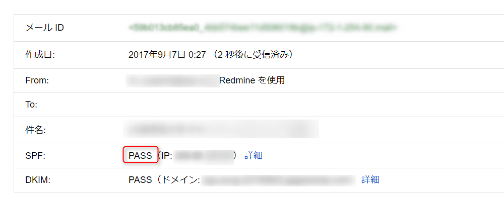

こんにちは。

今回は、**Postfixを利用してGmailにメールリレーする設定** を紹介します。

設定後の送信テストでGmailアカウントに対して送付すると、受信したGmail側でアイコンが **？** になる現象に遭遇しました。

受信したメールから確認できたメッセージは以下です。
>Gmailでは、このメールが(スパム発信者からではなく)本当に ooo.com から送信されたメールであることを確認できませんでした。

こちらの対応方法についても末尾にて紹介します。

## 準備
1. Gmailのアカウントを準備する。
2. メールサーバーを構築する。(今回はPostfixを使いました。)
3. メール通知を行うサービスを準備する。(今回はRedmineとしました。)

メールサーバーを自分自身に指定し、Redmine側の準備は完了していることを前提としています。今回の紹介ではRedmine構築手順を割愛しています。

Redmine構築については、こちらの記事が参考になります。
[AnsibleでAWS EC2インスタンス上のAmazon LinuxにRedmineを構築する](/redmine-amazon-linux-ansible/)

以下のような概念です。


## Gmail関連の設定

### Gmailの設定で安全性の低いアプリを許可
Postfixからのリレーを許可するために、Gmailアカウントでログインしたあと、以下にアクセスします。画像のように設定を変更してください。
[https://myaccount.google.com/security](https://myaccount.google.com/security)


### postfixの設定
最小構成のLinuxの場合、Gmailの認証をクリアするために `cyrus-sasl-plain` と `cyrus-sasl-md5` をインストールしてください。
以下のコマンドを実行することでインストールできます。
`yum -y install cyrus-sasl-plain cyrus-sasl-md5`

上記のインストールができていない状態だと、メール送付時に以下のエラーログが記録され送付できませんでした。

```
Nov  8 18:05:33 grelay postfix/smtp[9442]: warning: SASL authentication failure: No worthy mechs found
Nov  8 18:05:33 grelay postfix/smtp[9442]: A200A400DEA0: to=<test@example.com>, relay=smtp.gmail.com[108.177.97.109]:587, delay=4562, delays=4560/0.03/1.8/0, dsn=4.7.0, status=deferred (SASL authentication failed; cannot authenticate to server smtp.gmail.com[108.177.97.109]: no mechanism available)
```

## Postfix関連の設定

今回の記事で利用したPostfixはバージョンが **postfix-2.6.6-2.15** でした。
以下の手順はroot権限で実行してください。

### 設定をバックアップ
`cp /etc/postfix/main.cf{,.org}`

### 設定ファイルを編集
`vi /etc/postfix/main.cf` を実行しコンフィグを編集します。
`diff -u /etc/postfix/main.cf.org /etc/postfix/main.cf` の差分結果が以下になります。
```
--- main.cf.org 2017-08-30 16:41:23.131249494 +0900
+++ main.cf     2017-09-07 00:25:17.762417956 +0900
@@ -74,13 +74,14 @@
 #
 #myhostname = host.domain.tld
 #myhostname = virtual.domain.tld
+myhostname = redmine.example.com

 # The mydomain parameter specifies the local internet domain name.
 # The default is to use $myhostname minus the first component.
 # $mydomain is used as a default value for many other configuration
 # parameters.
 #
-#mydomain = domain.tld
+mydomain = example.com

 # SENDING MAIL
 #
@@ -96,7 +97,7 @@
 # to recipient addresses that have no @domain part.
 #
 #myorigin = $myhostname
-#myorigin = $mydomain
+myorigin = $mydomain

 # RECEIVING MAIL

@@ -116,7 +117,7 @@
 inet_interfaces = localhost

 # Enable IPv4, and IPv6 if supported
-inet_protocols = all
+inet_protocols = ipv4

 # The proxy_interfaces parameter specifies the network interface
 # addresses that this mail system receives mail on by way of a
@@ -261,7 +262,7 @@
 # of listing the patterns here. Specify type:table for table-based lookups
 # (the value on the table right-hand side is not used).
 #
-#mynetworks = 168.100.189.0/28, 127.0.0.0/8
+mynetworks = 127.0.0.0/8
 #mynetworks = $config_directory/mynetworks
 #mynetworks = hash:/etc/postfix/network_table

@@ -314,7 +315,7 @@
 #relayhost = [gateway.my.domain]
 #relayhost = [mailserver.isp.tld]
 #relayhost = uucphost
-#relayhost = [an.ip.add.ress]
+relayhost = [smtp.gmail.com]:587

 # REJECTING UNKNOWN RELAY USERS
 #
@@ -674,3 +675,13 @@
 # readme_directory: The location of the Postfix README files.
 #
 readme_directory = /usr/share/doc/postfix-2.6.6/README_FILES
+
+smtp_sasl_auth_enable  = yes
+smtp_sasl_password_maps = hash:/etc/postfix/smtp-auth-passwd
+smtp_sasl_security_options = noanonymous
+smtp_sasl_tls_security_options = noanonymous
+smtp_sasl_mechanism_filter = plain
+#tls setting
+smtp_use_tls = yes
+smtp_tls_security_level = may
+smtp_tls_loglevel = 1
```

**+** の行が追加している箇所、 **-** の行が削除している箇所になります。
mydomainがGmailのメールアドレスの@以降と同じとなっていることを確認してください。
セキュリティ向上のため、mynetworks=127.0.0.0/8とし、自分自身からのみ利用できるようにしていることも重要です。

### パスワードファイルを作成
`vi /etc/postfix/smtp-auth-passwd`
内容は以下の1行です。
`[smtp.gmail.com]:587 hogehoge@example.com:password`

### パスワードファイルからデータベースを作成
`postmap /etc/postfix/smtp-auth-passwd`
smtp-auth-passwd.dbというファイルができます。

### パスワードファイルを削除
`rm -rf /etc/postfix/smtp-auth-passwd`

### メールサービスの調整を実施
以下のコマンドを実行し、メールサービスを調整します。
```
/etc/init.d/sendmail stop
chkconfig sendmail off
chkconfig postfix on
/etc/init.d/postfix restart
```
コマンドの説明は以下のとおりです。

* sendmailが動作している場合、postfixの起動でこけるため停止します。
* sendmailが自動起動しないように設定します。
* postfixが自動起動するように設定します。
* postfixを起動します。（起動しているときのためにrestartにしています。）

以上でメールサーバー側の準備は終わりです。

## DNS逆引き設定

メールサーバーの逆引き設定を実施します。
設定は、DNS管理者に確認の上実施をお願いします。

今回のサーバーがAWSでしたので、参考までにAWSの方法を紹介します。

以下より申請します。
[https://aws.amazon.com/forms/ec2-email-limit-rdns-request](https://aws.amazon.com/forms/ec2-email-limit-rdns-request)

申請から、2時間後程度で完了メールがきました。


## 受信したメールがSOFTFAILになる

当初、postfixの設定で **myhostname** , **mydomain** , **myorigin** の変更が漏れていて、メール送信をするとGmailで受信したメールが迷惑フォルダに割り振られてしまいました。

原因は、Return-PathのドメインがSPFを指定しているドメインと一致していないためでした。

解決には以下のページを参考にさせていただきました。
[GMailにメールするとSPFがsoftfailする -でじうぃき](http://onlineconsultant.jp/pukiwiki/?GMail%E3%81%AB%E3%83%A1%E3%83%BC%E3%83%AB%E3%81%99%E3%82%8B%E3%81%A8SPF%E3%81%8Csoftfail%E3%81%99%E3%82%8B)


このメールのヘッダーを確認すると、**SPF** が **SOFTFAIL** になっていました。

↓


**myhostname** , **mydomain** , **myorigin** の設定を実施したあとにリトライすると迷惑メール判定とならず、**SPS** チェックも **PASS** となりました。



## あとがき

Gmailと連携したメールリレーは使い勝手のよさから利用されている方も多くいるのではないでしょうか。
Zabbixのような通報サービスと連携等、応用は様々です。

今回の紹介では迷惑メールフォルダに分類されてしまう、という現象にも遭遇したため併せて紹介させていただきました。

皆様の参考になれば幸いです。
それでは次回の記事でお会いしましょう。
