こんにちは。

AWS EC2インスタンスで、EBS (Elastic Block Store) のスナップショットを取得し、そのスナップショットの状態に復元する方法を紹介します。

OSはAmazon Linuxです。

## スナップショット採取までの流れ

AWSマネージメントコンソールにログインし、以下の流れでスナップショットを採取します。

1. EC2からインスタンスメニューに移動し、**インスタンスID**と**アベイラビリティーゾーン**を確認する。
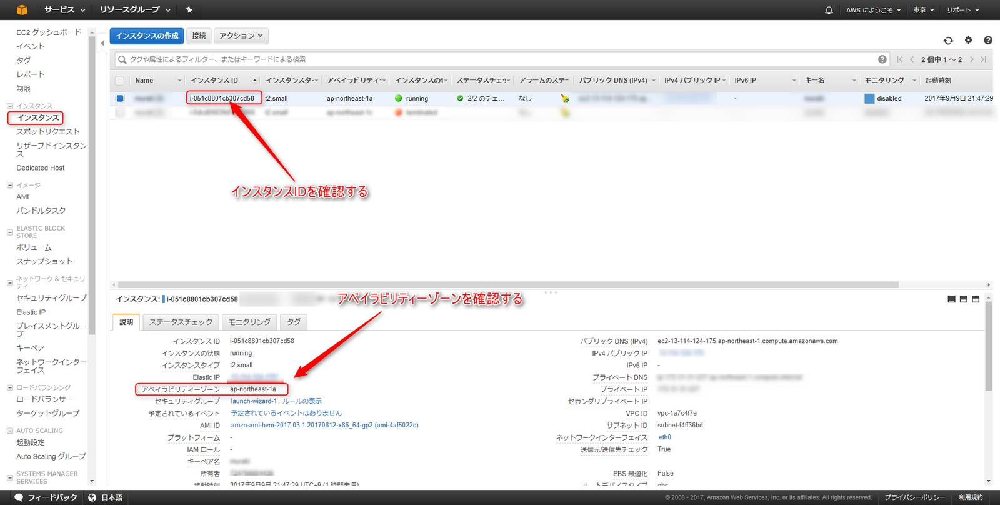

1. ボリュームメニューに移動し、インタンスIDが前項で確認したものと一致していることを確認し**右クリックからスナップショットの作成**を選択する。このとき、アタッチ済みの情報から**アタッチされているパスをメモ**する。
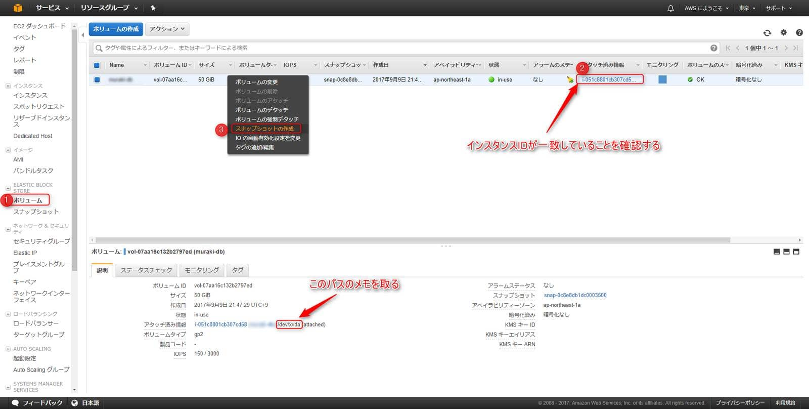

1. 名前と説明を入力し、作成する。説明は日本語の入力はできない。
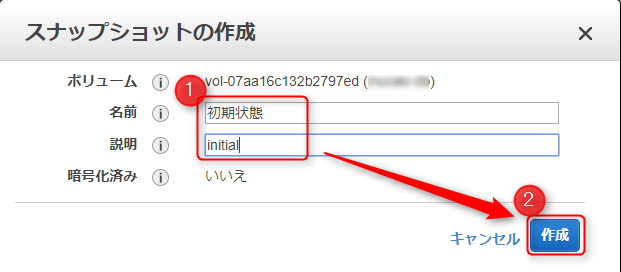
↓
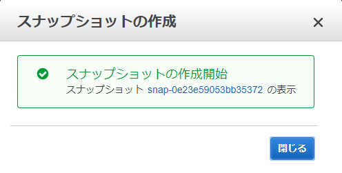

## 復元までの流れ

1. スナップショットで戻ったことを確認するため、インスタンスにログインしファイルを作成する。
 ```
 [ec2-user@ip- ~]$ touch snapshot-test.txt
 [ec2-user@ip- ~]$ ls
 snapshot-test.txt
 ```

1. インスタンスを停止する。

1. 停止したことを確認し、ボリュームメニューへ移動し、対象のボリュームを右クリックから**ボリュームのデタッチ**を選択する。
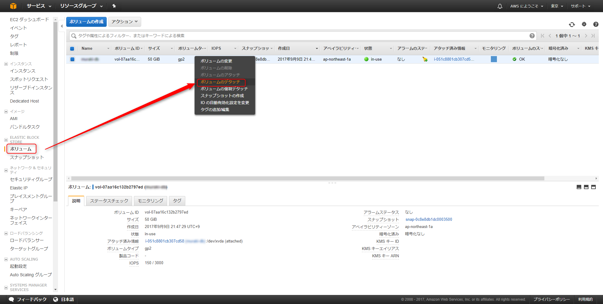
↓
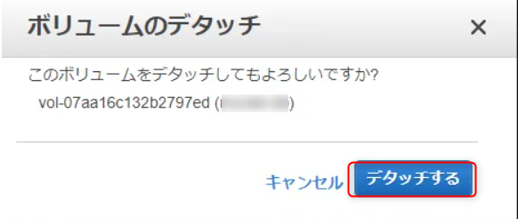

1. スナップショットメニューへ移動し、採取したスナップショットを選択し右クリックから**create volume**を選択する。
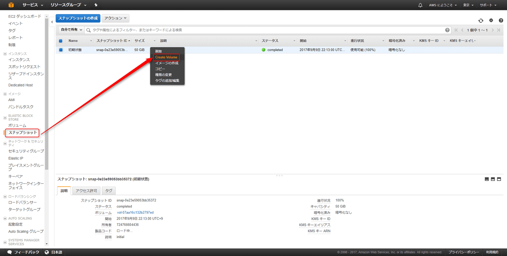

1. アベイラビリティーゾーンを前項と同じものになっているか確認し**Create Volume**を選択する。
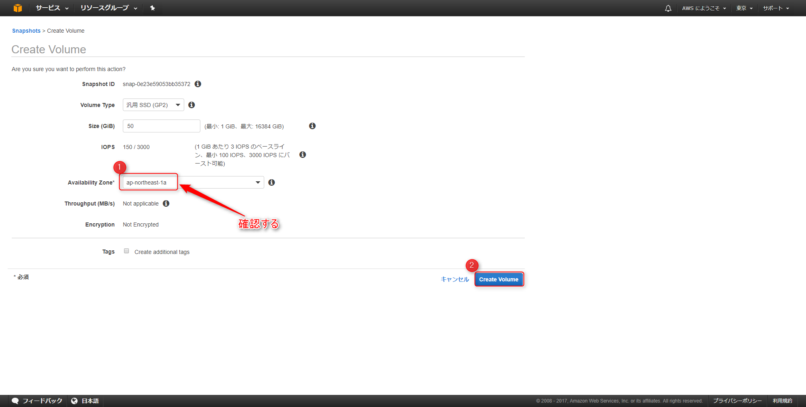
↓
作成されたvolume idをメモする。
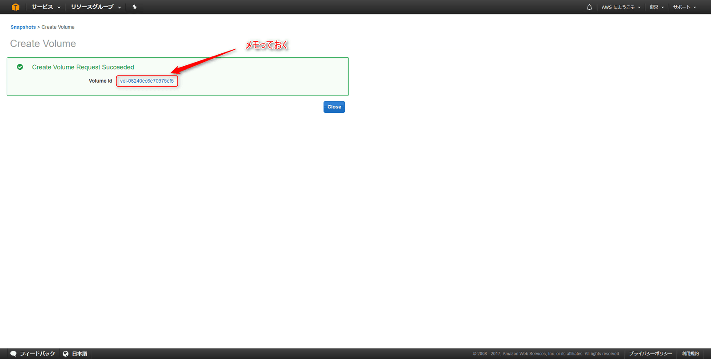

1. ボリュームメニューへ移動し、スナップショットから作成されたvolumeを確認し、右クリックから**ボリュームのアタッチ**を選択する。
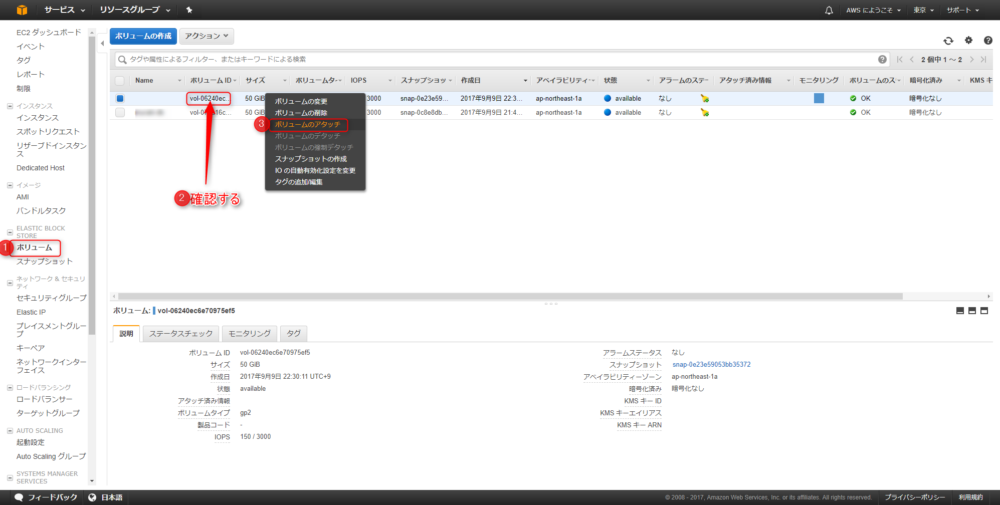

1. インスタンスを選択し、デバイスのパスを正しく入力し、**アタッチ**を選択する。
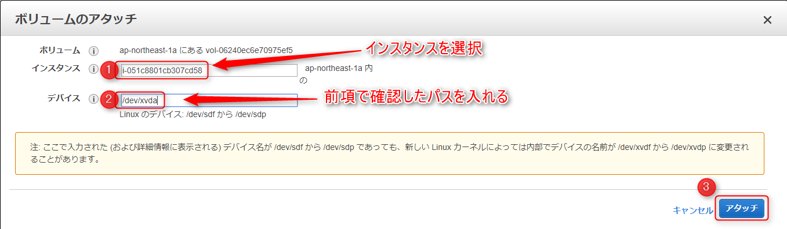
**※デバイスのパスが誤っているとインスタンス起動時に失敗する。**

1. インスタンスを起動する。

## 復元後の確認

1. 作成した snapshot-test.txt というファイルがないことを確認
```
[ec2-user@ip- ~]$ ls
[ec2-user@ip- ~]$
```

無事、元に戻りました。

## あとがき

復元手順は VMWare や Hyper-V よりは少し手間がかかるな、というのが正直な感想ですがとても便利に使っています。

スナップショットは便利な機能ですが、運用中のバックアップもしっかり取得するようにしましょう。

それでは次回の記事でお会いしましょう。