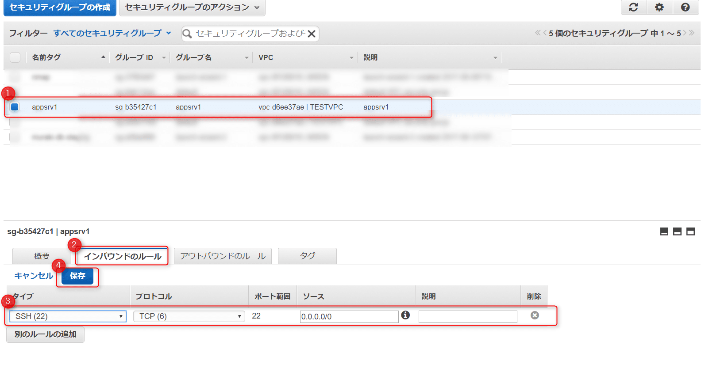
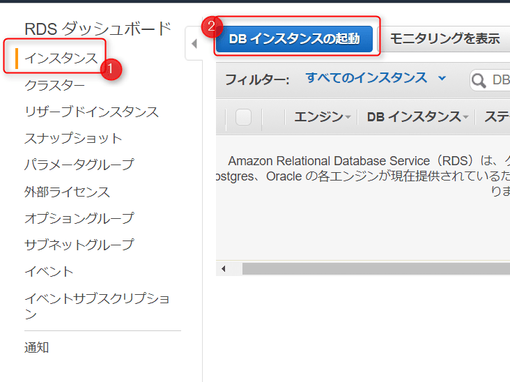
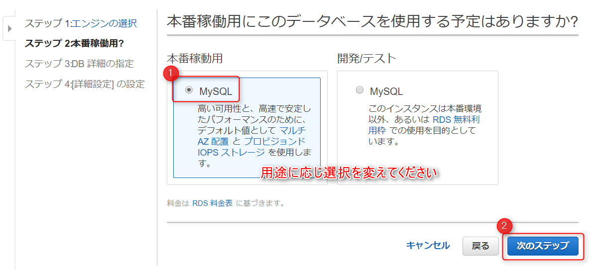
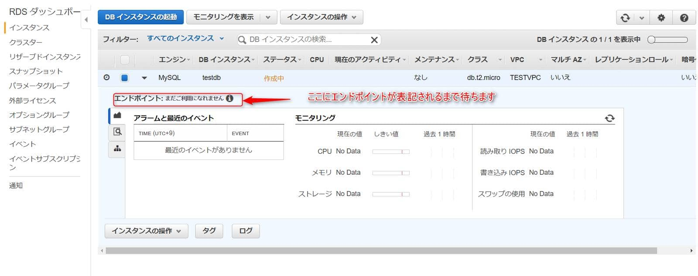
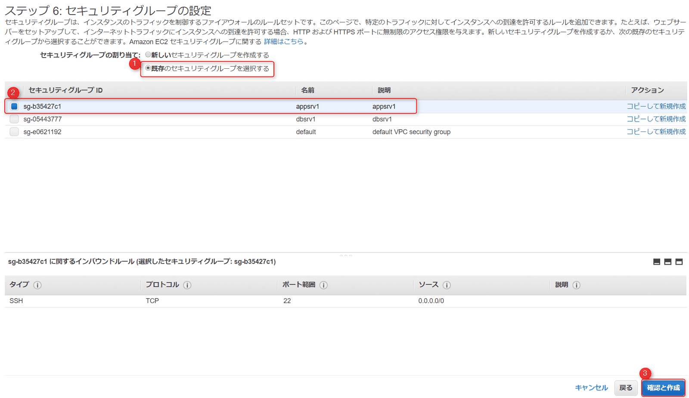
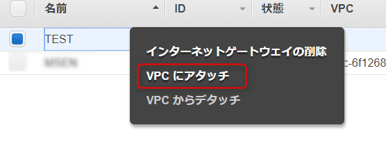

こんにちは。

今回は、AWS上のEC2からRDSを使う方法を紹介します。

RDSはタイトルでも記載したとおり、"Relational Database Service" でデータベース専用のインスタンスです。

よくあるDBサーバーの構築では、CentOSなどのOSをインストールし、OS上にMySQLをインストールし、ユーザーを作って・・・、という準備作業がいくつもありますが、RDSではこれらの構築を管理コンソール上から行います。

Amazonの[チュートリアル](http://docs.aws.amazon.com/ja_jp/AmazonRDS/latest/UserGuide/CHAP_Tutorials.WebServerDB.CreateVPC.html)を参考に、外部からアクセスできるWebサーバーのためのパブリックサブネットと、外部からアクセスできないDBサーバーのためのプライベートサブネットというケースで構築していきます。


## 環境

### VPC
TESTVPC:172.2.0.0/16

### サブネット
Webサーバー用:172.2.1.0/24（アベイラビリティーゾーン：us-east-1a）
DBサーバー用:172.2.2.0/24（アベイラビリティーゾーン：us-east-1a）

### セキュリティグループ
Webサーバー用：appsrv1
DBサーバー用：dbsrv1 

## 構築の流れ

構築の流れは以下のとおりです。
**AWSのアカウントがあり、管理コンソールにログインできることを前提とします。**

1. VPC を作成する
1. VPC 上にサブネットを2つ作る
1. セキュリティグループを2つ作る
1. DBサブネットグループを作る
1. DBインスタンスを作る(今回はMySQLとします）
1. EC2インスタンスを作る
1. EC2からRDSに接続してみる

リージョンは**バージニア北部**としています。
それでは、構築していきましょう。

## VPCを作成する

`TESTVPC` という名前で、`172.2.0.0/16` のVPCを作成します。


VPCができました。


## VPC 上にサブネットを2つ作る

Webサーバー用のサブネットと、DBサーバー用のサブネットを作成します。

Webサーバー用：172.2.1.0/24 アベイラビリティーゾーン us-east-1a
DBサーバー用：172.2.2.0/24  アベイラビリティーゾーン us-east-1b 
とします。

それぞれ以下のように作成します。


サブネットが2つできました。


## セキュリティグループを2つ作る

外部からWebサーバーにアクセスするためのセキュリティグループと、WebサーバーからDBサーバーに接続するセキュリティグループを作成します。

まずは、Webサーバー用のセキュリティグループ　**appsrv1** を作成します。


セキュリティグループに対して、インバウンドの許可を追加します。ここではSSHのみを許可しています。


続けてDBサーバー用のセキュリティグループ **dbsrv1** を作成します。


セキュリティグループに対して、インバウンドの許可を追加します。
Webサーバーからの接続を許可するために、直前に作成したWebサーバー用のセキュリティグループをソースに指定します。


## DBサブネットグループを作る

続けて、DBサブネットグループを作成します。
管理コンソールのメニューからRDSに進みます。

サブネットグループからDBサブネットグループの作成へ進みます。


先ほど作成した2つのサブネットを指定して作成します。


## DBインスタンスを作る

いよいよ、RDSインスタンスを作成します。
インスタンスのMySQLバージョンや、クラス(性能)等については構築するシステムに応じて決定します。

同じRDSメニューから、インスタンス→DBインスタンスの起動と進みます。


以下を参考にインスタンスを作成します。





作成がはじまります。

エンドポイントが表示されるまで待ちます。
エンドポイントはWebサーバーからDBに接続するためのホスト名になります。



エンドポイントが表示されました。


**このエンドポイントの値は後述の接続確認で利用します。**

## EC2インスタンスを作る

EC2作成の手順は関連部分のみとしておりますが、管理コンソールのサービスから、EC2→インスタンス→インスタンスの作成へ進みます。
この記事ではAmazonLinuxを作成しています。

前項までに作成したサブネット、セキュリティを適用しEC2インスタンスを作成します。




外部からアクセスするために、ElasticIPの割り当ても忘れず行いましょう。

## EC2からRDSに接続してみる

では、いよいよEC2インスタンスからRDSインスタンスに作成したデータベースに接続していきましょう。

その前に・・・この手順では作成したVPCのルートテーブルに外部からアクセスするためのインターネットゲートウェイがアタッチされていないことが分かったので、VPCを再度調整します。

VPCメニューから、インターネットゲートウェイを作成します。
ここではTESTという名前で作成しています。


作成されたインターネットゲートウェイを右クリックし、VPCにアタッチします。




ルートテーブルに移動し、TESTVPCに割り当てられているルートテーブルを編集し、作成したインターネットゲートウェイを追加します。
送信先は、全てを示す**0.0.0.0/0**とします。


これでEC2に接続する準備が整いました。


では、仕切り直して接続確認に進みます。


EC2にログインし、MySQLクライアント をインストールします。
コマンドは以下のとおりです。
`[root@ip-172-2-1-30 ~]# yum -y install mysql`

DBインスタンスの作成で確認したエンドポイントを元にRDSに接続します。
コマンドは以下のとおりです。(xxxxx部分はマスクしています)

`[root@ip-172-2-1-30 ~]# mysql -u test -h testdb.xxxxxxxxxx.us-east-1.rds.amazonaws.com -p`

パスワードを入力すると、無事ログインできました！

```
Enter password:
Welcome to the MySQL monitor.  Commands end with ; or \g.
Your MySQL connection id is 13
Server version: 5.7.19-log MySQL Community Server (GPL)

Copyright (c) 2000, 2017, Oracle and/or its affiliates. All rights reserved.

Oracle is a registered trademark of Oracle Corporation and/or its
affiliates. Other names may be trademarks of their respective
owners.

Type 'help;' or '\h' for help. Type '\c' to clear the current input statement.

mysql>
```

指定したDBが出来ているか確認してみます。

```
mysql> show databases;
+--------------------+
| Database           |
+--------------------+
| information_schema |
| innodb             |
| mysql              |
| performance_schema |
| sys                |
| test               |
+--------------------+
6 rows in set (0.00 sec)

mysql>
```

**test** が出来てますね！

## あとがき

EC2インスタンスを1つ構築し、同じインスタンスにDBサーバーを構築するほうがAWSのコスト的には優位なのは間違いないですが、
RDSインスタンスと分けることで、**耐障害性UP**や、**システム拡張性UP**、**導入速度UP**などが考えられると思います。

弊社もまだRDSは使いたてなので、コスト面が一番気になっておりますが、このあたりは別の記事で公開出来ればと思います。

それでは、次回の記事でお会いしましょう。