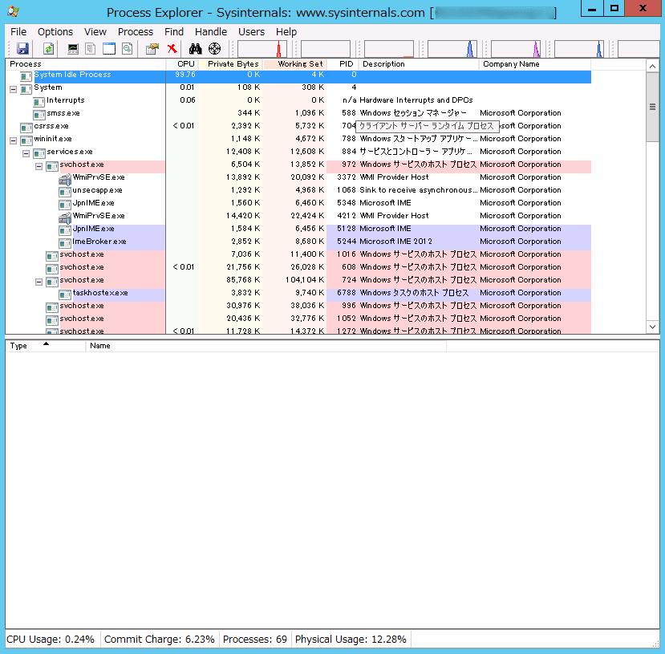
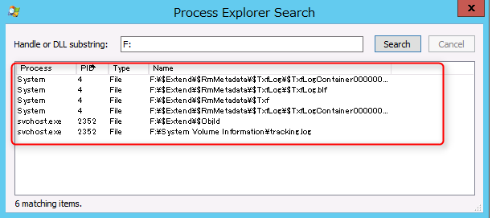
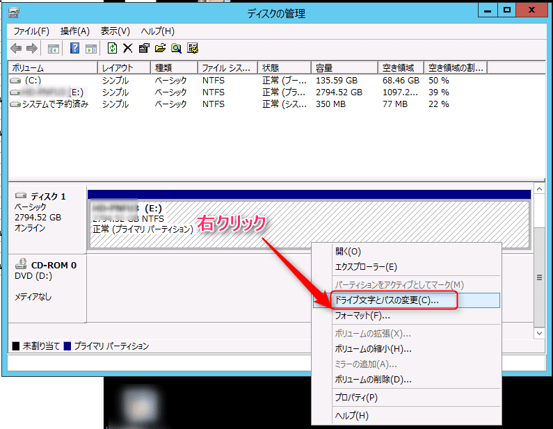

こんにちは。

先日、バックアップ領域をiSCSIマウントしている環境で諸事情で切断する必要がありiSCSIイニシエーターから実施するとエラーになりました。

<a href="images/issue-with-iscsi-unmounting-1.png"></a>

バックアップタスクも走っていないし、いったい何が使ってるのだ・・・。
運用中なので再起動できないし・・・。

ということで、該当ドライブを利用しているプロセスを特定します。
今回、ドライブレターは **F:** です。

## プロセスを特定する

Microsoftのツールである、**ProcessExplorer** を利用して特定します。

1. Process Explorerをダウンロード
[https://technet.microsoft.com/en-us/sysinternals/processexplorer.aspx](https://technet.microsoft.com/en-us/sysinternals/processexplorer.aspx)

<a href="images/issue-with-iscsi-unmounting-2.png"></a>

1. ダウンロードした圧縮ファイルを任意の場所に解凍します。

1. 解凍したフォルダから、procexp.exe を実行します。（64ビット環境の場合、procexp64.exeを実行します。）
<a href="images/issue-with-iscsi-unmounting-3.png"></a>

1. Findメニューから検索ウィンドウを起動します。
<a href="images/issue-with-iscsi-unmounting-4.png"></a>
<a href="images/issue-with-iscsi-unmounting-5.png"></a>

1. F: と検索するドライブを入力しSearchを実行します。
<a href="images/issue-with-iscsi-unmounting-6.png"></a>
結果が表示されます。
<a href="images/issue-with-iscsi-unmounting-7.png"></a>

1. 上記の結果から、問題を特定します。
svchost.exe によってロックされている以下の 2 つのファイルについては、「Distributed Link Tracking Client」サービスによって利用されているファイルであり、こちらがセッション切断の阻害要因になっている可能性があると判断しました。
**F:\$Extend\$Objld**
**F:\System Volume Information\tracking.log**

1. Distributed Link Tracking Clientサービスを停止します。
<a href="images/issue-with-iscsi-unmounting-8.png"></a>

1. 再度Pocess Explorer で検索をかけます。
<a href="images/issue-with-iscsi-unmounting-9.png"></a>
**F:\$Extend\$Objld**
**F:\System Volume Information\tracking.log**
上記2つが消えていることが確認できます。

1. 再度iSCSIイニシエーターより切断を実施します。
<a href="images/issue-with-iscsi-unmounting-10.png"></a>
<a href="images/issue-with-iscsi-unmounting-11.png"></a>
おっと・・・まだだめか・・・。
<a href="images/issue-with-iscsi-unmounting-12.png"></a>

1. 続いて、最後の手段、ボリュームを強制的にアンマウントします。
  コマンドプロンプトを開き、`mountvol F: /P` を入力します。
  **F:**の部分は、ドライブレターです。
  ```
  >mountvol F: /P
  ボリュームはまだ使用中です。強制マウント解除を発行しましたが、ボリュームへの現在
  のハンドラーは無効です。
  ```
1. 再度iSCSIイニシエーターより切断を実施します。
成功しました！
<a href="images/issue-with-iscsi-unmounting-13.png"></a>

1. 切断したターゲットの再接続時に注意
前項まででiSCSIターゲットは無事切断できたのですが、今回はこの後に同じターゲットを接続しました。
このとき、注意が2点あります。
1点目は、**6**で記載した、Distributed Link Tracking Clientサービスを開始してください。
2点目は、同じターゲットに接続したとき、こちらで実施し確認した限りではドライブレターの割り当てが解除されていました。
そのため、ディスクの管理から元のドライブレター（今回は**F**)を割り当ててください。
**以下は参考画像でドライブレターが割り当たっています。**
<a href="images/issue-with-iscsi-unmounting-14.png"></a>

## あとがき
本記事を書くまでに実は1週間以上かかっています。

調査→実施→NG→調査→実施、とまさにトライ＆エラーでした。。

1人でも多くの方の参考になれば嬉しいです。

それでは次回の記事でお会いしましょう。