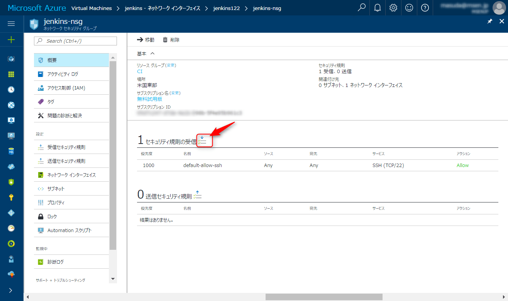
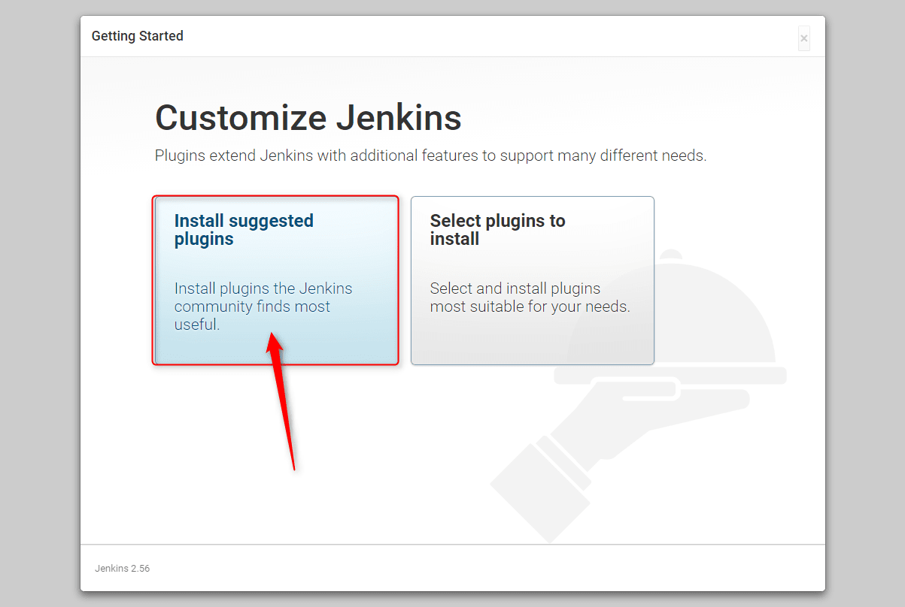

こんにちは。

今回は、以前紹介した**Microsoft Azure上のCentOS7にJenkins**を構築します。
[前回の記事はこちら](/centos7-on-microsoft-azure/)です。

## 事前準備

Jenkinsは標準で**8080/TCP** で待ち受けるため、Azure上の設定を変更します。

1. 仮想マシンの概要から**ネットワークインターフェース**を選択します。


1. セキュリティグループを選択します。


1. ネットワークセキュリティグループを選択します。


1. 受信設定を追加します。

↓


1. 追加されたら事前準備完了です。


## jenkins のインストール

CentOS7にSSHで接続し、Jenkinsのインストールを実施します。
以下の手順は **root** で実行します。

1. Javaのインストール
`yum -y install ava-1.8.0-openjdk java-1.8.0-openjdk-devel`

1. リポジトリのダウンロード
`wget -O /etc/yum.repos.d/jenkins.repo https://pkg.jenkins.io/redhat/jenkins.repo`

1. GPG公開鍵のインストール
`rpm --import https://pkg.jenkins.io/redhat/jenkins.io.key`

1. Jenkins本体のインストール
`yum -y install jenkins`

1. Jenkinsの起動と有効化
`systemctl start jenkins.service`
`systemctl enable jenkins.service`

1. オンプレミス環境の場合はポートを開放（今回はAzure上のため不要）
`firewall-cmd --permanent --add-port=8080/tcp --zone=public`
`firewall-cmd --reload`
起動していない場合は以下も必要。
`systemctl start firewalld`
`systemctl enable firewalld`

以上で構築は完了です。とても簡単ですね。

一気にいきたい方は以下のコマンドをコピー＆ペーストしてください。

**【Azure】**
```
yum -y install ava-1.8.0-openjdk java-1.8.0-openjdk-devel
wget -O /etc/yum.repos.d/jenkins.repo https://pkg.jenkins.io/redhat/jenkins.repo
rpm --import https://pkg.jenkins.io/redhat/jenkins.io.key
yum -y install jenkins
systemctl start jenkins.service
systemctl enable jenkins.service
```

**【オンプレミス】**
```
yum -y install ava-1.8.0-openjdk java-1.8.0-openjdk-devel
wget -O /etc/yum.repos.d/jenkins.repo https://pkg.jenkins.io/redhat/jenkins.repo
rpm --import https://pkg.jenkins.io/redhat/jenkins.io.key
yum -y install jenkins
systemctl start jenkins.service
systemctl enable jenkins.service
systemctl start firewalld
systemctl enable firewalld
firewall-cmd --permanent --add-port=8080/tcp --zone=public
firewall-cmd --reload
```

## Jenkinsの開始

1. `http://IPアドレス:8080`　にアクセスします。


1. JenkinsをUnlockします。
コンソール上から、`cat /var/lib/jenkins/secrets/initialAdminPassword`でUnlockパスワードを表示させ、Web画面にコピー＆ペーストします。


1. **Install suggested plugins** を選択します。


1. 必要項目を入力し、管理者アカウントを確定します。


1. Jenkinsを開始します。


1. ログインできました。


## SSL化

**HTTP:8080/TCP**で待ち受けているJenkinsを**HTTPS:443/TCPのみ**接続できるように変更します。

Nginxをインストールし、リバースプロキシとして動作させ、443/TCPでやってきた通信をJenkinsの8080/TCPにプロキシします。
サーバーのファイアウォールは、80/TCPと443/TCPを解放し、80/TCPできた通信は強制的に443にリダイレクトする設定も併せて行います。

事前に、SSL証明書を`/etc/nginx/example.cert`と`/etc/nginx/example.key`へ配置します。
nginxの証明書は証明書＋中間証明書の形式となります。

1. nginxのインストールと有効化
```
 rpm -ivh http://nginx.org/packages/centos/7/noarch/RPMS/nginx-release-centos-7-0.el7.ngx.noarch.rpm
yum -y --enablerepo=nginx install nginx
systemctl start nginx
systemctl enable nginx
```

1. 証明書ファイルのパーミッション
```
chmod 600 /etc/nginx/example.cert
chmod 400 /etc/nginx/example.key
```

1. リバースプロキシ設定
標準の設定ファイルをリネームし、リバースプロキシ用のコンフィグを作成します。
```
mv /etc/nginx/conf.d/default.conf{,.org}
vi /etc/nginx/conf.d/ssl.conf
```
ssl.confの例は以下のとおりです。

```
 > server {
    listen 80;
    server_name jenkins.example.com;
    return 301 https://$host$request_uri;
}
server {
        server_name jenkins.example.com;
        listen 443;
        ssl on;
        ssl_certificate      /etc/nginx/example.cert;
        ssl_certificate_key  /etc/nginx/example.key;
        ssl_protocols TLSv1.2;
        ssl_prefer_server_ciphers on;
        ssl_ciphers  'ECDH !aNULL !eNULL !SSLv2 !SSLv3';
        add_header  Strict-Transport-Security "max-age=31536000; includeSubdomains";
        ssl_session_cache shared:SSL:10m;
        ssl_session_timeout  10m;
        location / {
                proxy_redirect off;
                proxy_set_header Host $http_host;
                proxy_set_header X-Real-IP $remote_addr;
                proxy_set_header X-Forwarded-For $proxy_add_x_forwarded_for;
                proxy_set_header X-Forwarded-Proto $scheme;
                client_body_buffer_size 128k;
                proxy_connect_timeout 120;
                proxy_send_timeout 120;
                proxy_read_timeout 120;
                proxy_buffer_size 4k;
                proxy_buffers 4 32k;
                proxy_busy_buffers_size 64k;
                proxy_temp_file_write_size 64k;
                error_log  /var/log/nginx/jenkins_error.log warn;
                access_log  /var/log/nginx/jenkins_access.log  main;
                proxy_pass http://127.0.0.1:8080;
        }
}
```

1. 設定の反映
`systemctl restart nginx`

1. 管理ユーザーでログインし、**Jenkinsの管理**を選択します。


1. 続けて**システムの設定**へ進みます。


1. **Jenkinsの位置**の**Jenkins URLの設定**を`https://jenkins.example.com`に変更し、最後に保存します。


1. SELINUXの無効化
上記までの設定で接続できるはずが・・・Bad Gatewayとなってしまいました。

`/var/log/nginx/jenkins_error.log`のエラーログを確認すると、`127.0.0.1:8080 failed (13: Permission denied) while connecting to upstream`というエラーが出ていました。
事例を見ると、どうもSELINUXが有効の際に出るようで、設定を無効にして再起動します。
今回はこの対処としましたが、SELINUXを無効にせず対処できる方法があれば是非教えてください。
```
sed -i -e 's/SELINUX\=enforcing/SELINUX\=disabled/g' /etc/selinux/config
reboot
```

無事、接続することができました。

## あとがき

今回紹介させていただいたように、とても簡単にJenkins環境が構築できます。
オンプレミス環境の場合も利用できる手順となっております。

SELINUXは少しはまりました・・・。

今回はセキュリティ向上を目的に、443/TCPのみで接続できる方法も併せて実施しましたので、SSLテストの判定結果は**A**でした。

[SSL Server TestでのSSLサイト評価](https://www.ssllabs.com/ssltest/)

皆さまの参考になれば幸いです。
それでは次回の記事でお会いしましょう。

