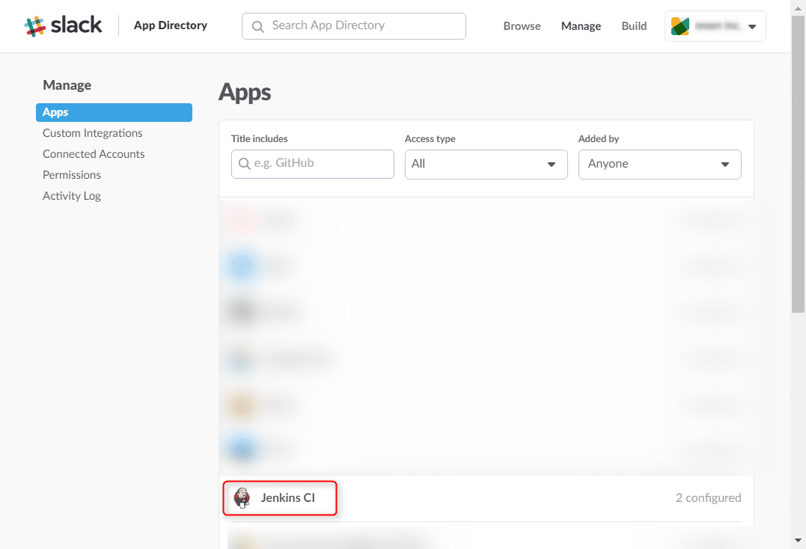
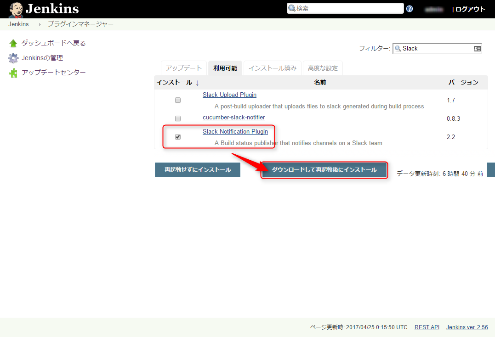
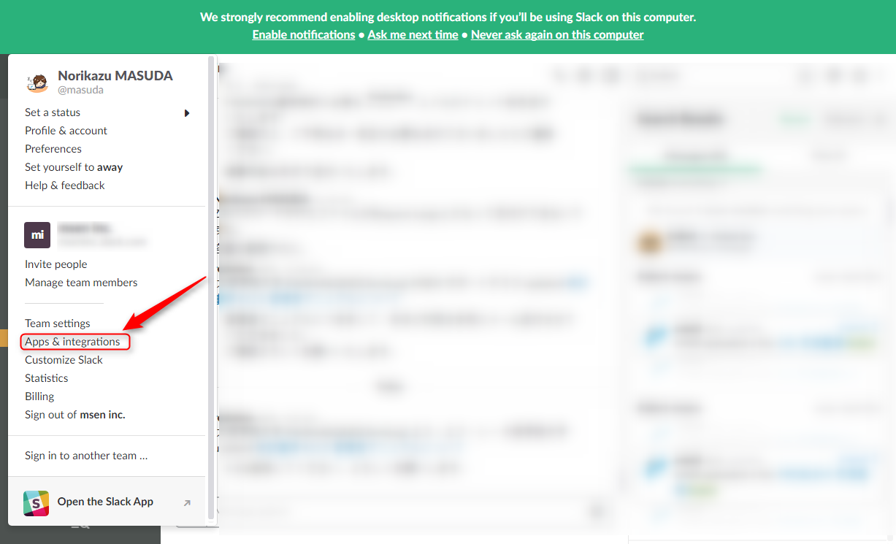
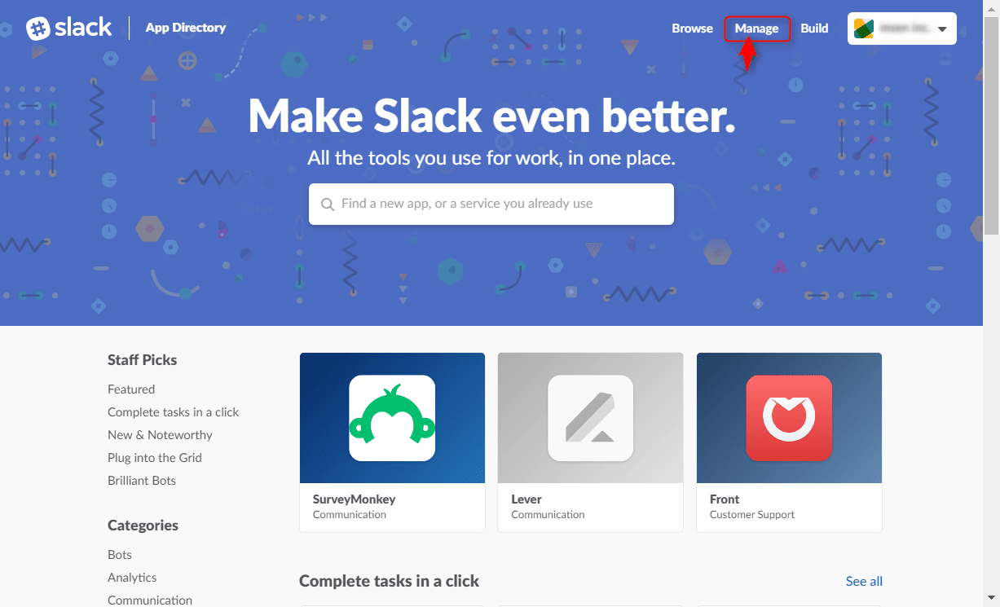
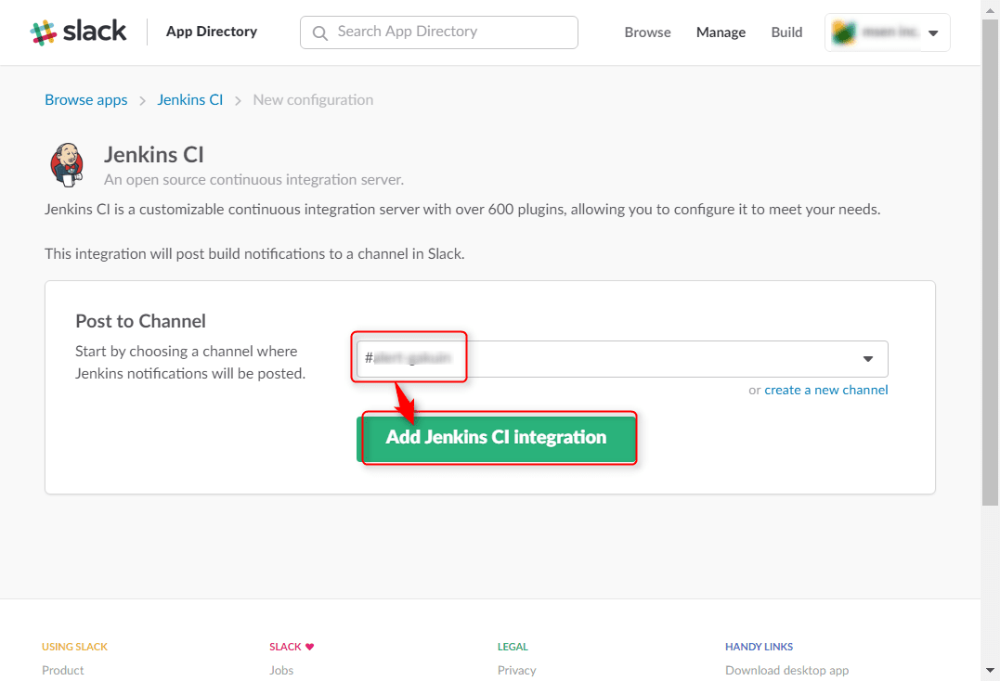
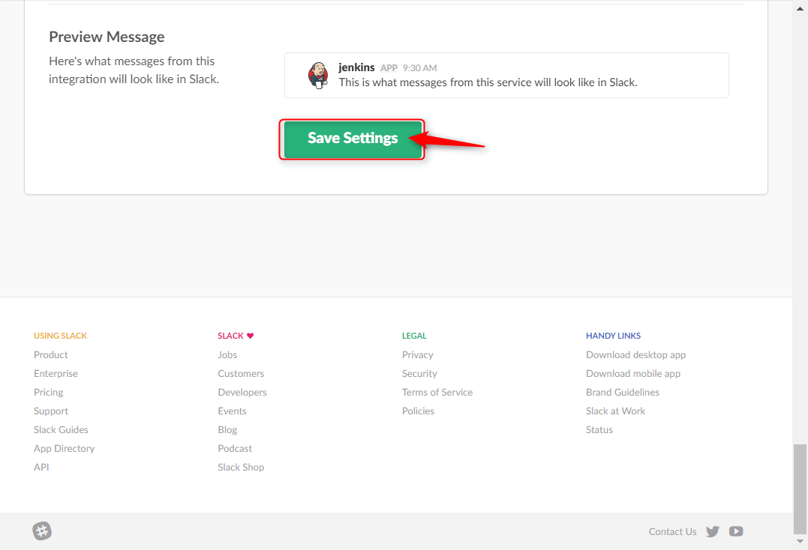
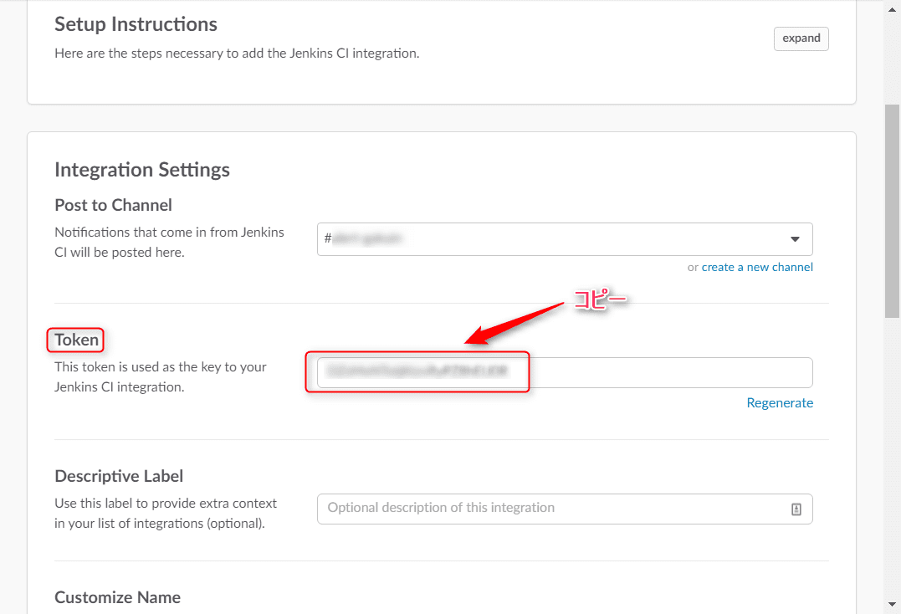
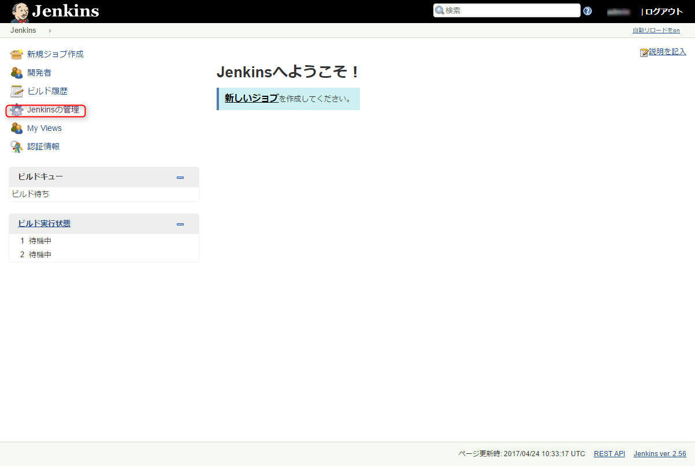
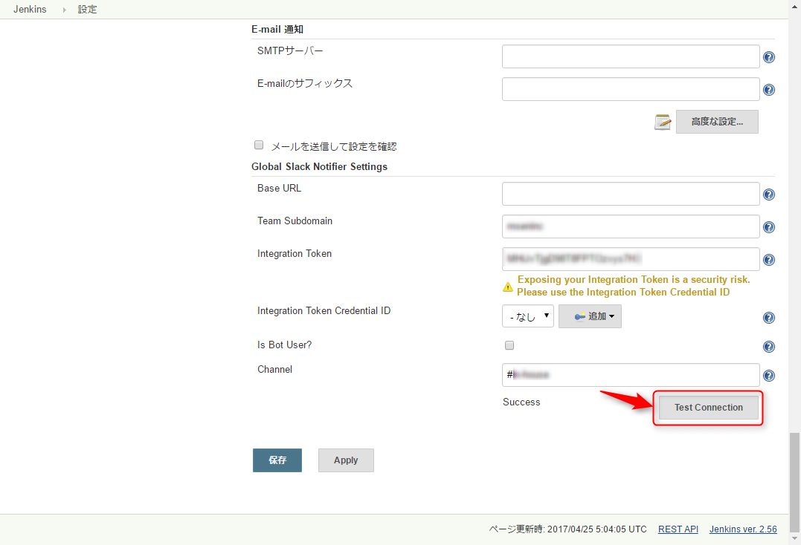
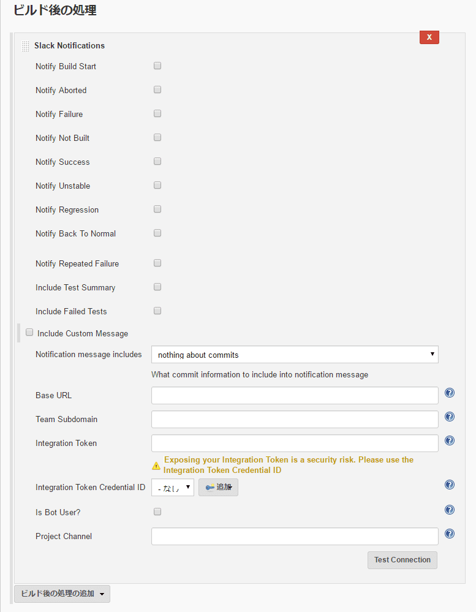

こんにちは。

今回はJenkinsとSlackを連携する方法を紹介します。

* 関連する記事：[Azure上のCentOS7にJenkinsを構築](https://mseeeen.msen.jp/jenkins-on-centos7-on-microsoft-azure)

## 前提状況

1. SlackにAPPsからJenkins CIがインストールされていること
<a href="images/link-jenkins-and-slack-1.png"></a>
1. Jenkinsにプラグインマネージャーから**Slack Notification Plugin**がインストールされていること
<a href="images/link-jenkins-and-slack-2.png"></a>

## Slack側

1. ブラウザからチームにログインし、左上のチーム名をクリックしメニューを出します。メニューから**Apps & integrations** を選択します。
<a href="images/link-jenkins-and-slack-3.png"></a>

1. **Manage** を選択します。
<a href="images/link-jenkins-and-slack-4.png"></a>

1. Apps から**Jenkins CI**を選択します。
<a href="images/link-jenkins-and-slack-5.png"></a>

1. **Add Configuration**から連携するチャンネルを選択し**Add Jenkins CI integration**を選択します。次の画面ではスクロースした先の**Save Setings**を選択します。
<a href="images/link-jenkins-and-slack-6.png"></a>
↓
<a href="images/link-jenkins-and-slack-7.png"></a>

1. 次の画面で表示された中から、**Token**をコピーします。
<a href="images/link-jenkins-and-slack-8.png"></a>

Slack側は以上で完了です。

## Jenkins側

1. 管理ユーザーでログインし、**Jenkinsの管理**を選択します。
<a href="images/link-jenkins-and-slack-9.png"></a>

1. 続けて**システムの設定**へ進みます。
<a href="images/link-jenkins-and-slack-10.png"></a>

1. スクロールし最下行付近に**Global Slack Notifier Settings**があります。各項目を入力します。
 ```
Team Subdomain=チーム名
Integration Token=Slackの項でコピーしたTokenを貼り付けます
Channel=投稿するチャンネルを # から指定します
 ```
Channel部分に指定するチャンネルは、Token作成時に指定したチャンネル以外でも可能です。
入力後、**Test Connection**を押して連携を確認します。
<a href="images/link-jenkins-and-slack-11.png"></a>
届いていることを確認します。
<a href="images/link-jenkins-and-slack-12.png"></a>

最後に保存します。
Jenkins側の基本設定は完了です。

## Githubと連携する準備

Githubと連携するために、必要な作業を実施します。
作業はJenkinsが動作しているサーバー上で行います。

1. 開発ツールのインストール。
SSH接続し、`root`ユーザーで`Git`をインストールするために開発ツールを事前にインストールします。
`yum groupinstall "Development Tools"`
`yum install curl-devel zlib-devel expat-devel perl-ExtUtils-MakeMaker`

1. Gitインストール
以下の流れでGitをインストールします。最新をインストールするためにソースからインストールしています。
 ```
wget "https://www.kernel.org/pub/software/scm/git/git-2.12.2.tar.gz"
tar xvfz git-2.12.2.tar.gz
cd git-2.12.2/
./configure --prefix=/usr/local
make
make install
 ```
バージョンが`2.12.2`とでればOKです。
 ```
git --version
git version 2.12.2
 ```

以上でGitのインストールが完了です。

## あとがき

Slackの連携は、Jenkinsのジョブを作成しビルド後の処理で設定することができます。
ビルド結果を指定したSlackのチャンネルに通知してくれる流れです。

<a href="images/link-jenkins-and-slack-13.png"></a>

それぞれ設定の参考になれば幸いです。
それでは、次回の記事でお会いしましょう。