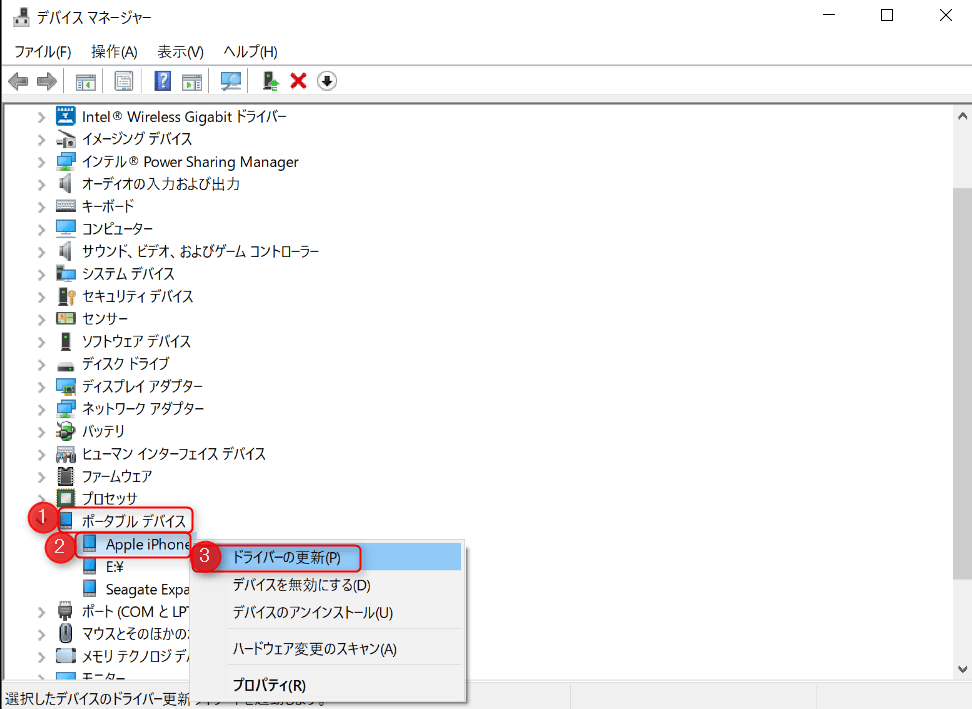
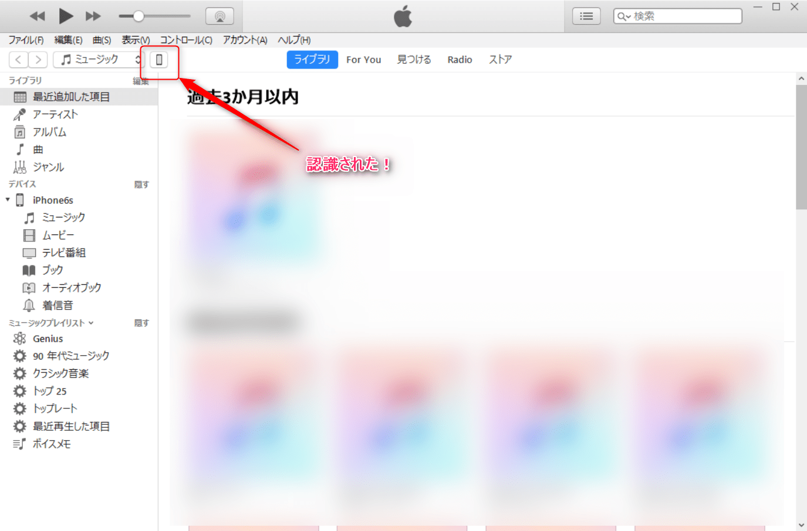

こんにちは。

今回は、iTunes を`12.6.1.25`に上げると今まで接続できていたiPhone・iPodが接続できなくなる事態になりましたので解決策を紹介します。

対象はWindows 10です。

## 解決策

Appleの公式に掲載されている方法を元に実施しました。
>[https://support.apple.com/ja-jp/HT204095](https://support.apple.com/ja-jp/HT204095)

1. iTunes を閉じる
1. デバイスマネージャーを開く
1. ポータブルデバイス→Apple iPhoneと進み右クリックからドライバーの更新を選択

1. コンピューターを参照してドライバソフトを検索を選択

1. 次の場所でドライバーを検索します：テキストボックスに`C:\Program Files\Common Files\Apple\Mobile Device Support\Drivers`と入力し、進む

1. ドライバが更新され完了する

1. iTUnesが開かれ認識されていることを確認

## あとがき

私自身はAndroidユーザーなのですが、身内の画面が割れたことで修理が必要になりバックアップしました。

普段iTunesを頻繁に利用しないこともあり、開くたびにアップデートされている気がします。
アップデートはいいのですが、アップデート後に再起動が必要になるのがちょっと辛いです。。

少しでもお役にたてる記事であれば嬉しいです。

それでは次回の記事でお会いしましょう。