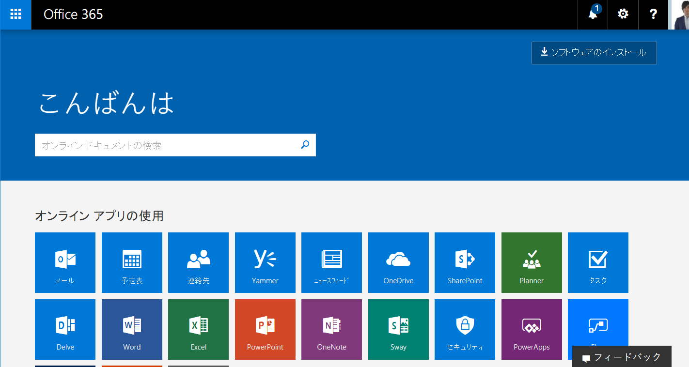
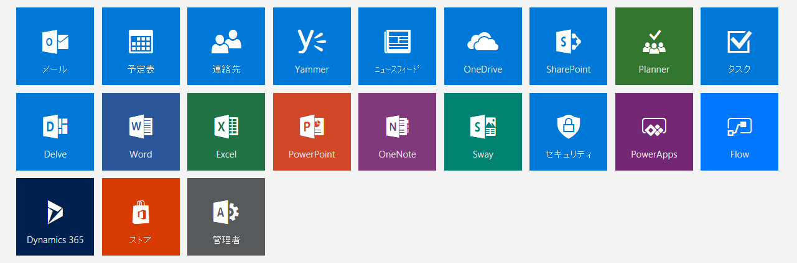

こんにちは。

タイトルが少々長くなってしまいましたが、Microsoft Office365にログインするとうまくログインできず、真っ白画面のまま無限ループになることがあります。

再起動したり、ブラウザのキャッシュを削除したりと色々やっていたのですが、そこまでしなくても解消する方法がありました。

## 現象

現象は以下のとおりです。

1. ログインします。

2. 以下のような真っ白な画面で無限ループしてしまいます。

## 解決策

1. 先に https://login.microsoftonline.com/ をコピーしておきます。
2. ブラウザーのアドレスバーで URL を全選択し、**瞬時に ↑ の URL を貼り付けて、Enter！**します。

この2の工程はゆっくり選択していると勝手に更新され選択が解除されてしまうため、瞬時に行う必要があります。

瞬速で行うためにショートカットキーを駆使します。 **Ctrl + L → Ctrl + V → Enter !!!**

私はいつも上記の方法で解決していますが、もしかしたら解決しない場合があるかもしれません・・・。

## あとがき
Office365はその機能をどんどん増やしています。
執筆時に確認すると、以下のサービスを提供していました。

すごい数ですよね・・・。
弊社もせっかく契約しているのだからと、色々使ってみては社内で議論しています。

ところで、Office365 の意味はご存じでしょうか。

>1年間365日、Microsoftがサポートし、提供するサービスであるという意味を込めた

だそうです。
私は、以前までいっぱい使えるサービスがあるから、すべての角度で、という意味の　**360°** だと思っていました(笑)

ご覧いただきありがとうございました。
それでは、次回の記事でお会いしましょう。