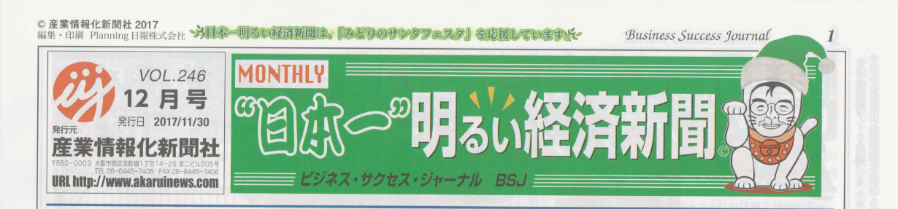
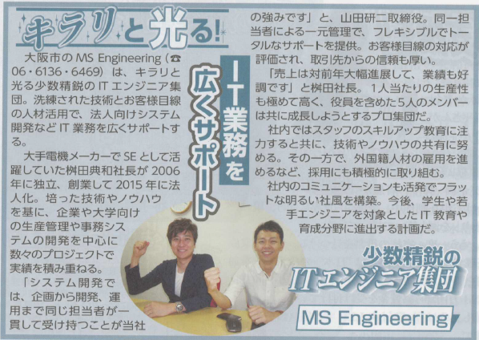

こんにちは。

突然ですが、 **日本一明るい経済新聞** という新聞をご存じでしょうか？

ホームページからの引用になりますが、日本一明るい経済新聞は、フジサンケイグループの日本工業新聞社（現サンケイビジネスアイ）で、約３０年間記者活動された竹原信夫さんが編集長を務め、中小企業をメインに明るいニュースを紙面にされている新聞です。

[竹原編集長の日本一明るい経済新聞 - 日本一明るい経済新聞と竹原編集長](http://www.akaruinews.com/modules/s_pages/index.php?content_id=1)

竹原さんは、本誌の編集長だけではなく、ラジオ番組をもたれていたり、セミナーも開催したりととてもバイタリティあふれる方です。

先日、本誌掲載のお話をいただき取締役の山田と共に取材していただきました。

その記事が12月号に掲載となりました！

※取材のタイミングがまだ社名変更前だったため、MS Engineeringとなっております。

取材していただくという普段はできない経験をさせていただき、またこのように新聞という紙面になると嬉しさが倍増です！

今後も取り上げていただけるような活動を頑張っていきたいと思います！

最後になりましたが、取材をいただいた **BS企画の浦上さん** 、掲載に向けて各調整してくれた **日本生命の村川さん**　本当にありがとうございました。