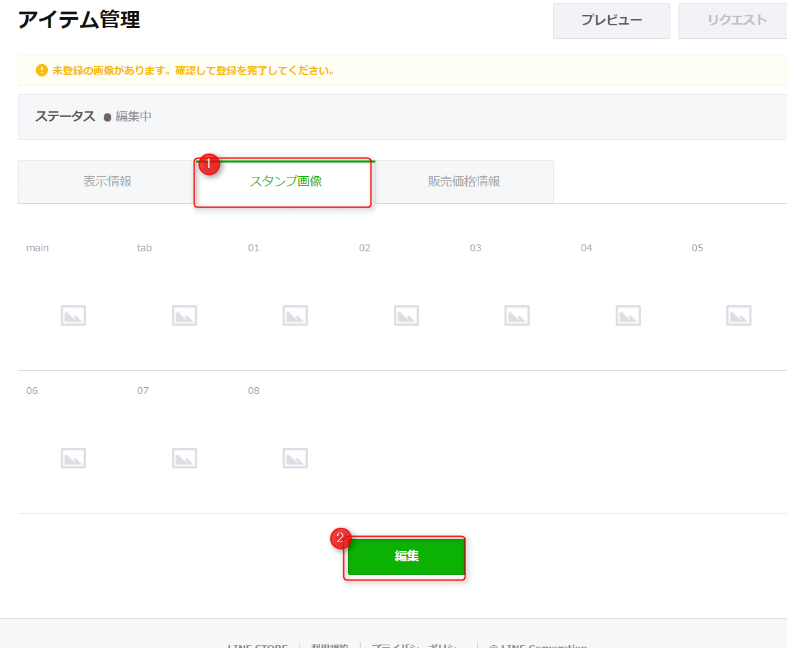

こんにちは。

この1年ほど密かに進めてきた、**社長LINEスタンプ**がいよいよ**審査中**となりました。
リジェクト（拒否）されなければ近日中にお披露目になります！

クリエイターズスタンプを購入されている方も多いと思いますが、**どうやって登録するの？**と思ったかたもおられると思いますので今回登録までに実施した流れを紹介したいと思います。

## スタンプ登録までの流れ

1. LINEアカウントを登録する
クリエイターズスタンプを登録しようとする方がLINEを使っていないということもないとは思いますが、LINEを使える状態になっていることが必須です。また、設定でメールアドレスを登録します。セキュリティ対策には十分注意してください。（参考画像はPC利用の設定画面です）

1. クリエイターズ登録をする
[ここから](https://creator.line.me/ja/)クリエイターズページに進み、マイページからログインし、クリエイターズ登録をします。

1. スタンプを作成します。
弊社は、スタンプ作成専門業者に依頼しましたが、LINEスタンプを作る方法などの書籍は多数販売されておりますので自分にあった方法でスタンプを作成します。

1. 審査に出す
2のクリエイターズページにログインし、新規登録から順に進めます。以下に画像を使って流れを紹介します。

**新規登録を進める**

**登録画面を進める**
スタンプ詳細で、日本語の説明ができるように追加します。

英字と日本語の説明を追加します。英語は全角が含まないように注意してください。

**クリエイター情報とライセンス証明を登録する**
クリエイターの情報と、カテゴリを登録します。また、写真を利用している場合は著作権の観点で利用してよいことを証明する書類を添付する必要があるようです。弊社の登録では写真を利用しないため**スタンプに写真を利用していません**をチェックして進みます。

**以下のようなテスト的な記述で保存**

保存を押すと、Chromeでは以下のように**ページを離れていいか？**と聞かれますが**OK**で進みます。

無事保存できました。

続いてスタンプを登録します。

登録するスタンプの枚数を変更し、ZIPでアップロードします。ファイルの中身は、`01.png～40.png` というファイル名で準備し、メイン画像とタブ画像のために、`main.png` と `tab.png` を登録します。計42枚の画像を**ZIP**で圧縮します。

販売価格は標準で120円に設定されていますが、変更する場合は以下の流れで変更します。

全ての登録が完了すると、右上のリクエストボタンが押せるようになるので、審査を申請します。以下の画像はテスト登録のため押せない状態になっています。

審査状態になるとアイテム管理から確認できます。

無事登録された際には、ブログで連絡します！
