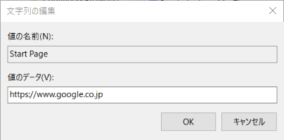

こんにちは。

今回は、IE11を新規に開いたとき、指定したURLのタブが3つ表示されるようにインターネットオプションではなくレジストリで登録する方法を紹介します。

レジストリを操作しますので自己責任で注意して操作してください。

## スタートページ設定方法
1. スタートから、`regedit` とタイプしレジストリエディタを開きます。
1. レジストリキー `HKEY_CURRENT_USER\Software\Microsoft\Internet Explorer\Main` を展開します。
1. 新規で**文字列値**を**Start Page**という名前で作成します。

文字列を編集します。ここではGoogleを指定しました。これが1つ目のタブになります。

Googleが表示されました。

## 応用で複数タブを設定

1. 応用で2つ、3つと同時に多分を設定してみます。
同じキー位置に、新規で**複数行文字列値**を**Secondary Start Pages**という名前で作成します。

1. 文字列を編集し、2つめのタブにYahoo、3つめのタブにMSNを指定します。
タブごとに改行で追記します。2つ目のあとに改行をいれておきます。

入れないとエラーになります。

エラーになるのですが、OKを押せば正しい状態に補正されるのでエラーは特に気にする必要はありません。
1. IEを新規で開くと、正しく3つ表示されました。

## あとがき

スタートページ1つにする場合は、**Secondary Start Pages**を空欄にすればOKです。

この方法はプロファイルに依存せず、環境を整えたい場合などに使えると思います。

これらの方法は、ドメイン環境であればグループポリシーを利用して実施することがよいと思いますがいろいろなケースで複合したいケースが実際にはでてくるので1つの選択肢として覚えておくといいかもしれません。

実際に私の関わるネットブート環境でもこの方法が利用されています。

それでは、次回の記事であいましょう。