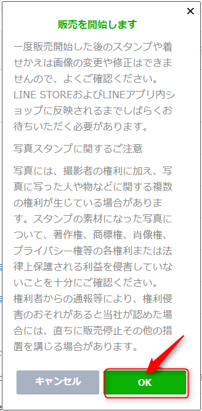

こんにちは。

先日、[こちら](https://mseeeen.msen.jp/register-line-creators-stamp/)でLINEクリエイターズスタンプの登録方法を紹介しましたが、6/16(金)に無事承認され、本日6/18に公開しました！

今回は、承認からリリース（公開）までの流れを紹介したいと思います。

[MSENのちょっとIT的スタンプ](https://store.line.me/stickershop/product/1460848)


## 実は審査落ち（リジェクト）していた

実は、一度リジェクトされましたｗ

LINEからこんなメールが届きました。
<a href="images/release-line-creators-stamp-1.png"></a>

メッセージセンターを確認すると具体的に修正点が記載されているので、その通りに修正しました。
指摘は、以下の2点でした。

1. 英語表記で**Stamp**という表現は**Sticker**と記載しなければいけなかった。
1. 販売国の指定を**全て**にしていたが、**インドネシアを外さないとダメ**だった。（原因不明） 

早速以下の画像の流れで修正しました。

**[英語表記の修正]**

<a href="images/release-line-creators-stamp-2.png"></a>

<a href="images/release-line-creators-stamp-3.png"></a>

**[販売国の修正]**

<a href="images/release-line-creators-stamp-4.png"></a>

<a href="images/release-line-creators-stamp-5.png"></a>

2点の修正を行い、再度審査リクエストを出し、**3日後**に無事承認されました。

## 初回の審査から承認までの日数

今回、1度リジェクトされましたが以下の日数で承認されました。

```
6/11(日)　審査リクエスト
6/14(火)　リジェクト通知
6/14(火)　修正及び、再審査リクエスト
6/16(金)　承認
```

リジェクトされていなければ2日程度で承認されていたと推測しますが、今回は審査依頼から**約6日間で**承認されました。

## いよいよリリース

承認の状態ではまだ公開されていません。
クリエイターズスタンプのアイテム管理から以下の流れでリリースします。

1. 承認されているアイテムを選択する
<a href="images/release-line-creators-stamp-6.png"></a>

1. リリースをクリックする
<a href="images/release-line-creators-stamp-7.png"></a>

1. 注意を確認しOKをクリックする
<a href="images/release-line-creators-stamp-8.png"></a>

無事、リリースされました！
<a href="images/release-line-creators-stamp-9.png"></a>


## あとがき

公開後にマイページを眺めていると、こんな統計もありましたｗ

<a href="images/release-line-creators-stamp-10.png"></a>

<a href="images/release-line-creators-stamp-11.png"></a>

LINEスタンプを公開するために、企画から実施し、とても良い経験ができました。

どの程度みなさんに見ていただけるか、ドキドキではありますが少しでも**MSEN**に興味をもっていただけるきっかけになれば嬉しいです！
