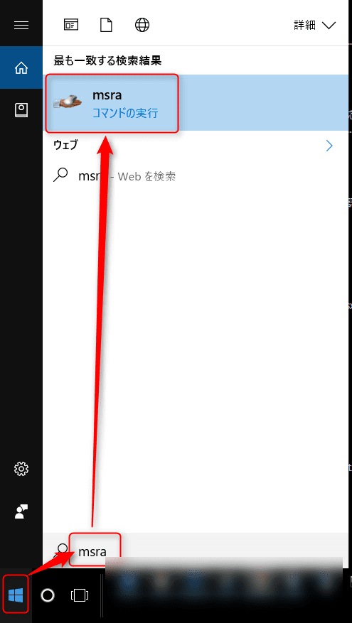

こんにちは。

弊社は、コミュニケーションツールにSlackを利用していますが、互いが遠隔地にいてもすぐに連絡が取れる状態にあっても、「ちょっと操作をみてみないと分からないな」ということが発生します。

そんなときに、Windows標準のリモートアシスタント機能を利用しています。

今回はこの手順について紹介したいと思います。

本記事ではWindows 10について紹介しますが、Windows7, 8では手順が異なるようで注意が必要です。

また、弊社で実施した際に、依頼者・支援者の双方がVPNに接続している状態ではうまく接続できなかったのでVPNに接続している状態でうまくいかなかった場合は一度切断後に試してみてください。

## 操作される側（依頼者）からの操作

### リモートアシスタントツールを起動する

左下のWindowsマークをクリックし、 **msra** とタイプします。

このような画面がでます。

### 招待する手続きを実施

招待ファイルを添付で送付しようと思いますので、**この招待をファイルに保存する** を選択します。

デスクトップ上に保存します。

### 保存されたファイルを**信頼できる支援者** に送付

### 支援者からの接続待ち

以下のウィンドウが画面上に現れます。
接続用パスワードが記載されているので支援者に伝えます。

ここまでが**操作される**側から支援者への依頼となります。

## 操作する側（支援者）の操作

### 依頼者のPCに接続する

前項で紹介した、依頼者より送られてきたバイナリファイルを実行すると、以下のような画面が出ます。

続けて、依頼者より送られてきた（接続待ちの画面に表示されている）パスワードを入力し、OKをクリックします。

ここまでが**操作する**側の手順となります。

## 支援者の接続を許可

前項までの手順が完了すると、以下の画面が依頼者のPCに出ます。
確認して、許可します。

許可すると、依頼者側の待ち受け画面が以下のようになります。

また、支援者側からデスクトップの操作を要求されると以下の画面になります。
確認し、許可をしてください。

許可後に、依頼者のデスクトップは支援者側で操作できます。

以上までが 支援者にWindowsリモートアシスタントを使って操作してもらう流れになります。

## あとがき

先日、けんけんに支援してもらったとき、けんけん側では私の画面が以下のような表示になっていたようです。

えらく伸びて見れる状態ではないですね(笑)

原因は、2画面にしていることでした。

操作される側は、VPNと合わせて事前にデュアルディスプレイを解除して1つの画面で使っている状態で利用されることをお勧めします。

参考にしてください。
それでは次回の記事でお会いしましょう。