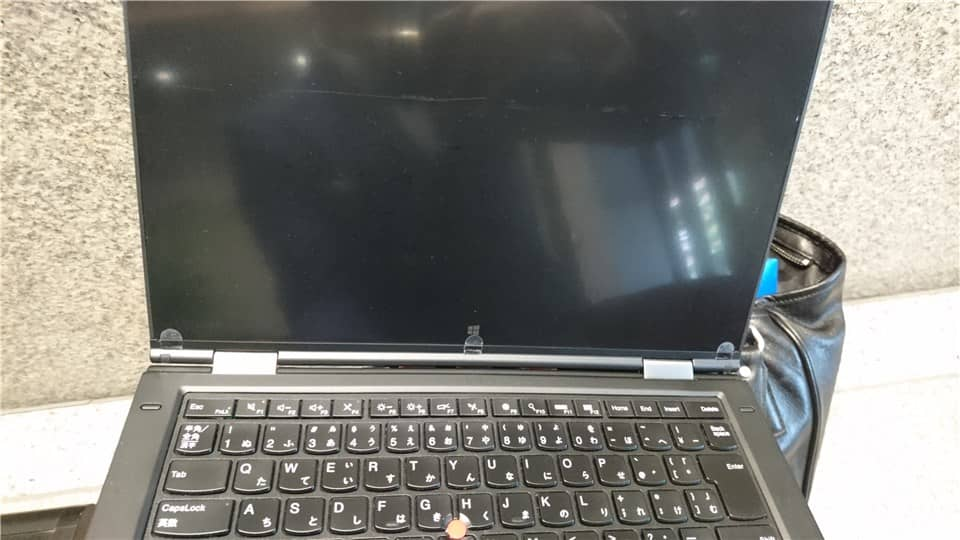

こんにちは。

つい先日、朝PCを立ち上げると画面が真っ暗・・・。

電源は入ったまま、長押ししても落ちる気配なし…。

機種はLenovo ThinkPad X1 Yogaです。

## 解決への道のり

バッテリーが取り外しできるタイプであれば、バッテリーを取り外し、電源ケーブルを外して電源ボタンをぽちぽち、で大体は解決するのですが、X1 Yogaは内蔵タイプです。

電車に乗りながら検索すると、解決策を示すメーカーページがありました。
[https://support.lenovo.com/jp/ja/solutions/HT104894](https://support.lenovo.com/jp/ja/solutions/HT104894)

これを参考に早速、電車をおりてから実施してみました。

まず、資料を挟むときによく使うクリップを準備し、次の画像のように曲げておきます。

次にPCを裏向けにし、背面の真ん中ほどのリセットボタンの穴を発見します。
このあたりです。

拡大。

準備したクリップで５秒ほどリセットボタンを押します。

無事復旧！

クリップを常備していたのか？
いえ、お客さまにお願いして１ついただきました。
感謝です、ありがとうございました。

**「Yoga のおともにクリップ。」**
今回の教訓です。

参考になれば嬉しいです。
それでは、次の記事でお会いしましょう。