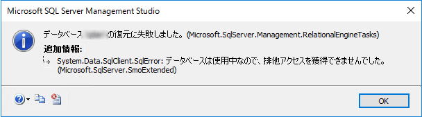
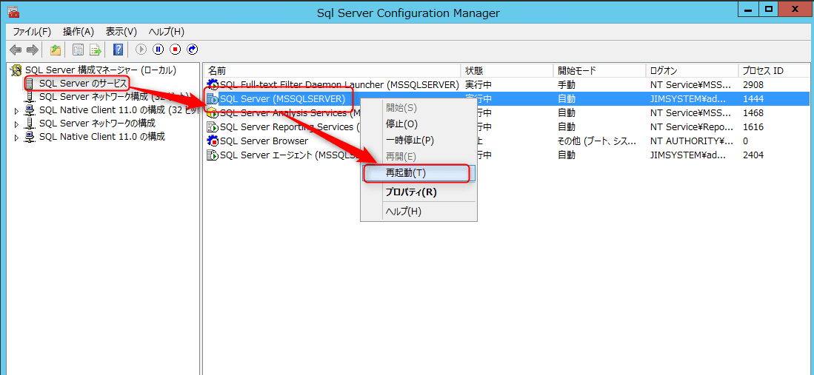
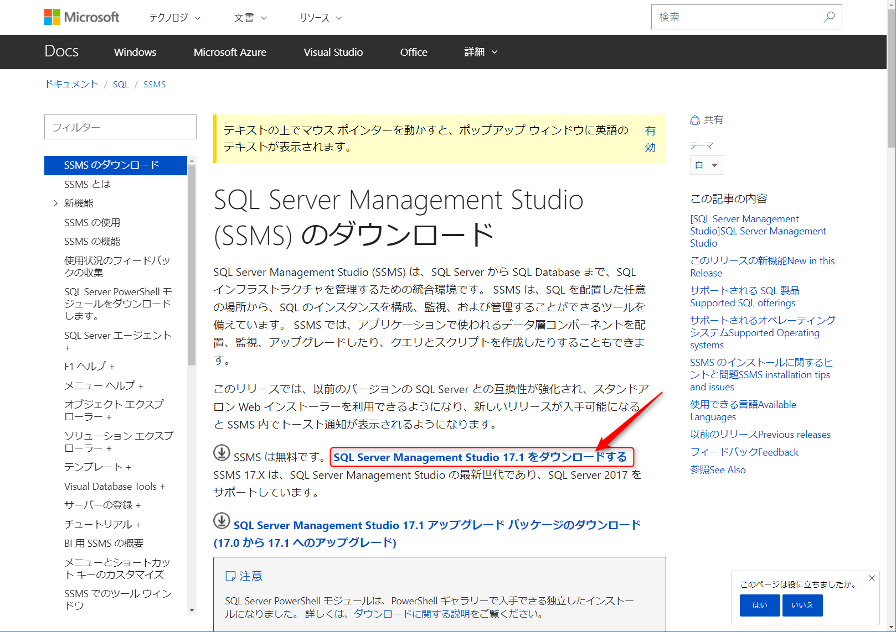

こんにちは。

今回はSQL ServerのDB復元に関するトラブルシューティングの紹介です。

SQL Server 2012を利用する評価環境で、ダンプファイル(バックアップデータ)からデータベースの復元を試みると、**データベースは使用中なので、排他アクセスを獲得できませんでした。**　となることが稀に発生していました。

>データベースooの復元に失敗しました。(Microsoft.SqlServer.Management.RelationalEngine.Tasks)
>追加情報:
>System.Data.SqlClient.SqlError:データベースは使用中なので、排他アクセスを獲得できませんでした。
>(Microsoft.SqlServer.SmoExtended)

データベースの復元方法の詳細は割愛しますが、**Microsoft SQL Server Management Studio** を利用し、**データベースの復元**から開始します。

## SQL Serverサービスを再起動で簡単に対処

復元を試みる時点で、サービス停止を伴うので、深く考えずエラーの対象となっているインスタンスを再起動し対処します。

1. SQL Serverがインストールされたサーバ上で、**Sql Server Configuration Manager** を開きます。
2. 対象のインスタンスを確認し、**SQL Server (インスタンス名)** を再起動します。インスタンス名はインストール時に決定しますが、**MSSQLSERVER**はデフォルトのインスタンス名です。

3. インスタンス再起動完了後、**Microsoft SQL Server Management Studioの接続を一度閉じて再接続してから、**再度復元を実施すると、成功するはずです。

## あとがき

SQL Serverの復元につかう、**Microsoft SQL Server Management Studio**(SSMS)は無料で使うことができ、以下の
URLからダウンロードできます。

* [ダウンロードリンク](https://docs.microsoft.com/ja-jp/sql/ssms/download-sql-server-management-studio-ssms)

800MB程度の容量があるため、ダウンロード環境には注意してください。

それでは、次回の記事でお会いしましょう。