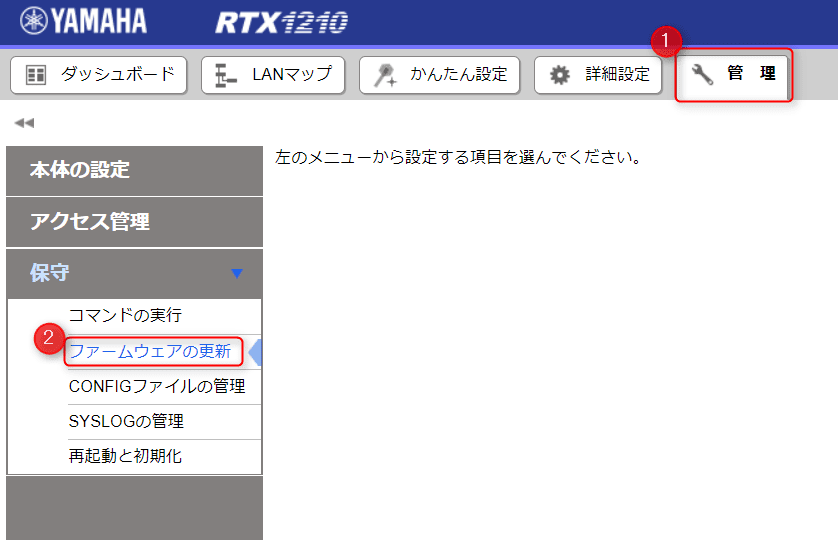
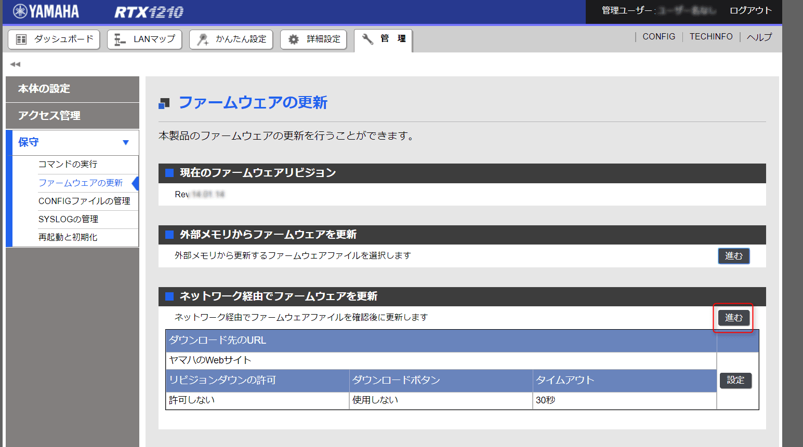
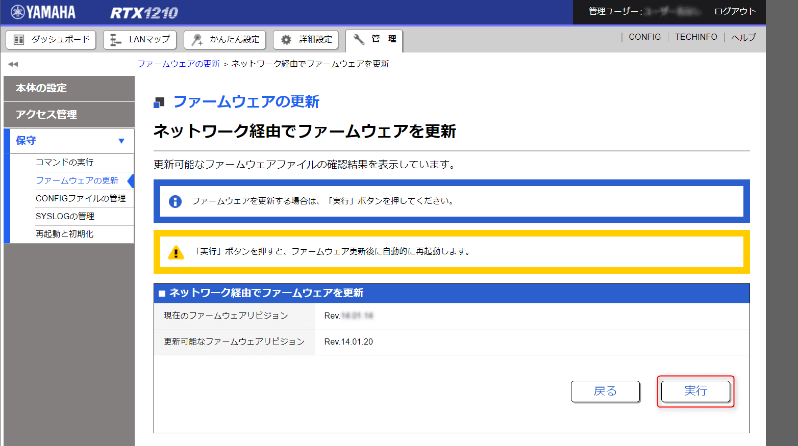
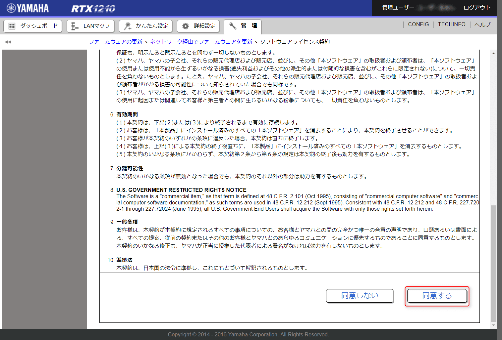
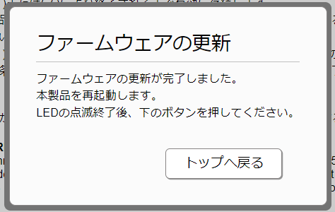
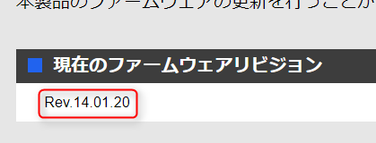

こんにちは。

YAMAHAの中小規模拠点向けVPNルーターであるRTX1210に、気になる機能「[Amazon VPCとのVPN接続(API方式)](http://www.rtpro.yamaha.co.jp/RT/docs/cloud_vpn/amazon-vpc_api.html)」が追加されたのでファームウェアを14.01.20にアップデートしてみました。

リリースノートは[こちら](http://www.rtpro.yamaha.co.jp/RT/docs/relnote/Rev.14.01/relnote_14_01_20.html
)です。
14.01.20は、投稿時点で最新でバグについても38項目で修正されているため適用をおすすめします。

今回は完全にリモートで実施し、ちゃんと上がってくるかな・・・とドキドキしながらこの記事を書いてみました。

## アップデート手順
1. Web画面にアクセスし、管理権限でログインします。

1. **管理**から**ファームウェア更新**に進みます。

1. **ネットワーク経由でファームウェアファイルを確認後に更新します** へ進みます。

1. 更新可能なファームを確認し、**実行** を選択します。

1. ライセンス契約を**同意**します。

1. 前項の同意をクリックした時点でアップデートが始まります。

1. しばらくすると以下の画面が出るので、**トップへ戻る**を選択します。再起動は一瞬で完了しました。

1. バージョンを確認すると正常に上がっていました。特に問題もなく無事完了です。

AWSとRTX1210の連携記事は是非書きたいと思っていますのでお楽しみに。