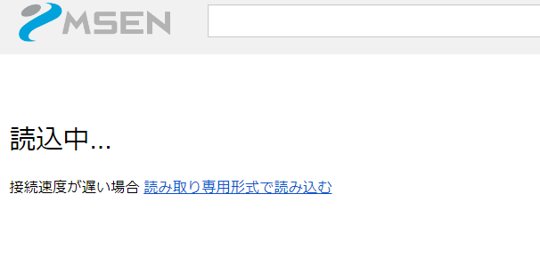
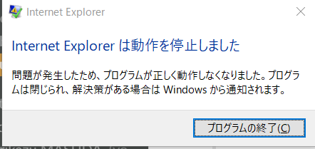
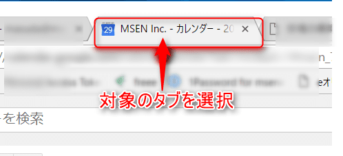

こんにちは。

つい先ほど、GoogleカレンダーをChromeで開くと何度更新しても **読込中...** となってしまう現象に見舞われ途方に暮れていました。

スタッフの神の一声で解決しましたので早速記事にしてみました。
キーワードは、**スーパーリロード** ！

発生したきっかけは、ほんとに突然でした。

朝起きてメールみて、カレンダーみて・・・あれ？
ん？カレンダーが読込中から変わらないな。。

こういう状態です。

[ググってみる](https://www.google.co.jp/search?q=chrome+%E8%AA%AD%E3%81%BF%E8%BE%BC%E3%81%BF+%E7%B5%82%E3%82%8F%E3%82%89%E3%81%AA%E3%81%84&oq=Chrome+%E8%AA%AD%E3%81%BF%E3%81%93%E3%81%BF&aqs=chrome.2.69i57j0l5.6802j0j7&sourceid=chrome&ie=UTF-8)と、色々な方が類似現象に悩まされているようでした。

私の環境情報は、**Windows 10 1709**、**Chrome 62.0.3202.75（Official Build）**です。

そして、色々やりました、でも全く改善しませんでした。。
上から順番に実施しました。

1. カレンダーを開いているタブを更新(F5)
1. Windows 再起動
1. Chromeタブを1つ1つ全て停止して再度Googleカレンダーを開く
1. Cookieの全削除。(設定→詳細設定→プライバシーとセキュリティのコンテンツの設定→Cookie→すべての Cookie とサイトデータ→全て削除)
1. 予測サービスを使用してページをより迅速に読み込むをオフ。(設定→詳細設定→プライバシーとセキュリティからオフ)

全てダメ！

余談ですが、切り分けでIEではどうかなと実施してみるとメールアドレスを入れて次を押したところでｗ

Edgeではいけましたｗ
この違いは一体・・・。

そして、ここでスタッフの神のひと言、「**スーパーリロード** で無理？」

スーパーリロードとは、表示されている**htmlだけでなくCSSやJSや画像など、読み込んでいる全てをキャッシュ含めて全て更新する**といった感じです。

Chromeでは、対象のタブを選択し、**Ctrl+F5**これでスーパーリロードになります。

そして、**Ctrl+F5** →　解決！！

いやー、焦りました。

皆様の参考になりますように。
それでは次回の記事でお会いしましょう。
