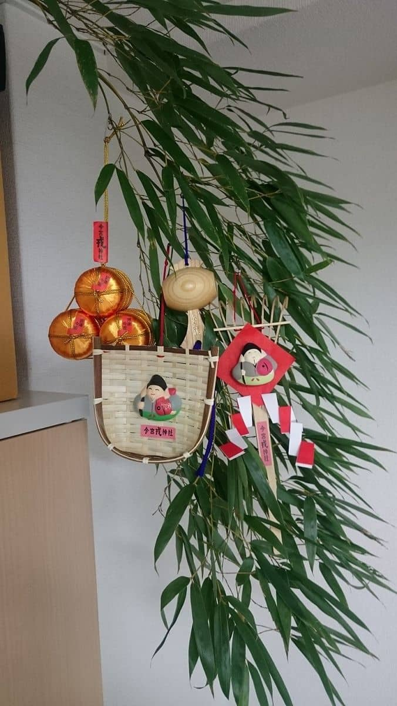

新年あけましておめでとうございます。
本年もよろしくお願いいたします。

1/9(火)に十日戎（今宮戎神社）に参拝にいってきました。

今年で毎年いくこと3回目です。
「商売繁盛で笹もってこい」の音声を聞いて「よし、1年スタートだ！」という気持ちになります。

## 参拝・福笹
午前中に参拝しましたが、平日なこともあって去年とは変わりとても落ち着いた感じです。

返納した去年の福笹です。
1年間ありがとうございました。

今年の福笹です。

毎年この時期は期末となっていて、次の期に向けて飾りを1つずつ増やしています。
今年の追加は、「打ち出の小槌」にしました。
4期目にむけてなので合計4つになりました。

()は、飾りをつけた時期です。
1.2. 「熊手」→福や運をかき集める、「箕」→かき集めた福や運をすくい取る(2016年2期目に向けて)
3.   「俵」　→金運や財運の豊作を願う(2017年3期目に向けて)
4.   「打ち出の小槌」→打てばなんでも好きなものが出てくるといわれる(2018年4期目にむけて)

来年(2019年)も5つ目を飾り付けて投稿できるように頑張っていきたいと思います！

## あとがき

3年連続で購入しているベビーカステラも今年は全く並ぶことなく購入できました。

福笹は **1月9日から11日まで終夜** いただけるようです。

[今宮戎神社ホームページ](http://www.imamiya-ebisu.jp/%e5%8d%81%e6%97%a5%e6%88%8e%e3%81%ae%e3%81%94%e6%a1%88%e5%86%85%ef%bc%88%e3%81%94%e7%a5%88%e7%a5%b7%e3%83%bb%e7%a6%8f%e7%ac%b9%e3%81%ab%e3%81%a4%e3%81%84%e3%81%a6%ef%bc%89)

2018年もスタッフ一同頑張って参りますのでどうぞよろしくお願いいたします！
それでは次回の記事でお会いしましょう。
