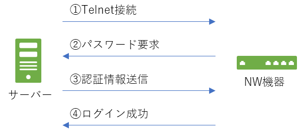
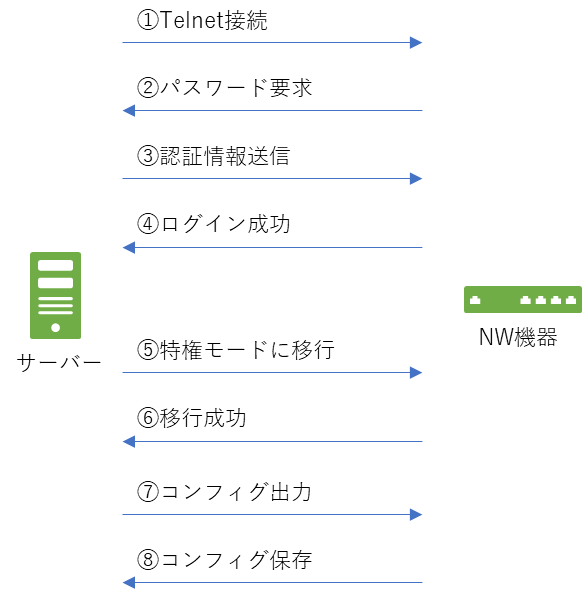

こんにちは。

先日、**expect コマンドを使って対話式に対応したユーザー作成**用のシェルスクリプトを作りました。

> [\[CentOS7\] expect を使って対話式に対応したユーザー作成用のシェルスクリプトを作る](https://mseeeen.msen.jp/dealing-with-interactive-command-with-shell-script-using-by-expect/)

今回は、これを応用して、**NW機器にTelnet接続し、コンフィグ(コマンドの実行結果)を取得**してみようと思います。

対象の機器は、[YAMAHA RTX1210](https://network.yamaha.com/products/routers/rtx1210/index) です。

## 準備

最小構成でCentOS7をインストールすると、Telnetコマンドは使えない状態なのでインストールします。

`yum -y install telnet`

## 接続までやってみよう

イメージとしては以下の図の流れです。



さっそく、シェルスクリプトを書いていきましょう。

**## の部分** は説明です。

```sh
#!/bin/sh

## function を宣言
connect_nw_device() {
  ## expect の始まり
  expect -c "
    ## タイムアウトを5秒に設定
    set timeout 5
    ## Telnet接続を開始(192.168.111.111 へ接続)
    spawn telnet 192.168.111.111
    ## NW機器で出力されるパスワード要求の文字列を記載
    expect \"Password:\"
    ## 認証情報送信(hogepass)
    send \"hogepass\n\"
    ## ログイン後の待機文字列を記載
    expect \">\"
  ## expect の終了
  expect "
}

## functionを実行
connect_nw_device
```

実行してみます。

```sh
[root@server ~]# ./test.sh 
spawn telnet 192.168.111.111
Trying 192.168.111.111...
Connected to 192.168.111.111.
Escape character is '^]'.

Password: 

RTX1210 Rev.14.01.29 (Tue May 29 16:47:33 2018)
Copyright (c) 1994-2018 Yamaha Corporation. All Rights Reserved.
To display the software copyright statement, use 'show copyright' command.
00:a0:de:xx:xx:xx, 00:a0:de:xx:xx:xx, 00:a0:de:xx:xx:xx
Memory 256Mbytes, 3LAN, 1BRI

The login password is factory default setting. Please request an administrator to change the password by the 'login password' command.
> [root@server ~]# 
```

ログインができました。

最後の行の、 `> [root@server ~]# ` 部分は、 `>` のあとまでがNW機器で、その後、タイムアウトの秒数が経過すると接続は終了され、 `[root@server ~]#` となります。

## コンフィグを取得する

無事接続ができたので、続けてコンフィグをサーバー上の `/var/log/nw.config` に保存してみましょう。

イメージとしては以下の図の流れ (**⑤～⑧を追加**) です。



```sh
#!/bin/sh

## function を宣言
connect_nw_device() {
  ## expect の始まり
  expect -c "
    ## タイムアウトを5秒に設定
    set timeout 5
    ## Telnet接続を開始(192.168.111.111 へ接続)
    spawn telnet 192.168.111.111
    ## NW機器で出力されるパスワード要求の文字列を記載
    expect \"Password:\"
    ## 認証情報送信(hogepass)
    send \"hogepass\n\"
    ## ログイン後の待機文字列を記載(>)
    expect \">\"
    ## 特権モードに移行(RTX1210はadministratorコマンド)
    send \"administrator\n\"
    ## NW機器で出力されるパスワード要求の文字列を記載
    expect \"Password:\"
    ## 認証情報送信(hogepass)
    send \"hogepass\n\"
    ## 特権モード移行後の待機文字列を記載(#)
    expect \"#\"
    ## 標準出力が初期値24行で止まるため制限を解除
    send \"console lines infinity\n\"
    ## 特権モード移行後の待機文字列を記載(#)
    expect \"#\"
    ## コンフィグを出力
    send \"show config\n\"
    ## 特権モード移行後の待機文字列を記載(#)
    expect \"#\"
    ## 標準出力の制限を初期値に設定
    send \"no console lines infinity\n\"
    ## 特権モード移行後の待機文字列を記載(#)
    expect \"#\"
    ## 設定を保存
    send \"save\n\"
    ## 特権モード移行後の待機文字列を記載(#)    
    expect \"#\"
  ## expect の終了
  expect "
}

## functionを実行
connect_nw_device > /var/log/nw.config
```

実行結果は、出力結果をファイルにリダイレクトしているため、以下のようになります。

```sh
[root@server ~]# ./test.sh 
[root@server ~]# 
```

ファイルも存在しています。

```sh
[root@server ~]# ls -l /var/log/nw.config 
-rw-r--r--. 1 root root 10184  7月 28 17:13 /var/log/nw.config
```

このファイルには、**expectで処理した認証情報のパスワードも保存されているため権限に注意が必要**です。

## あとがき

cronで毎日コンフィグを保存して、ログローテーションと組み合わせることで世代管理もできます。

その世代を比べてコンフィグに変更があればメールで通知、などの応用も可能です。

地味に使える `expect` 、 次は何をしてみようか。

それでは、次回の記事でお会いしましょう。