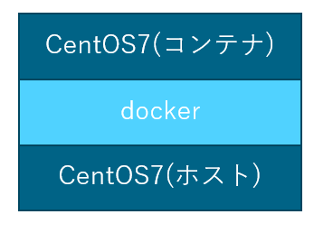

こんにちは。

今回は、CentOS 7を利用して、Dockerを立ち上げ、その上にCentOS 7を動かしてみたいと思います。
イメージ的にはこのような形です。




## 利用までのながれ

1. CentOS 7 を最小構成でインストールします。

1. ログインが出来るようになったら、 `root` 権限で `yum update` を実行し、アップデートを実施します。

1. `docker` と ネットワークツール をインストールします。
`yum -y install docker net-tools`
`systemctl start docker`
`systemctl enable docker`

1. CentOS 7 のイメージをダウンロードします。
`docker pull centos:centos7`

1. **TEST** という名前で、docker **コンテナ** (docker の上のCentOS 7) を立ち上げます。
`docker run --privileged -d --name TEST centos:centos7 /sbin/init`

1. 作成した **コンテナ** にログインします。
`docker exec -it TEST /bin/bash`

以上で、完了です。

上記で作成したCentOS 7は通常のOS同様に利用することが出来ます。

## ターミナルにコピペ！

最小構成でインストールし、アップデート後に以下の流れでログインまで一瞬で進むことができます。
ターミナルにコピペでお試しください！


```
yum -y install docker net-tools
systemctl start docker
systemctl enable docker
docker pull centos:centos7
docker run --privileged -d --name TEST centos:centos7 /sbin/init
docker exec -it TEST /bin/bash
```

別にいらないだろう、と言われそうですが・・・動画を撮ってみました(笑)
利用しているターミナルソフトは `Tera Term` です。

※50秒の動画です。
[video width="824" height="608" mp4="/wp-content/uploads/2018/03/2018-03-10_21h31_20.mp4"][/video]

## コマンドの付録

Dockerでよく使うであろう、コマンドを記載します。

- 稼働しているコンテナ イメージの確認
`docker ps -a`

```
[root@localhost ~]# docker ps -a
CONTAINER ID        IMAGE               COMMAND             CREATED             STATUS              PORTS               NAMES
d525ad405bc5        centos:centos7      "/sbin/init"        3 minutes ago       Up 3 minutes
```

- 稼働している コンテナ にログイン
`docker exec -it NAMES /bin/bash`

```
[root@localhost ~]# docker exec -it TEST /bin/bash
[root@d525ad405bc5 /]#
```

- 稼働している コンテナ からログアウト
`exit`
**コンテナ上で実行すると、ホストに戻る**

- Dockerホストからコンテナへのファイル転送
`docker cp "ローカルファイル名" コンテナ名:"パス"`
```
[root@localhost ~]# echo test123 > test,txt
[root@localhost ~]# docker cp test,txt TEST:/root
[root@localhost ~]# docker exec -it TEST /bin/bash
[root@d525ad405bc5 /]# cd /root
[root@d525ad405bc5 ~]# ls
anaconda-ks.cfg  test,txt
[root@d525ad405bc5 ~]# cat test,txt
test123
```

- コンテナの開始
`docker start NAMES`
```
[root@localhost ~]# docker start TEST
TEST
```

- コンテナの停止
`docker stop NAMES`
```
[root@localhost ~]# docker stop TEST
TEST
```

- コンテナの削除
`docker rm NAMES`
```
[root@localhost ~]# docker rm TEST
TEST
```
***docker stop の後に削除する**

## あとがき

最近のプロジェクトで、CPU 2コア、メモリ 2GB の1台(しかもVMWare上の仮想マシン)に
CnetOS7をインストールし、Docker コンテナを8つ動かして、そのうちの6つにWordPressサイトを移行しました。

特にレスポンス等に不満はなく動作しているので、
1つのサービスに1つ物理サーバーを構築していた時代がとても遠くなった感じがしました。

少し寂しくなりましたが、これが時代の進化ですね。

それでは次回の記事でお会いしましょう。