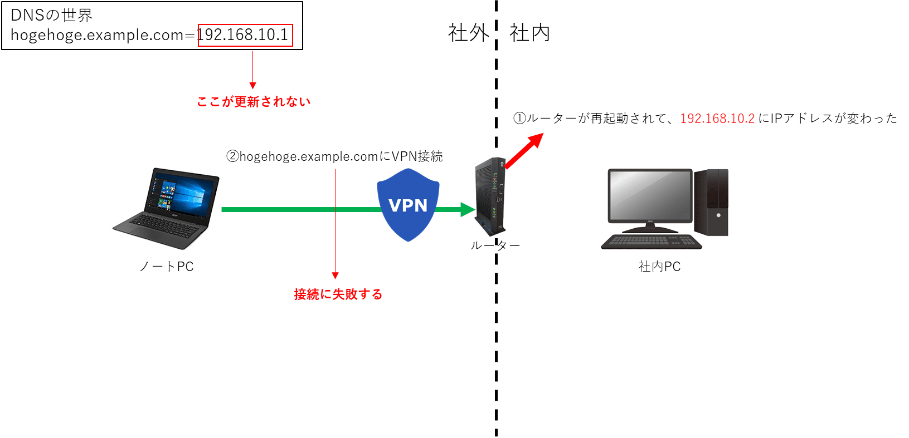
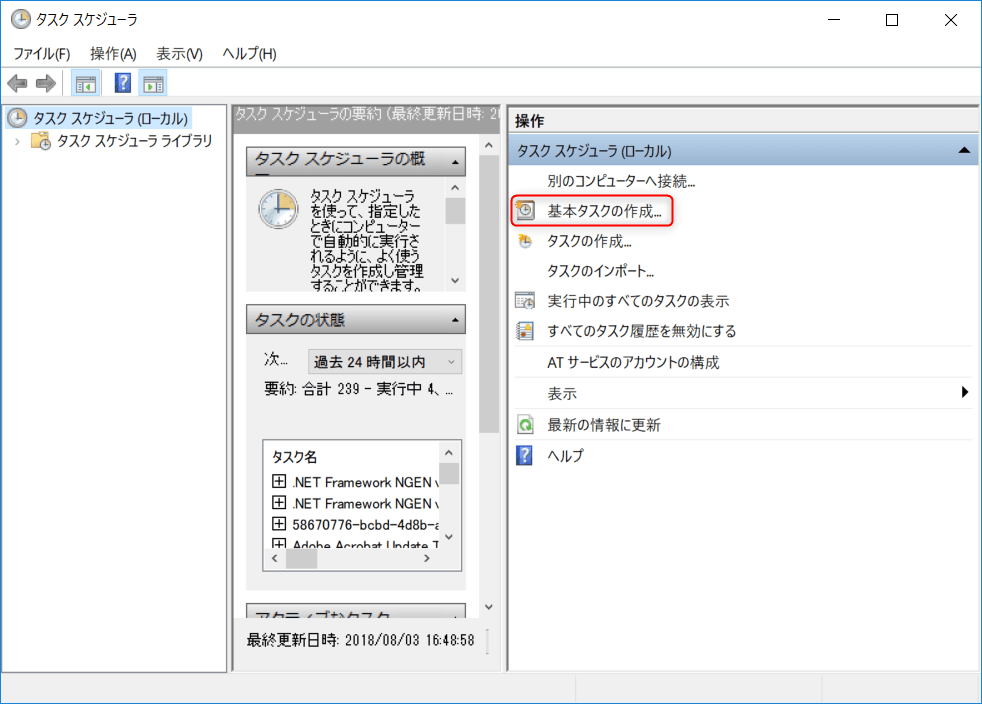
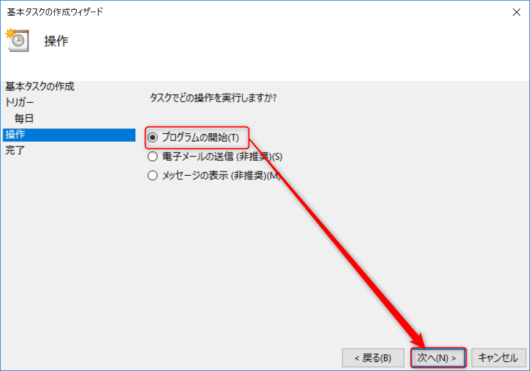
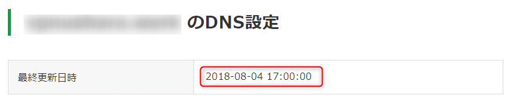
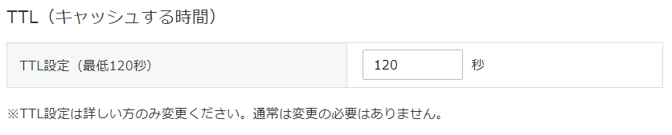

こんにちは。

あるお客さまから、 **固定IPはないが、社外から社内PCに接続したい**
という要望があり対応しました。

イメージは以下のような形で、外出先でノートパソコンからルーターにVPN接続をして、社内PCにリモート接続するような流れです。
**※事前に `example.com` というドメインをValue-domainで取得している前提です。**
**※ドメイン名、IPアドレスは架空のものです。**


DNSの仕組みについて詳細な説明は割愛しますが、 `hogehoge.example.com` に登録されているIPアドレスが `192.168.10.1` として登録されている状態で、このIPアドレスが変化しない状態(固定IP)であれば、ダイナミックDNSの仕組みを使う必要はありません。

固定IPアドレスは月額5000円程度が別途発生する有料契約ですし、理由がない限り別途契約することはないと思います。

固定IPがない場合はどうなるかというと、上記で説明したIPアドレスの部分が変更されると接続できなくなります。

変更される例としては、ルーターを再起動すると変わります。(不定期で変更されるとも言われていますが実際にはなかなか変わりません)

ルーターの再起動などでIPアドレスが変更になると、なんの **仕組み** も導入していない状態であれば、  `hogehoge.example.com` に登録されているIPアドレスが更新されないため、VPN接続を実施しても接続に失敗します。

以下のようなイメージです。



これを解決する仕組みがダイナミックDNSです。
[ダイナミックドメインネームシステム - Wikipedia](https://ja.wikipedia.org/wiki/%E3%83%80%E3%82%A4%E3%83%8A%E3%83%9F%E3%83%83%E3%82%AF%E3%83%89%E3%83%A1%E3%82%A4%E3%83%B3%E3%83%8D%E3%83%BC%E3%83%A0%E3%82%B7%E3%82%B9%E3%83%86%E3%83%A0)

前おきが長くなりましたが、Value-domainで紹介されている **決められたURLに接続することでIPアドレスを変更する方法** を紹介します。
[VALUE-DOMAIN(バリュードメイン)](https://www.value-domain.com/ddns.php?action=howto)

## 設定方法

変更するイメージは以下のとおりです。

以下のようなイメージです。


前提条件は以下のとおりとなります。

* 社内PC(Windows)が、後述するタスクスケジューラー実行時間に起動していること
* Value-domain で事前にaレコードを `a * xxx.xxx.xxx.xxx` の形で登録しておくこと

### 準備
Value-Domainにログインし、対象のドメインに対してダイナミックDNSの機能を有効にします。
以下のURLから、**domainname=** の部分を適切に修正すれば画面に遷移すると思います。

[https://www.value-domain.com/ddns.php?action=dyn2&domainname=example.com](https://www.value-domain.com/ddns.php?action=dyn2&domainname=example.com)


こうなります。


同画面から、更新用のパスワードを設定します。


### 変更用のURLを準備する

以下が変更用のURLになります。

[https://dyn.value-domain.com/cgi-bin/dyn.fcg?d=example.com&p=password&h=*&i=](https://dyn.value-domain.com/cgi-bin/dyn.fcg?d=example.com&p=password&h=*&i=)

以下を適宜修正してください。
1. example.com の部分を登録しているドメイン名に修正
2. password の部分を前項で設定したパスワードに修正

準備ができたところで、ブラウザのURL欄に貼り付けてEnterを押してみましょう。


正しく変更できました。

### 自動で更新されるように設定する

設定は社内PC(Windows 10)で設定します。

更新用のPowerShellを作成し、タスクスケジューラーに登録して定期的に実行するように設定します。

では、以下の手順で設定しましょう。

1. 更新用のPowerShellを作成する
    Documents フォルダ下に `mod-dns.ps1` という名前で保存します。(保存場所は任意です)
    ```
    [System.Net.ServicePointManager]::SecurityProtocol = [System.Net.SecurityProtocolType]::Tls12;
    Invoke-WebRequest "https://dyn.value-domain.com/cgi-bin/dyn.fcg?d=example.com&p=password&h=*&i="
    ```
    前項と同様、以下を注意してください。
    * example.com の部分を登録しているドメイン名に修正
    * password の部分を前項で設定したパスワードに修正

1. 右下のWindowsマークの上で右クリックし、 **ファイル名を指定して実行** をクリックします


1. **taskschd.msc /s** と入力し、OKをクリックします


1. 「基本タスクの作成へ」進みます


1. 任意の名前を入力します


1. 以下の画像の流れで毎日12:00に実行されるように設定します




1. 各項目を以下を参考に入力します


  [プログラム/スクリプト]
  `%SystemRoot%\System32\WindowsPowerShell\v1.0\powershell.exe`
  
  [引数の追加]
  `-ExecutionPolicy RemoteSigned -File "C:\Users\user\Documents\mod-dns.ps1"`

  [開始]
  `C:\Users\user\Documents`
  **C:\Users\user\Documents は保存場所です。**

1. **プロパティダイアログを開く** にチェックを入れて完了します


1. ログオフ状態でも実行されるように、以下にチェックを入れてOKをクリックします


1. パスワードが求められるので、入力してOKをクリックします。


以上で完了です。

タスクの実行間隔を短くすれば、変更になった時に接続できなくなる時間が短くなりますが、今回のお客さまの場合、この程度の周期で十分と判断し、1日1度にしています。
※あまり短くしすぎるのは、DNSサーバーの負荷につながりよくありませんのでご注意ください。

### 動作確認

評価していた時間が12:00ではなかったので、タスクの時間を調整して動作を確認しました。

17：00 にタスクが起動するように設定して、ログオフしました。

無事、更新されてますね。


### DNSの浸透待ち時間

動作確認で17:00に実行できたことを確認しましたが、IPアドレスが変更になっていた場合、すぐに反映されません。
DNSの世界にはTTLという情報をキャッシュする時間が設定されているためです。

Value-domain上で更新され、それが世界中に伝播されるのに時間がかかります。

Vlaue-domainの初期設定ではTTLが1200秒となっていて、これを一番短い120秒まで短くした場合、経験上 だいたい30分ほどで反映されます。

[Value-domainのTTL設定画面]


### 正しく変更されたか確認する方法

浸透待ちの状態なのか、浸透されたのか、確認する方法も参考までに紹介します。

今回の例では、まず現在のIPアドレスを確認するために、 **社内PCから** 以下のサイトに接続し、画像の赤枠部分をメモします。
[確認くん](https://www.ugtop.com/spill.shtml)


続けて以下のサイトで `example.com` がどのIPアドレスになっているか確認します。
[nslookup(dig)テスト【DNSサーバ接続確認】](https://www.cman.jp/network/support/nslookup.html)


↓


この2つのIPアドレスが同じであれば浸透した確認になります。

## 更新用スクリプトVBSバージョン

前述の手順では、PowerShellで更新用のスクリプトを書きましたが、VBSバージョンも紹介します。

Documents フォルダ下に `mod-dns.vbs` という名前で保存します。(保存場所は任意です)
```
Option Explicit
Dim objIE
Set objIE = CreateObject("InternetExplorer.Application")
objIE.Visible = FALSE
objIE.Navigate2 "https://dyn.value-domain.com/cgi-bin/dyn.fcg?d=example.com&p=password&h=*&i="
```

こちらを参考にさせていただきました。
[VBScriptでIEを使って複数WEBサイトをダブルクリック一発で開く方法](https://tonari-it.com/vbs-internet-explorer/)

## あとがき

参考に記載したVBSバージョンで評価をしていた時にログオフ状態でうまく実行されない現象に見舞われ、少し古いですが以下のMicrosoftフォーラムでも同様の質問をされているかたがいて、無理なのかな、と思っていました。

[タスクスケジューラを利用してのＩＥの起動について](https://social.technet.microsoft.com/Forums/ja-JP/f377be73-b3a7-49bf-9445-e29f894f992e/12479124731246312473124651247212517125401252112434210332999212?forum=internetexplorerja)

記事のレビュー時に、スタッフから **「最上位権限で実行する」にチェックを入れたらどうか？** とアドバイスがあり、やってみるといけました！


では、また次回の記事で。
