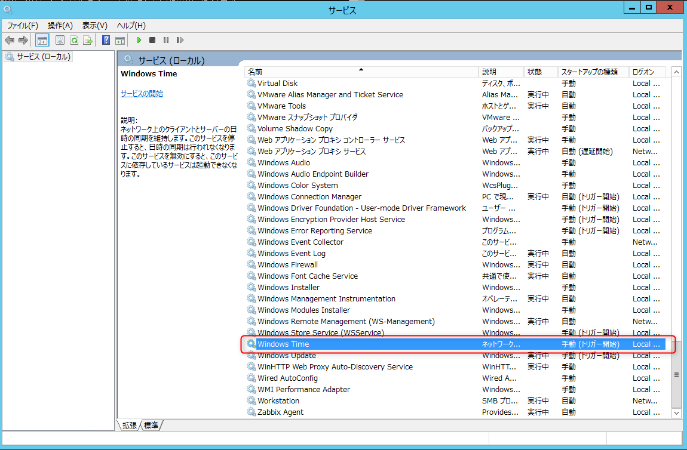
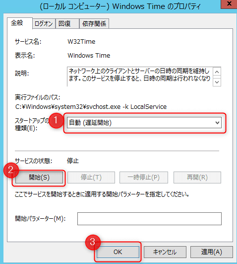

こんにちは。

ずいぶん過去の記事(↓)で、コマンドでNTPサーバーを設定する方法を掲載していました。
[コマンドでWindows ServerのNTPサーバーを設定する](https://mseeeen.msen.jp/set-ntp-server-with-command-in-windows-server/)

Windows Server 2016のサーバーを構築する機会があったので、この記事のとおりにやってみたところ、正常に同期されませんでした。

上記の記事では、以下の3つのコマンドで **設定→同期→確認** とできるように記載しておりました。
```
w32tm /config /syncfromflags:manual /manualpeerlist:ntp.nict.jp /update
w32tm /resync
w32tm /query /status
```

それが、以下のようになってしまいました。
```
C:\Users\Administrator>w32tm /config /syncfromflags:manual /manualpeerlist:ntp.nict.jp /update
コマンドは正しく完了しました。

C:\Users\Administrator>w32tm /resync
再同期コマンドをローカル コンピューターに送信しています
時刻データが利用できなかったため、コンピューターは同期をとり直しませんでした。

C:\Users\Administrator>w32tm /query /status
閏インジケーター: 3 (最後の 1 分間は 61 秒)
階層: 0 (未指定)
精度: -6 (ティックごとに 15.625ms)
ルート遅延: 0.0000000s
ルート分散: 0.0000000s
参照 ID: 0x00000000 (未指定)
最終正常同期時刻: 未指定
ソース: Local CMOS Clock
ポーリング間隔: 6 (64s)
```

コマンドは正しく完了しました、となっているものの最後の確認コマンドのソースの部分が更新されていません。

しかし、落ちを先に書きますと、セキュリティの厳しいネットワーク環境だったので　`ntp.nict.jp` と **単に通信できていないため** 発生している可能性が高いことが分かりました・・・。

せっかく書き出したので・・・、前回の記事と合わせて読んでいただけるように補足の意味を込めて記載しました。

## 事前確認
Windows Timeサービスの状態を確認します。

スタートアップの種類が **手動** で、状態が　**開始** されていない状態であれば設定を変更します。
以下の画像は、手動で開始されていない状態です。


以下のように設定を **自動(遅延開始)** に設定し、実行中にします。


サービスが開始していない状態で、例えば `w32tm /query /status` を実行すると、
`次のエラーが発生しました。 そのサービスを開始できませんでした。 (0x80070426)` となります。

## NTPサーバーを設定

コマンドプロンプトを管理者権限で開き、以下を設定します。

以前の記事では `ntp.nict.jp` 1つだけの指定で、同期モードを指定していませんでした。
今回は、NTPサーバーを3つ指定し、さらに同期モードも指定します。　**0x8の部分**

[設定コマンド]
`w32tm /config /syncfromflags:manual /manualpeerlist:"192.168.10.1,0x8 192.168.10.2,0x8 192.168.10.3,0x8" /update`

正常に応答した場合、以下のようになります。
`コマンドは正しく完了しました。`

[同期コマンド]
`w32tm /resync`

正常に応答した場合、以下のようになります。
```
再同期コマンドをローカル コンピューターに送信しています
コマンドは正しく完了しました。
```

[確認コマンド1]
`w32tm /query /status`

応答結果は以下のようになります。
```
閏インジケーター: 0 (警告なし)
階層: 3 (二次参照 - (S)NTP で同期)
精度: -6 (ティックごとに 15.625ms)
ルート遅延: 0.0094857s
ルート分散: 7.8031821s
参照 ID: 0x8501C00A (ソース IP:  192.168.10.1)
最終正常同期時刻: 2018/10/15 23:36:44
ソース: 192.168.10.1,0x8
ポーリング間隔: 6 (64s)
```

[確認コマンド2]
`w32tm /query /peers`

応答結果は以下のようになります。
```
ピア数: 3

ピア: 192.168.10.3,0x8
状態: アクティブ
残り時間: 5.6509915s
モード: 3 (クライアント)
階層: 0 (未指定)
ピアポーリング間隔: 0 (未指定)
ホストポーリング間隔: 5 (32s)

ピア: 192.168.10.2,0x8
状態: アクティブ
残り時間: 5.6510157s
モード: 3 (クライアント)
階層: 0 (未指定)
ピアポーリング間隔: 0 (未指定)
ホストポーリング間隔: 5 (32s)

ピア: 192.168.10.1,0x8
状態: アクティブ
残り時間: 37.6510457s
モード: 3 (クライアント)
階層: 2 (二次参照 - (S)NTP で同期)
ピアポーリング間隔: 6 (64s)
ホストポーリング間隔: 6 (64s)
```
※複数設定できていることが分かります。

## あとがき

`/manualpeerlist:` で指定した同期モード `0x8` ですが、以下の記事を参考にしました。

[第2回　Active Directoryおよびワークグループ環境での時刻同期 (2/5)：Windowsネットワーク時刻同期の基礎とノウハウ（改訂版） - ＠IT](http://www.atmarkit.co.jp/ait/articles/1205/17/news135_2.html) 

ここには、
> Clientモードで同期／RFC1305に準拠した間隔での同期
と記載があります。

こちらの記事のも詳しく書かれていました。
[べっ、別に・・・あんたの(以下略) | NTP の構築 (Windows)](http://uso59634.blog63.fc2.com/blog-entry-10.html)

>最適と判断したタイムサーバーに接続します 

とありますので、`w32tm /query /status` の結果から、今回設定した3つのNTPサーバーの中で `192.168.10.1` が最適と判断されていると思います。

前回記事の補足となりましたが、合わせて参考になれば幸いです。
それでは次回の記事でお会いしましょう。