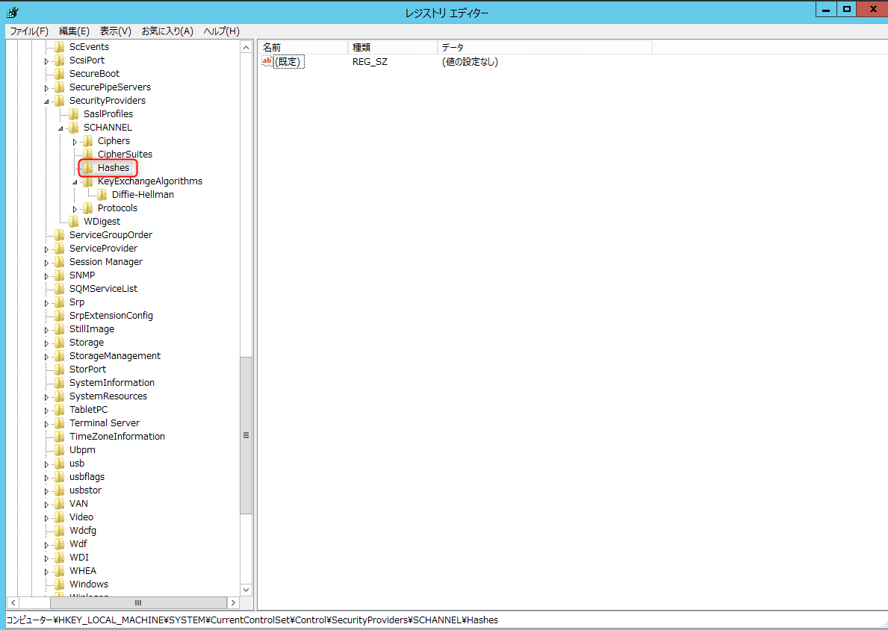

こんにちは。

[前回の記事](/disable-ssl-3-and-tls-1-in-iis-85) で、**IIS8.5のSSL3.0とTLS1.0を無効にしてSSLチェックを判定Bに引き上げましたが、まだ足りないので今回は 判定A を目指します**。

前回の記事のチェック結果に、以下の2つがありました。

1つめは **Diffie-Hellmanアルゴリズムが有効** になってること、2つめは **RC4を利用した暗号化スイートが有効** になっていること、という指摘でした。

さっそく無効にしましょう。

## Diffie-Hellmanアルゴリズム無効化

レジストリエディターを開き、 `HKEY_LOCAL_MACHINE\SYSTEM\CurrentControlSet\Control\SecurityProviders\SCHANNEL\KeyExchangeAlgorithms` へ移動します。

**新規→キー** から **Diffie-Hellman** というキーを作成し、ここに、 **新規→DWORD** から **Enabled** を作成し、**値データは0** とします。

これで完了です。

## RC4を利用した暗号化スイート無効化

レジストリエディターを開き、 `HKEY_LOCAL_MACHINE\SYSTEM\CurrentControlSet\Control\SecurityProviders\SCHANNEL\Ciphers` へ移動します。

**新規→キー** から **RC4 128/128** というキーを作成し、ここに、 **新規→DWORD** から **Enabled** を作成し、**値データは0** とします。

続けて、
`HKEY_LOCAL_MACHINE\SYSTEM\CurrentControlSet\Control\SecurityProviders\SCHANNEL\Hashes` へ移動します。

**新規→キー** から **MD5** というキーを作成し、ここに、 **新規→DWORD** から **Enabled** を作成し、**値データは0** とします。

これで完了です。
設定が完了したら、OSを再起動します。

上記のレジストリをダブルクリックで反映できる regファイルを載せておきます。
**※評価環境で適用されることは確認しておりますが、お使いの場合はテストしてからご利用ください**
<a href="/wp-content/uploads/2018/10/Disable-Diffie-HellmanandoRC4.zip">download>>Disable-Diffie-HellmanandoRC4.zip</a>

## SSLチェックを実施

前回の記事同様、以下のサイトに接続し **Hostname** 部分にテストするサイトのURLを入力してチェックを実行します。
[SSL Server Test (Powered by Qualys SSL Labs)](https://www.ssllabs.com/ssltest/)

しばらくチェック完了まで待機します・・・

おー、無事 **判定A** になりました。

前回の記事と合わせてご覧いただき、是非IISのセキュリティレベルを向上させてください。

>[[Windows Server] IIS 8.5 でSSL 3.0とTLS 1.0を無効にする](/disable-ssl-3-and-tls-1-in-iis-85)

それでは次回の記事でお会いしましょう。

## 2019/11/7 に追記
コメントをいただきましたので、**評価Aになった後のHandshake Simulationの結果** を掲載します。
