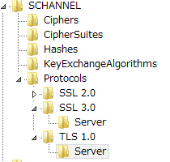
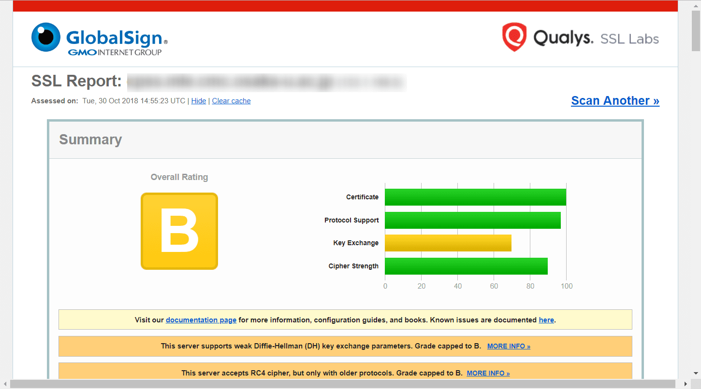

こんにちは。

IIS 8.5でWebシステムを構築した際、インストールした直後にSSL Testを行うと **判定C** と脆弱な状態でした。

> [SSL Server Test (Powered by Qualys SSL Labs)](https://www.ssllabs.com/ssltest/)

結果を確認すると、SSL 3.0 と TLS 1.0 が有効(Yes)になっていることが分かりました。

これは改善すべき点なので、早速無効にしましょう。

## IIS 8.5 で SSL 3.0 と TLS 1.0 を無効にする方法

以下を参考に設定しましたが、なんて分かりにくい説明なんでしょう・・・。

[インターネット インフォメーション サービスで PCT 1.0、SSL 2.0、SSL 3.0、または TLS 1.0 を無効にする方法](https://support.microsoft.com/ja-jp/help/187498/how-to-disable-pct-1-0-ssl-2-0-ssl-3-0-or-tls-1-0-in-internet-informat)

>プロトコルを無効にするには、サーバーのプロトコルのサブキー内に新しい DWORD 値を作成し、その DWORD 値を 00 00 00 00 に設定します。

いや、なんていう名前で作るねん！　とひとりで画面に突っ込んでました。
と、いうことでこれはあくまで参考に。。

さて、仕切り直して。
設定はレジストリ変更で行います。

レジストリーエディターを開き、以下のキーに移動します。

`HKEY_LOCAL_MACHINE\SYSTEM\CurrentControlSet\Control\SecurityProviders\SCHANNEL\Protocols`

弊社構築の環境では、上記のキーの下には、 **SSL 2.0** のキーしか存在しておりませんでしたので、 **SSL 3.0** と **TLS 1.0** のキーを作成します。

[新規→キーから作成]

そして、さらにそれぞれの下に、 **Server** というキーを作成します。
こうなるわけですね。

さらにさらに、 **Server** のキーの下に、 **新規→DWORD** から **Enabled** という名前で値を作成し、値のデータは **0** とします。

これで完了です。
設定が完了したら、OSを再起動します。

上記のレジストリをダブルクリックで反映できる regファイルを載せておきます。
**※評価環境で適用されることは確認しておりますが、お使いの場合はテストしてからご利用ください**
<a href="https://mseeeen.msen.jp/wp-content/uploads/2018/10/Disable-SSL-3.0andTLS1.0_reg.zip">download>>Disable-SSL 3.0andTLS1.0_reg.zip</a>

ここまで設定したら再起動します。

再起動後、SSLチェックのページから **Clear cache** をクリックして再チェックします。

判定が　**B** に上がり、SSL3.0 と TLS 1.0　が無事無効になりました。

## あとがき

うーん、判定がBでまだ微妙なので次の記事でA以上を目指してみます。

また下記のように、SSL3.0、TLS 1.0を無効にすることで環境によっては不便になることがあるようです。

> いくつかの IIS 管理ツールのクライアント側の機能も失われます。
>[SSL3 および TLS 1.0 を無効にした後、IIS マネージャーと Web 配置を有効にします。](https://support.microsoft.com/ja-jp/help/3206898/enabling-iis-manager-and-web-deploy-after-disabling-ssl3-and-tls-1-0)

適用する場合には合わせて参考にしてみてください。

それでは次回の記事でお会いしましょう。