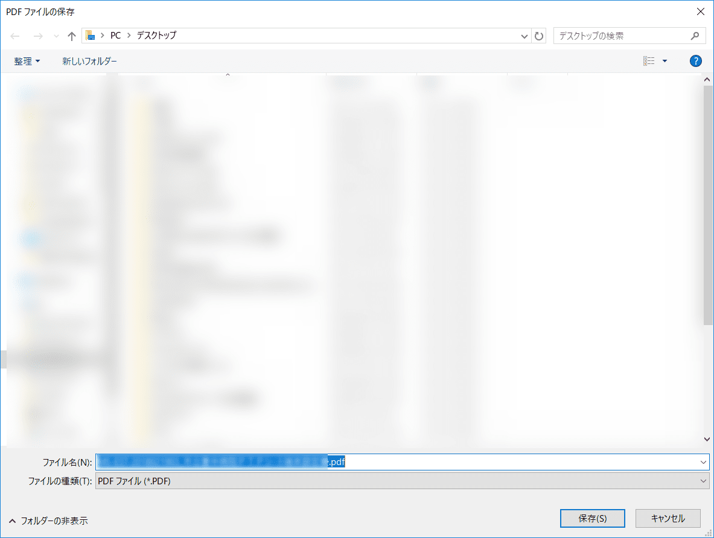
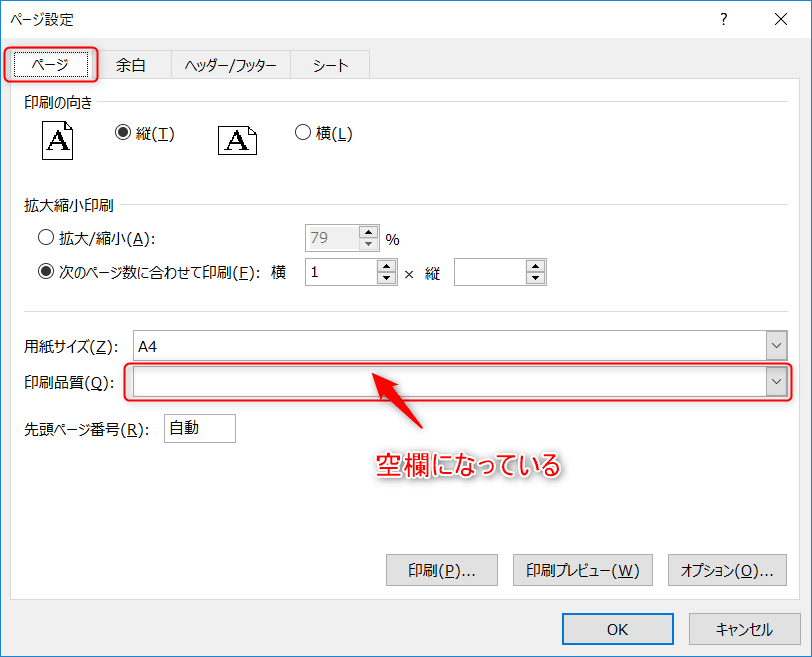

こんにちは。

今回の紹介は、複数シートのExcelをPDFへ印刷すると、シート毎に別ファイルになってしまう現象について解決策を紹介します。

## 現象の確認

文字では少し分かりにくいと思いますので、現象について確認しましょう。

1. 複数シートのExcel

1. **ブック全体を印刷** に変更して印刷する

1. 保存先が聞かれる

1. PDFができた

1. しかし・・・すぐにまた保存先が聞かれ、「2シート目が別ファイルとして印刷される」現象が発生します

## 原因と解決

ずばり原因は、**印刷品質設定がシート毎で異なっているから** です。

**ページタイトル** → **印刷タイトル** から、**ページ設定** に進みます。

**印刷品質** 空欄になっています。
もう1つのシートの設定が **600dpi** であることを事前に確認していましたので **600dpi** に設定します。

再度印刷すると・・・

無事、1つのPDFファイルに2ページ印刷されました。

## あとがき

この現象が発生するきっかけとして、別のExcelからシートを移動やコピーをして複数シート状態にしたときに発生することが経験上多いです。

紙印刷であれば、問題なる現象ではありませんが、PDFにするときにこの現象が発生すると別ソフトウェアで結合したりなど手間が増えます。

同じ現象の方が解決できれば幸いです。
それでは次回の記事でお会いしましょう。
