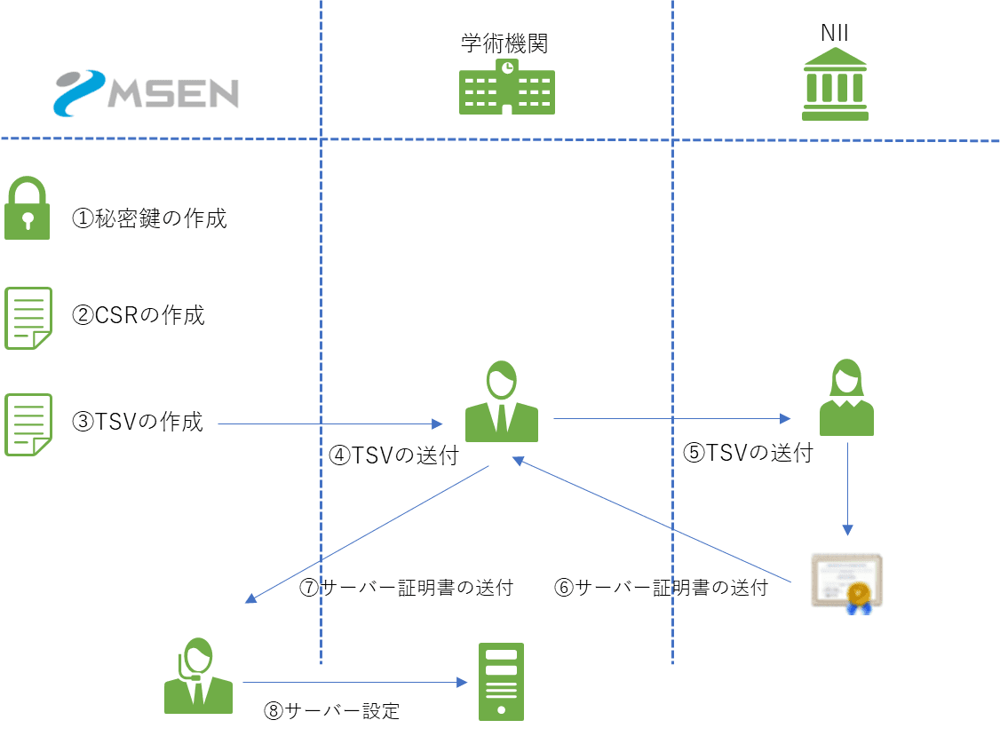
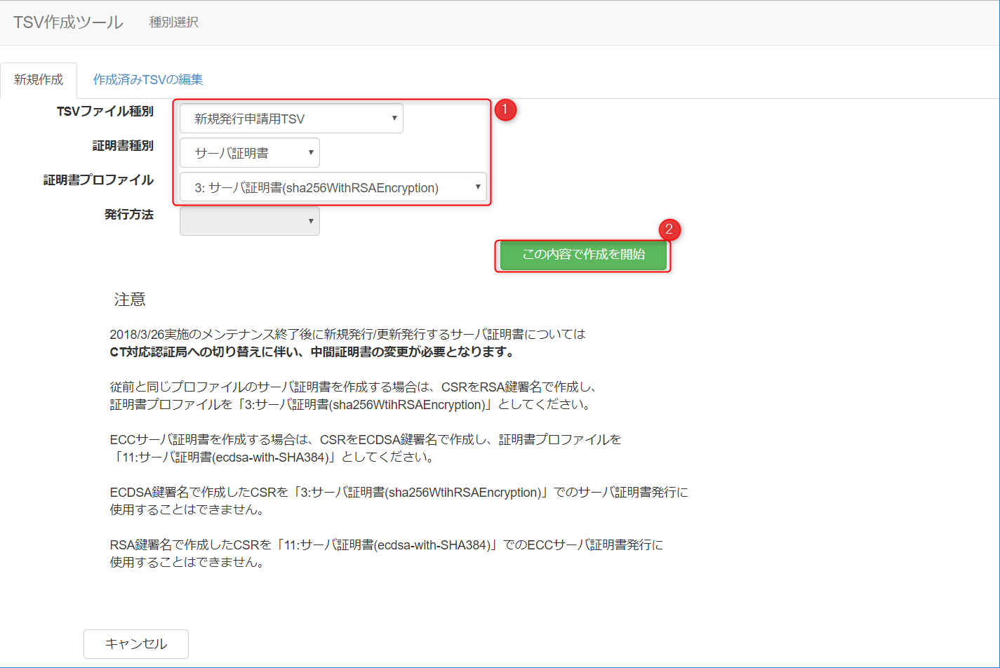
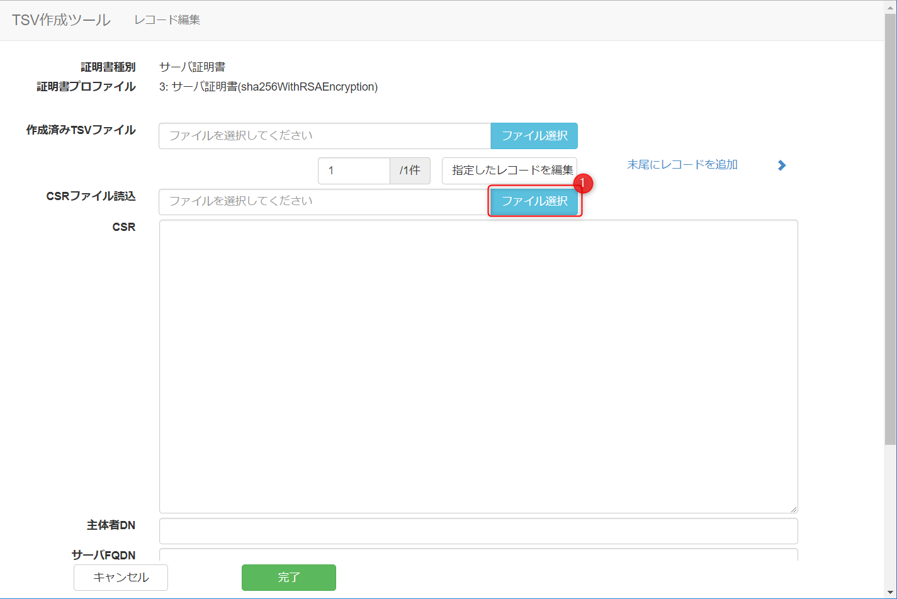
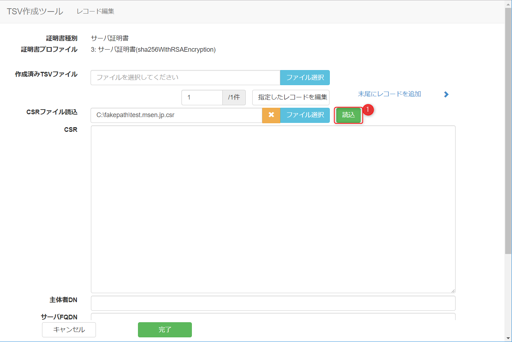
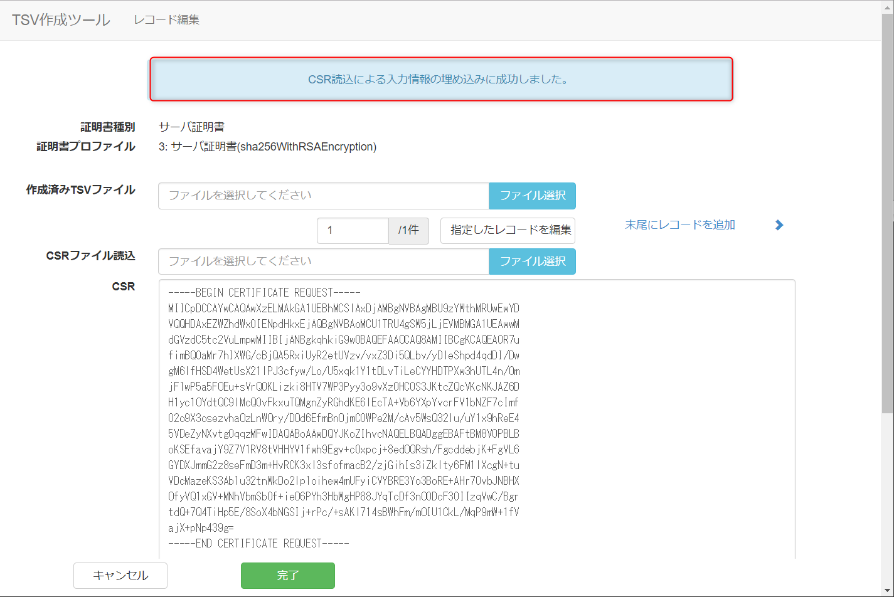
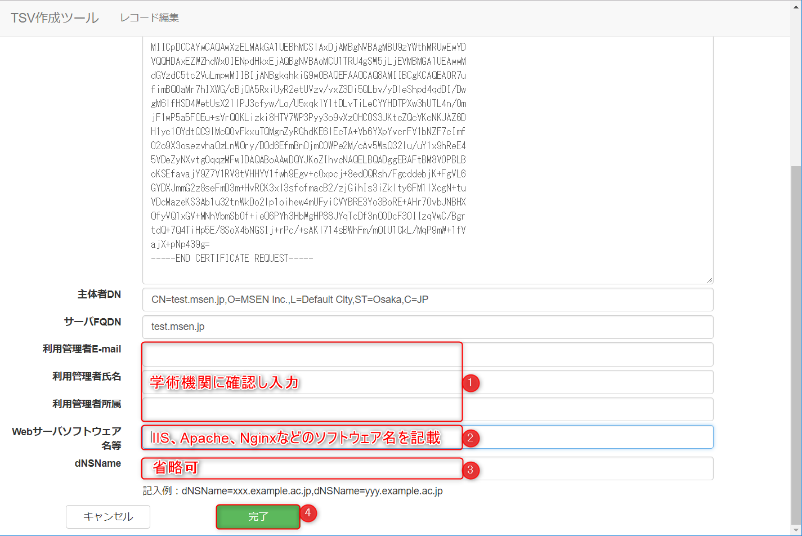
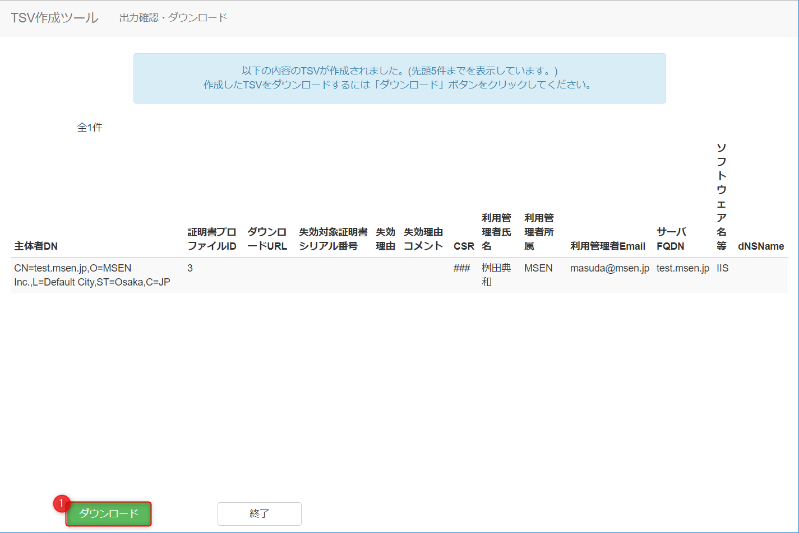

こんにちは。

今回は、**UPKI電子証明書発行サービスの利用** について紹介する記事です。


UPKIは、国立情報学研究所(National Institute of Informatics※)が運営する、学術機関（大学，短大等）向けの電子証明書発行サービスです。
[概要 - UPKI電子証明書発行サービス](https://certs.nii.ac.jp/certs/)
※ **以降、NIIと記載**

今回の記事では、証明書の発行依頼をするために必要なTSVの作成までの流れを説明します。

## 概要

大きな流れは以下のとおりです。

1. 秘密鍵の作成
1. CSRの作成
1. TSVの作成

シチュエーションとして、弊社が学術機関のサーバーを設定する業者として証明書を入手するまでの流れを想定します。(あくまで一例です)



次項から順番に作業を開始していきましょう。

秘密鍵等の作成方法は色々とあると思いますが、今回は **opensslコマンドが利用できるCentOS** で作業を進めます。

作成するドメインを `test.msen.jp` とします。
(注意:弊社は学術機関ではありませんので、実際にUPKIの証明書を発行してもらうことはできません。)

## 秘密鍵の作成

* 鍵長を2048bitで秘密鍵を作成します
以下のコマンドを実行します。
`openssl genrsa -des3 -out test.msen.jp.passfrase 2048`

パスフレーズが要求されますので入力します。
```
$ openssl genrsa -des3 -out test.msen.jp.key.passfrase 2048
Generating RSA private key, 2048 bit long modulus
......................................................................................................+++
......................+++
e is 65537 (0x10001)
Enter pass phrase for test.msen.jp.key.passfrase:
Verifying - Enter pass phrase for test.msen.jp.key.passfrase:
```

正しく入力できれば、 `test.msen.jp.key.passfrase` というファイルができます。

* 前項で作成した秘密鍵からパスフレーズを解除します。
秘密鍵にパスフレーズが設定されていると、Webサーバーが起動するたびにパスフレーズを要求され、自動起動をすることが難しくなるため、今回はパスフレーズなしの秘密鍵を作成します。

以下のコマンドを実行します。

`openssl rsa -in  test.msen.jp.key.passfrase -out test.msen.jp.key`

パスフレーズが要求されますので、先ほど入力したパスフレーズを入力します。

```
$ openssl rsa -in  test.msen.jp.passfrase -out test.msen.jp
Enter pass phrase for test.msen.jp.passfrase:
writing RSA key
```

正しく入力できれば、 **writing RSA key** と出力され `test.msen.jp.key` というファイルができます。

以上で秘密鍵の作成が完了です。

## CSRの作成
* SHA-256でCSRを作成する

以下のコマンドを実行します。
`openssl req -new -sha256 -key test.msen.jp.key -out test.msen.jp.csr`

コマンドを実行すると、DNの入力が求められます。
ルールについては以下を参照してください。
[CSRに関するルール - UPKI電子証明書発行サービス](https://certs.nii.ac.jp/archive/TSV_File_Format/csr/)

今回はテストのため、**必須属性のみ正しく入力し** その他は弊社の情報として入力します。
**実際には学術機関に確認をして入力する必要があります。**

以下のように入力しました。

```
Country Name (2 letter code) [XX]:JP
State or Province Name (full name) []:Osaka
Locality Name (eg, city) [Default City]:
Organization Name (eg, company) [Default Company Ltd]:MSEN Inc.
Organizational Unit Name (eg, section) []:
Common Name (eg, your name or your server's hostname) []:test.msen.jp
Email Address []:

Please enter the following 'extra' attributes
to be sent with your certificate request
A challenge password []:
An optional company name []:
```

説明は以下のとおりです。

1. **C=JP** 固定値です。
1. **ST=Osaka** 以下の **ST固有一覧** から正しく入力します。
[ST固有値一覧 - UPKI_Manual - meatwiki](https://meatwiki.nii.ac.jp/confluence/pages/viewpage.action?pageId=29235860)
1. **L=そのままEnter** 「**原則としてサービス窓口に事前に届出したとおりの所在地の市区町村名をローマ字表記で指定する**」とされていますので、**学術機関に確認**する必要があります。以前は **Academe** が固定でしたが、**2018年7月9日以降に設定するとエラー**となるようです。**そのままEnter** すると **Default City** となりますので値を除外したい場合は *.(ピリオド)** を入力します。
1. **O=MSEN Inc.** サービス利用申請時の学術機関名(英語表記)を設定する必要がありますので、**学術機関に確認**する必要があります。
1. **OU=空欄** 省略可能項目です。
1. **CN=test.msen.jp** サーバーのFQDNを誤りなく記載します。
1. **Email=空欄** 「**使用しない**」とされています。

**challenge password も空Enterします。**

正しく入力できれば、 `test.msen.jp.csr` というファイルができます。

以上でCSRの作成が完了です。

TSV作成の手順で作成した **CSRが必要となりますので作業端末にダウンロード** します。

## TSVの作成
NIIで提供されているツールを利用して作成します。

以下にアクセスします。
[TSV作成ツール: 種別選択](https://certs.nii.ac.jp/tsv-tool/create/)

以下の流れで作成します。

1. 以下の画像を参考に作成を開始します


1. ファイル選択から作成したCSRを読み込みます

↓

↓(無事読み込まれました)


1. 以下を参考に残りの情報を入力します


1. ここまででTSVが作成され、ダウンロードボタンを押せばTSVがダウンロードされます


以上でTSVの作成が完了です。

学術機関の担当者様にTSVを送付し、証明書が発行されるのを待ちます。

## あとがき
購入型のサーバー証明書とは少し手順が異なりますが、関連の作業をされているかたの参考になれば幸いです。

それでは次回の記事でお会いしましょう。