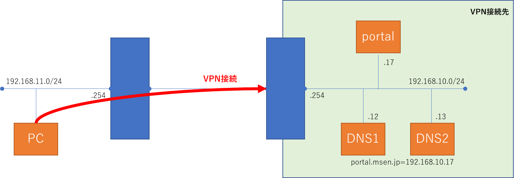

こんにちは。

今回は、VPNに接続した時にVPN接続先に存在するDNSサーバーを参照する方法を紹介します。

※この記事はすでにVPN接続が出来る状態になっていることが前提となります。

## 概要

この図に示すネットワークを元に説明を進めます。



## 事前設定

1. ネットワーク接続を開き、VPNインターフェースのプロパティを開きます


1. ネットワークタブからインターネットプロトコルバージョン4を選択しプロパティを選択します


1. DNSサーバーのIPアドレスを指定し、詳細設定に進みます


1. 自動メトリックのチェックを外し、 インターフェースメトリックに **1** を入力しOKで閉じます

↓


1. その後の設定画面もOKで閉じていき変更を確定します

以上で設定は完了です。

## テスト

それではテストをしてみましょう。

VPN接続しない状態で、 **portal.msen.jp** を解決してみます。
```
λ nslookup portal.msen.jp
サーバー:  UnKnown
Address:  192.168.11.254

*** 192.168.11.1 が portal.msen.jp を見つけられません: Non-existent domain
```

名前解決に失敗しました。

では、VPNに接続してからやってみましょう。
VPN接続を行います。

```
λ nslookup portal.msen.jp
サーバー:  dc1.msen.jp
Address:  192.168.10.12

名前:    portal.msen.jp
Address:  192.168.10.17
```

VPN接続先のIPアドレスが解決できました。

## あとがき

インタフェースメトリックの設定が肝で、**値が小さい方が優先**されます。

そのため、自動チェックが入っているとVPN接続先のDNSサーバーが利用されず
目的が満たせない状態になっていました。

通常は自動で問題ないですが、意図的に変更したい場合にこの方法は有効です。

それではまたお会いしましょう。