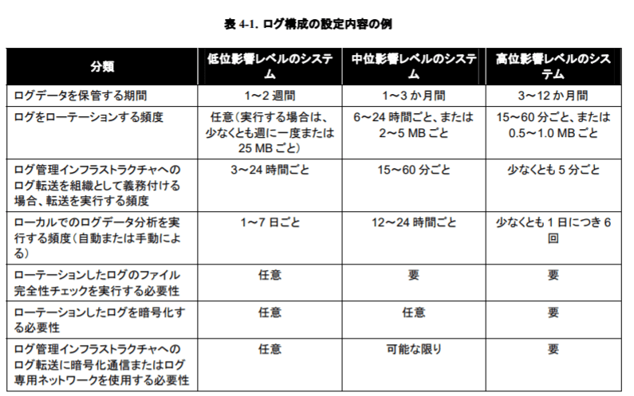
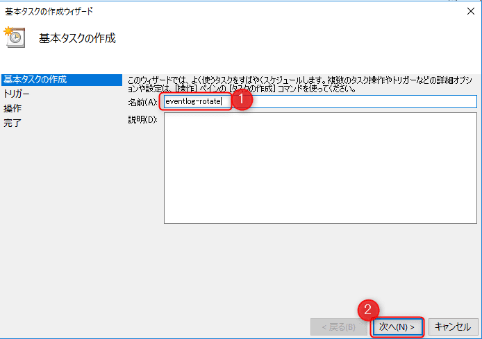

こんにちは。

今回は、Windows のイベントログ(セキュリティ)を7zで圧縮してローテーションする方法を紹介します。

Windows Serverを運用されている方には分かっていただけると思うのですが、Windows には自動でログローテーションされる標準機能がありません。

昨今のセキュリティ事情を考えると特にセキュリティログは大切で、できれば1年程度は保持したいところです。

IPAが紹介している資料にも、高位影響レベルのシステムが保持するログの期間は3ヶ月～12ヶ月となっています。

**4-7抜粋**

[コンピュータセキュリティログ管理ガイド](https://www.ipa.go.jp/files/000025363.pdf)

今回は、PowerShellを使って、セキュリティイベントログを高圧縮率の7zで圧縮し、ローテーションする方法を紹介します。

動作確認は、**Windows Server 2012R2** と **Windows Server2016** で行いました。

## ログの設定を変更する

まず、標準の設定を確認します。

イベントログから、**Windowsログ→セキュリティを右クリックしプロパティを選択** します。


プロパティから、ログの設定は **必要に応じてイベントを上書きする** に設定されていることが分かります。


これは、**Security.evtx** が設定されている最大ログサイズ(約130MB)に達した時点でログを上書きしてしまうという設定になります。

同じ画面から、ログの保存先は `%SystemRoot%\System32\Winevt\Logs\` であることが分かりますので開いてみます。


上記のように、**Security.evtx** が一つしかなく上書きされていることが分かります。

ログが上書きされてしまっては困るので、同じプロパティ画面から、以下のように変更します。(ログサイズはデフォルトのままとします)

**OKを押したタイミングで設定は反映されます。**

この設定により、最大ログサイズに達したSecurity.evtxは、同じフォルダに **Archive-Security-2018-09-26-13-30-57-581.evtx** のような名前でArchiveされます。


ここまでで、ログが上書きされることなく残るようになりました。

## PowerShellを使ってログローテションスクリプトを作成する

### 準備

PowerShellを使って、ログローテションするスクリプトを作成します。
動作させるための準備を行います。
※[あとがき](https://mseeeen.msen.jp/how-to-rotate-windows-event-log/#i-6) に**一瞬でインストールできるように展開ファイルをダウンロードできるように** しています。

1. C:\batch フォルダを作成する
2. C:\batch\log フォルダ作成する
1. C:\batch\log\Transcript フォルダを作成する
3. C:\batch\tmp フォルダを作成する
4. C:\EventLogArchive フォルダを作成する
5. C:\EventLogArchive\Archive フォルダを作成する
6. C:\EventLogArchive\Backup フォルダを作成する
7. [7-Zip - OSDN](https://ja.osdn.net/projects/sevenzip/releases/) より**7z1805-extra.7z** をダウンロードし解凍する。解凍したフォルダを **7z-extra** にリネームして、**C:\batch フォルダにコピー** する。※**7zxxxx-extra.7z** の **xxxx** の部分は **執筆時点のバージョンとなる** 。
8. C:\batch\MoveAndZip-File.ps1 を以下の内容で作成する

```
## ファイルを移動した後、圧縮を実施する。
## 圧縮後のファイルのうち30日より古いファイルについては削除を行う。

# 入力元フォルダ、出力先フォルダを変更できるように関数にする。
function ZipAndMoveLogFiles(
    # デフォルトのパラメータの設定

    # 7zipのモジュールのパスを指定
    $SZpath = "C:\batch\7z-extra\x64\7za.exe",
    # 入力元フォルダのパスを指定
    $SourceFolder   = "C:\Windows\System32\winevt\Logs",
    # 作業用フォルダのパスを指定
    $CopyTempFolder = "C:\batch\tmp",
    # 出力先フォルダのパスを指定
    $DestinationFolder = "C:\EventLogArchive",
    $DestinationFolderBackup  = $DestinationFolder + "\Backup",
    $DestinationFolderArchive = $DestinationFolder + "\Archive",
    # トランスクリプトの出力先フォルダのパスを指定
    $TranscriptFolder = "C:\batch\log\Transcript", 
    # 入力元フォルダから作業用フォルダにファイルを移動する際のフィルタの有効性の指定
    $MoveFilter = $true
){

    # 入力元フォルダ、出力先フォルダ等が存在しない場合は処理を中止する。
    if(Test-Path $SZpath){}else{$SZpath + "が存在しません。処理を終了します。" ; exit} 
    if(Test-Path $SourceFolder){}else{$SourceFolder + "が存在しません。処理を終了します。" ; exit} 
    if(Test-Path $CopyTempFolder){}else{$CopyTempFolder + "が存在しません。処理を終了します。" ; exit} 
    if(Test-Path $DestinationFolder){}else{$DestinationFolder + "が存在しません。処理を終了します。" ; exit} 
    if(Test-Path $DestinationFolderBackup){}else{$DestinationFolderBackup + "が存在しません。処理を終了します。" ; exit} 
    if(Test-Path $DestinationFolderArchive){}else{$DestinationFolderArchive + "が存在しません。処理を終了します。" ; exit} 
    if(Test-Path $TranscriptFolder){}else{$TranscriptFolder + "が存在しません。処理を終了します。" ; exit} 

    # トランスクリプト用の時刻データ取得
    $DateTime = Get-Date -Format "yyyyMMdd-HHmmss"
    $TranscriptFileName = $TranscriptFolder + "\ts-" + $DateTime + ".txt"
    # トランスクリプトの取得開始
    Start-Transcript -Path $TranscriptFileName

    # 7zipのパスをエイリアスとして設定
    Set-Alias sz $SZpath

    # 入力元フォルダから作業用フォルダにファイルを移動する。
    # フィルターが有効な場合はアーカイブされたイベントログ（セキュリティ）ファイルのみを移動する。
    if($MoveFilter){
        Get-ChildItem -Path $SourceFolder | Where-Object {$_.Name -like "Archive-Security-*"} | Move-Item -Destination $CopyTempFolder
    }else{
        Get-ChildItem -Path $SourceFolder | Where-Object {$_.LastWriteTime -lt (Get-Date).AddDays(-7)} | Move-Item -Destination $CopyTempFolder
    }
    
    # 作業用フォルダのファイル一覧を取得
    $ItemsList = Get-ChildItem -Path $CopyTempFolder


    # 作業用フォルダのファイルに対して圧縮処理の実行する
    foreach ($EachItem in $ItemsList){
    
        # 圧縮後のファイル名を設定（.7zを付加）
        $Source = $EachItem.FullName
        $Target = $EachItem.FullName + ".7z"

        # 7zipにて圧縮を実行する。
        $ZipResult = sz a -t7z -mx=9 $Target $Source | Out-String
        $ZipResult

        # 7zipのログを確認して、正常終了の場合はファイルを移動する。
        if($ZipResult -match "Everything is Ok"){
            Write-Output "$EachItem.FullName の圧縮は正常に完了しました。"
            Move-Item -Path $Source -Destination $DestinationFolderBackup 
            Move-Item -Path $Target -Destination $DestinationFolderArchive
            Get-Item  -Path ($DestinationFolderBackup + "\" + $EachItem.Name)
            Get-Item  -Path ($DestinationFolderArchive + "\" + $EachItem.Name + ".7z")
        }else{
            "$EachItem.FullName の圧縮は失敗しました。"
        }

    }


    # 古いファイルの削除
    # 30日より古いファイルを削除
    $FilesToBeRemoved = Get-ChildItem -Path $DestinationFolderBackup | Where-Object {$_.LastWriteTime -lt (Get-Date).AddDays(-30)}
    # 削除対象ファイルの出力
    Write-Output "削除対象ファイル"
    $FilesToBeRemoved
    # 対象ファイルの削除
    $FilesToBeRemoved | Remove-Item 


    # トランスクリプトの取得終了
    Stop-Transcript

}

ZipAndMoveLogFiles
```

### 実行してみる
準備が完了したら、**C:\batch\MoveAndZip-File.ps1** を実行してみます。


PowerShellウィンドウが現れ、処理が終了すると消えます。


### スクリプトの動作概要

1. **C:\Windows\System32\winevt\Logs** のArchiveされたセキュリティログを **C:\batch\tmp** に移動する。
2. **C:\batch\tmp** 内で、Archiveされたセキュリティログを7zで圧縮する。
3. 圧縮が成功したら、**C:\batch\tmp** から圧縮されたファイルを **C:\EventLogArchive\Archive** に移動する。
4. 元のログを、**C:\EventLogArchive\Backup** に移動する。
5. **C:\EventLogArchive\Backup** の中のログで更新日時が **30日を超えたもは削除** する。
※**C:\EventLogArchive\Archive**に保存された7zで圧縮したファイルは **約130MBのファイルが約4MB(約3%)** になるため日にちが経過しても削除しないようにしています。
※実行されたログは、**C:\batch\log\Transcript** 配下に出力されます。

## タスクスケジューラーの設定

前項までで、PowerShellを実行することでArchiveログが圧縮され、ログローテーションができるようになりましたが、手動で毎回実行するのは現実的ではないため、タスクスケジューラーを設定します。

以下の流れで設定します。

1. タスクスケジューラーを開きます。(**コントロールパネル→管理ツール→タスクスケジューラー**)
2. 基本タスクの作成をクリックします。
  
3. 以下の流れを参考に作成します。
  [名称を入力します] (任意名称)
  
  [毎日を選択します]
  
  [実行する時間を指定します] (記事では3:00としています)
  
  [プログラムの開始を選択します]
  
  [以下のように入力します]
  ①プログラム/スクリプト部分 **%SystemRoot%\System32\WindowsPowerShell\v1.0\powershell.exe**
  ②引数の追加部分 **C:\batch\MoveAndZip-File.ps1**
  ③開始部分 `C:\`
  
  [チェックを入れて完了します]
  
  [①と②の設定を変更します] (完了をクリックした後、認証が求められるため応答します)
  

上記でタスクスケジューラーの設定は完了です。

## あとがき

前項の準備の部分で、フォルダを作成したり、7zをダウンロードしてリネームなど、少し手間のかかる作業がありますので、インストール用の展開ファイルを準備しました。

以下をダウンロードいただき、C:直下にコピーしてください。

<a href="https://mseeeen.msen.jp/wp-content/uploads/2018/09/logrotate_install.zip">logrotate_install</a>

本番環境に適用する際には十分評価を行った上で実施してください。

それでは次回の記事でお会いしましょう。