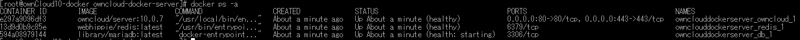
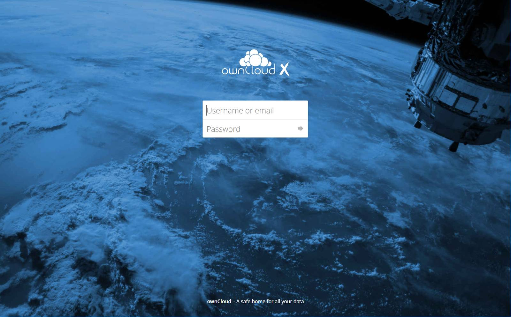
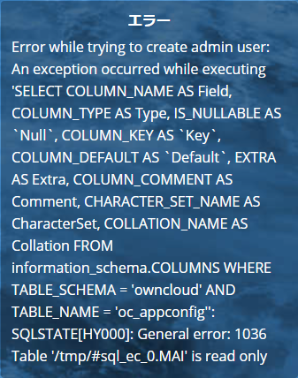

こんにちは。

ownCloudはGoogle DriveやDropboxのようなオンラインストレージです。

過去に、ownCloudの認証をActiveDirectory認証にする記事を公開しましたが、
今回は、執筆時の最新バージョンをCentOS7上のDockerにインストールしよう！という記事です。
[ownCloudをActiveDirectory認証にする](https://mseeeen.msen.jp/owncloud-active-directory-authentication/)

執筆時の最新バージョンは、 **ownCloud 10.0.7 Server** でした。

## 手順
### 準備
1. CentOS7を最小構成でインストールし、SSHで接続できるようにネットワーク周りの設定をします。
1. SELINUX を無効にします。
1. `yum -y update` で最新にアップデートします。
1. VMware環境の場合は、 `yum -y install open-vm-tools` でVMwareツールもインストールしましょう。
1. 後述の手順で `wget` を利用するため、 `yum -y install wget` を実行してインストールしておきます。
1. ここまでで、一度再起動します。
SSH接続できるようになってからの流れは以下のとおりです。
```
sed -i -e 's/SELINUX=enforcing/SELINUX=disabled/g' /etc/selinux/config
yum -y update
yum -y install open-vm-tools
yum -y install wget
reboot
```

### Docker インストール
1. 以下のコマンドでDockerのインストールと有効化を行います。
```
yum -y install docker net-tools
systemctl start docker
systemctl enable docker
```

### Docker Compose インストール
1. 以下のコマンドでDocker Compose をインストールします。
```
curl -L https://github.com/docker/compose/releases/download/1.2
0.1/docker-compose-`uname -s`-`uname -m` -o /usr/local/bin/docker-compose
chmod +x /usr/local/bin/docker-compose
```
**1.20.1** の部分は、[Tags · docker/compose](https://github.com/docker/compose/tags)を確認して最新バージョンに変更してください。

### ownCloud Server インストール
1. プロジェクトフォルダを作成します。
  ```bash
  mkdir owncloud-docker-server
  cd owncloud-docker-server
  ```

1. GitHub repositoryからYMLファイルをダウンロードします。ダウンロードしたデフォルトのYMLでは後述のエラーに見舞われるため、 `sed` で置き換えます。
  ```
  wget https://raw.githubusercontent.com/owncloud-docker/server/master/docker-compose.yml
  sed -i -e 's/webhippie\/mariadb/library\/mariadb/g' docker-compose.yml
  sed -i -e 's/MARIADB/MYSQL/g' docker-compose.yml
  sed -i -e 's/MYSQL_USERNAME/MYSQL_USER/g' docker-compose.yml
 ```
**データベースのユーザー名やパスワードは脆弱なものに設定されているため、適宜YMLファイルを変更してください。**

1. 環境設定ファイルを作成します。
  ```
  cat << EOF > .env
  VERSION=10.0.7
  DOMAIN=localhost
  ADMIN_USERNAME=admin
  ADMIN_PASSWORD=admin
  HTTP_PORT=80
  HTTPS_PORT=443
  EOF
  ```
設定値は環境に合わせて変更してください。
`.env` ファイルの作成は `cat` に続く `<< EOF >` から 最後の `EOF` までの間に入力した文字列で`.env` の設定ファイルができます。
**こちらもID・パスワードは非常に脆弱のため変更しましょう。**

1. ビルドを開始します。
  `docker-compose up -d`

### 動作確認
1. `docker ps -a` で確認します。
おぉぉ、ちゃんと動いています。
<a href="images/install-the-latest-owncloud-10-in-docker-on-centos-7-1.png"></a>

1. 表示確認
`http://IP/` に接続してみます。
おぉぉ、表示されました。
ずっと、9.xを利用していたのでなんかかっこいい。。
<a href="images/install-the-latest-owncloud-10-in-docker-on-centos-7-2.png"></a>

初期設定はすでに完了しているため、 `.env` で指定したユーザー名とパスワードでログインが完了します。

## 一気にいきましょう
`root` 権限で以下を実行することで一気に構築が完了します。

```
sed -i -e 's/SELINUX=enforcing/SELINUX=disabled/g' /etc/selinux/config
yum -y update
yum -y install open-vm-tools
yum -y install wget
reboot

yum -y install docker net-tools
systemctl start docker
systemctl enable docker
curl -L https://github.com/docker/compose/releases/download/1.20.1/docker-compose-`uname -s`-`uname -m` -o /usr/local/bin/docker-compose
chmod +x /usr/local/bin/docker-compose
mkdir owncloud-docker-server
cd owncloud-docker-server
wget https://raw.githubusercontent.com/owncloud-docker/server/master/docker-compose.yml
sed -i -e 's/webhippie\/mariadb/library\/mariadb/g' docker-compose.yml
sed -i -e 's/MARIADB/MYSQL/g' docker-compose.yml
sed -i -e 's/MYSQL_USERNAME/MYSQL_USER/g' docker-compose.yml
cat << EOF > .env
VERSION=10.0.7
DOMAIN=localhost
ADMIN_USERNAME=admin
ADMIN_PASSWORD=admin
HTTP_PORT=80
HTTPS_PORT=443
EOF

docker-compose up -d

```

## はまった点

手順の中で、ダウンロードしたYMLファイルの設定を置換していますが、この部分がかなりはまりました。

これをしないと、以下のエラーが。。

>Error while trying to create admin user: An exeption occurred while executing 'SELECT COLUMN_NAME AS Field, COLUMN_TYPE AS Type, IS_NULLABLE AS `Null` , COLUMN_KEY AS `Key`, COLUMN_DEFALUT AS `Default`, EXTRA AS Extra, COLUMN_COMMENT AS Comment, CHARACTER_SET_NAME AS CharacterSet, COLLATION_NAME AS CharacterSet, COLLATION_NAME AS Collation FROM
information_schema.COLUMNS WHERE TABLE_SCHEMA='owncloud' AND TABLE_NAME='oc_appconfig": SQLSTATE[HY000]: General error: 1036 Table '/tmp/#sql_ec_0.MAI' is read only

<a href="images/install-the-latest-owncloud-10-in-docker-on-centos-7-3.png"></a>

ここで、以下の記事に行き着き解決しました。
[Unable to install server (db tables not created) · Issue #46 · owncloud-docker/server](https://github.com/owncloud-docker/server/issues/46)

ポイントは以下の4点です。

1. **ownCloudのバージョン**は、 **10.0.7** にする
1. **SELINUX を無効** にする
1. **MARIADB** のパラメーターを **MYSQL** に変更する
1. **MYSQL_USERNAME** を **MYSQL_USER** に変更する※3で置換後。

1と2はいいにしても、3と4は分からないですよね。。
よく英語読みましたｗ

それでは次回の記事でお会いしましょう。

## 参考手順
[Installing with Docker — ownCloud 10.0.7 Server Administration Manual 10.0.7 documentation](https://doc.owncloud.org/server/latest/admin_manual/installation/docker/)

