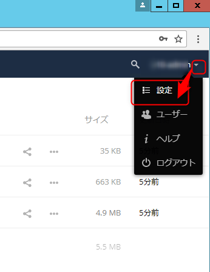
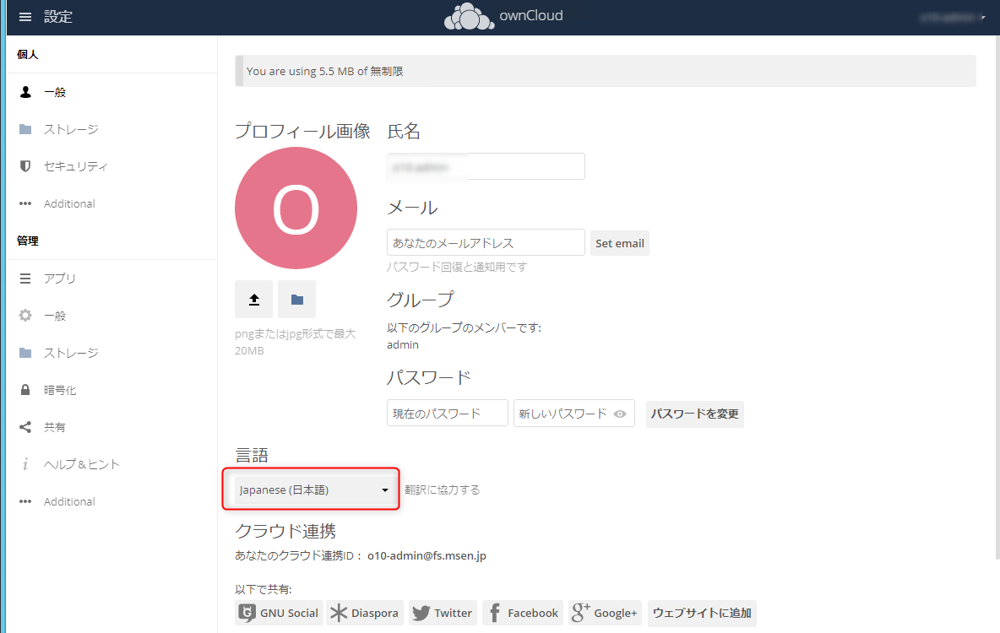
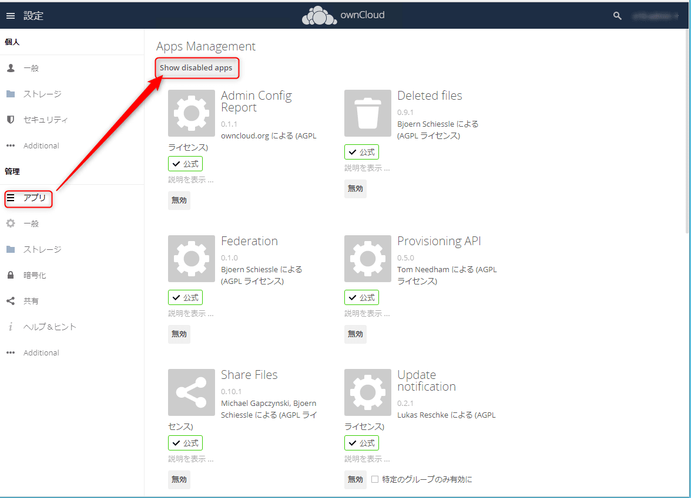
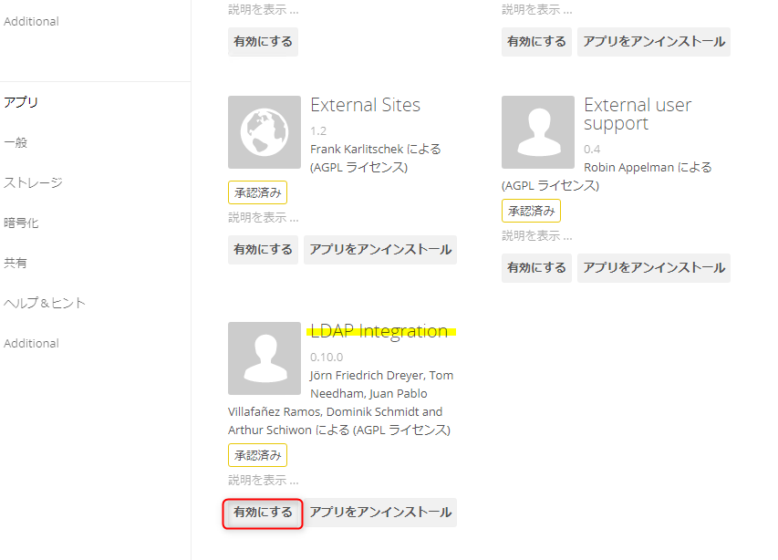
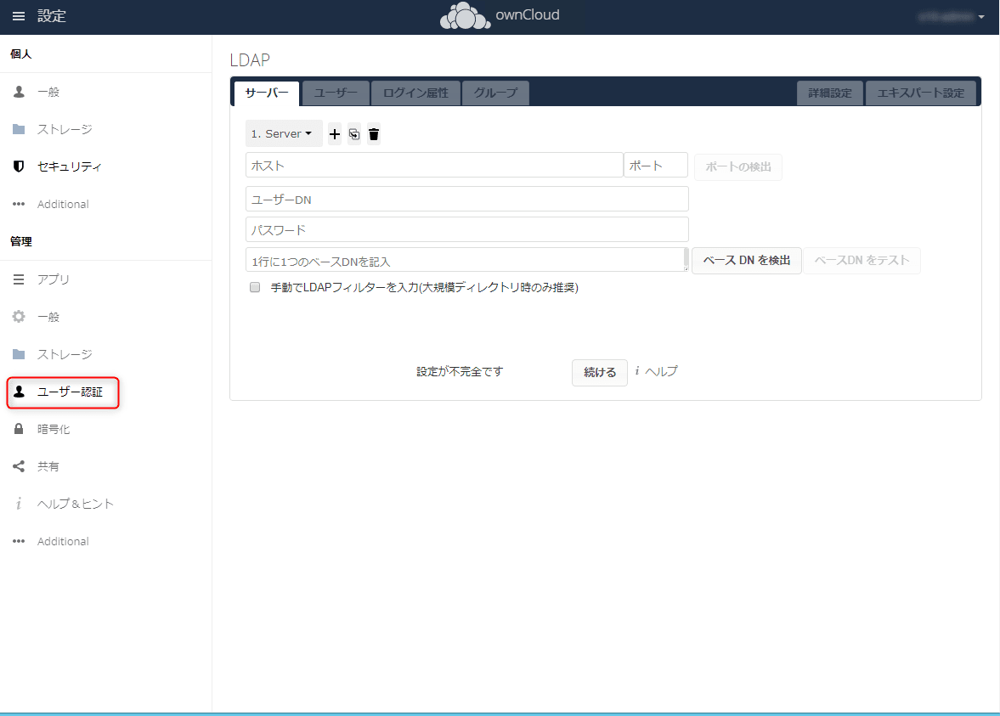

こんにちは。

先日、以下の記事でownCloud 10を構築したので、Active Directory認証に対応させる方法を紹介します。

[CentOS 7上のDockerに最新のownCloud 10をインストールする](https://mseeeen.msen.jp/install-the-latest-owncloud-10-in-docker-on-centos-7)

## 有効化
1. 管理権限でログインします。
1. 右上のユーザー名から、設定を開きます。

1. 日本語化もしておきましょう。

1. アプリから **LDAP Integration** を有効にします。

↓

1. ユーザー認証メニューが追加されていることが確認できます。

## 設定手順
設定手順は、 ownCloud 9 で紹介した以下の記事の **手順6** から実施してください。

[ownCloudをActiveDirectory認証にする](https://mseeeen.msen.jp/owncloud-active-directory-authentication/)

**ownCloud 9では設定後に条件に一致したユーザーが自動で作成** されていましたが、**ownCloud 10ではユーザーがログインした時に作成** されることを確認しました。

設定完了と同時にActiveDirectoryユーザーでログインが可能になっていると思います。

参考になれば幸いです。
それでは次回の記事でお会いしましょう。