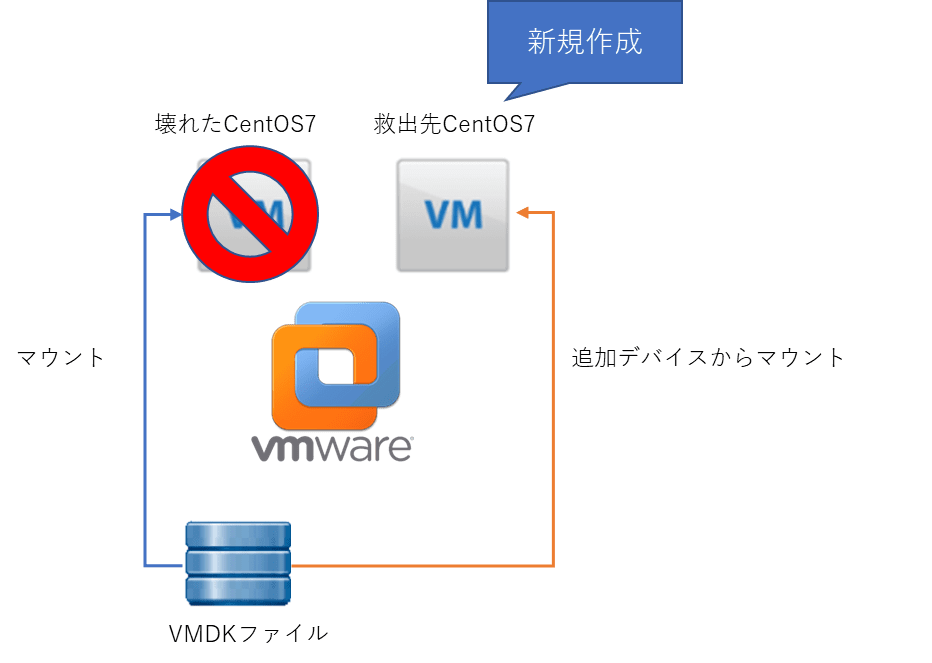
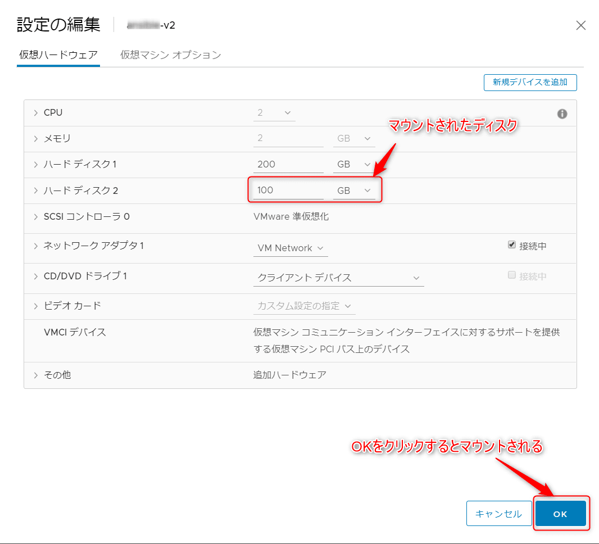

こんにちは。

VMware上で仮想マシンを運用しているケースはそれなりに多いと思いますが、
突如仮想マシンが壊れて再起不能になることが稀にあります。

このような感じで。


非常にショックな状態ですが、こんな状態でもなんとか **作成していたファイルや設定を救出したい** 、なんてこともあると思います。

そんな時に、壊れたCentOS7でマウントしていた仮想ディスク(VMDK)を別の仮想マシンにマウントして救出する方法を紹介します。

今回は、壊れたCentOS7(以降 救出元と記載)・救出先共にCentOS7(以降 救出先と記載)として紹介します。

## 作業の流れ

1. **救出先** の仮想マシンを新規作成する
1. **救出元** で動いていたVMDKファイルを **救出先** にマウントする
1. **救出先** でLVMを利用できるようにする(※)
1. マウントし、マウント先からファイルを救出する
※**救出元** がLVM形式の場合に必要

イメージは以下のような形です。


### 救出元VMDKを救出先に追加する

**救出先** の仮想マシン作成後、 **vSphere Client** から **救出元** の仮想ディスクをマウントします。
※画像イメージはWebクライアントになります。

事前に **救出先** で、 `tail -f /var/log/messages` を実行しておけば、マウント時の確認がリアルタイムにできます。
※**救出先** を停止する必要はありません。

1. 作成した **救出先** の仮想マシンを **右クリック→設定の編集** へと進みます。
1. **新規デバイスを追加** を選択し、**既存のハードディスク** を選択します。

1. データーストア上の救出元VMDKを指定します。このとき、ファイル名に番号が付いていないVMDKを指定します。


以下のように追加されますので、OKで確定します。



そのとき、 **救出先** のログに以下のように出力されます。

```
Nov 19 11:38:32 xxxxx-v2 kernel: vmw_pvscsi: msg type: 0x0 - MSG RING: 1/0 (5) 
Nov 19 11:38:32 xxxxx-v2 kernel: vmw_pvscsi: msg: device added at scsi0:1:0
Nov 19 11:38:32 xxxxx-v2 kernel: scsi 0:0:1:0: Direct-Access     VMware   Virtual disk     2.0  PQ: 0 ANSI: 6
Nov 19 11:38:32 xxxxx-v2 kernel: sd 0:0:1:0: [sdb] 209715200 512-byte logical blocks: (107 GB/100 GiB)
Nov 19 11:38:32 xxxxx-v2 kernel: sd 0:0:1:0: [sdb] Write Protect is off
Nov 19 11:38:32 xxxxx-v2 kernel: sd 0:0:1:0: [sdb] Cache data unavailable
Nov 19 11:38:32 xxxxx-v2 kernel: sd 0:0:1:0: [sdb] Assuming drive cache: write through
Nov 19 11:38:32 xxxxx-v2 kernel: sd 0:0:1:0: Attached scsi generic sg2 type 0
Nov 19 11:38:32 xxxxx-v2 kernel: sdb: sdb1 sdb2
Nov 19 11:38:32 xxxxx-v2 kernel: sd 0:0:1:0: [sdb] Attached SCSI disk
```

**/dev/sdb** として認識されたことが確認できます。

**救出先** を操作して、認識された **/dev/sdb** を確認してみます。

```
# fdisk /dev/sdb
Welcome to fdisk (util-linux 2.23.2).

Changes will remain in memory only, until you decide to write them.
Be careful before using the write command.


コマンド (m でヘルプ): p

Disk /dev/sdb: 107.4 GB, 107374182400 bytes, 209715200 sectors
Units = sectors of 1 * 512 = 512 bytes
Sector size (logical/physical): 512 bytes / 512 bytes
I/O サイズ (最小 / 推奨): 512 バイト / 512 バイト
Disk label type: dos
ディスク識別子: 0x000a64cd

デバイス ブート      始点        終点     ブロック   Id  システム
/dev/sdb1   *        2048     1026047      512000   83  Linux
/dev/sdb2         1026048   209715199   104344576   8e  Linux LVM
```

**sdb1** と **sdb2** で認識していることが確認できました。

### 救出元VMDKを救出先にマウント

#### LVM有効化前

続けて、 **救出先** を操作し、前項で確認したデバイスをマウントします。

1. マウント先ディレクトリを `/mnt/test` に作成します。(任意です)
    ```
    # mkdir /mnt/test
    ```

1. `/dev/sdb2` をマウントします。
    ```
    # mount /dev/sdb2 /mnt/test/
    mount: unknown filesystem type 'LVM2_member'
    ```

エラーが出てしまいました。
これは、LVMボリュームでは通常の `mountコマンド` ではマウントできないため発生しています。

#### LVM有効化

1. 最小構成で **救出先** を構築しているため、必要なコマンドをインストールします。
    ```
    # yum -y install lvm2
    ```

1. LVMボリュームを確認します。
    ```
    # lvscan
      inactive          '/dev/centos/swap' [4.00 GiB] inherit
      inactive          '/dev/centos/root' [<95.51 GiB] inherit
    ```
    **/dev/centos/swap** と **/dev/centos/root** という2つのボリュームが見えました。
    2つとも、 **inactive** になっています。

1. 今回は、2つ目の **/dev/centos/root** をマウントしたいのでこちらを有効にします。
    以下のコマンドで指定したボリュームを有効化します。
    ```
    # lvchange --available y /dev/centos/root
    ```

1. 再度確認します。
    ```
    # lvscan
      inactive          '/dev/centos/swap' [4.00 GiB] inherit
      ACTIVE            '/dev/centos/root' [<95.51 GiB] inherit
    ```

無事、 **ACTIVE** になりました。

LVMボリュームの有効については以下を参考にさせていただきました。
[LVMボリュームのマウントの仕方 - Qiita](https://qiita.com/tukiyo3/items/bf8164c6bc703c894598)

#### 再度マント

再度マウントをしてみます。
```
# mount /dev/centos/root /mnt/test
```

無事マウントされました。

ファイルを確認してみます。
```
# cd /mnt/test/
# ls
bin  boot  dev  etc  home  lib  lib64  media  mnt  opt  proc  root  run  sbin  srv  sys  tmp  usr  var
```

おー、見えましたね。
必要ファイルを **救出先** にコピーして無事完了です。

1人でも多くの方が救われますように。
それでは次回の記事でお会いしましょう。