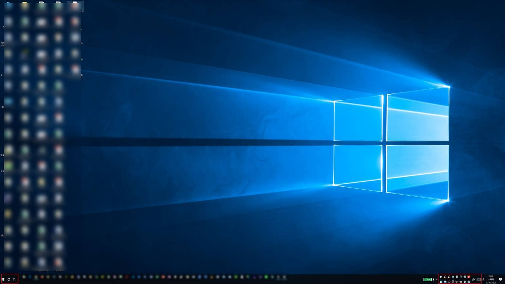

こんにちは。

つい先ほど、PCにログインすると・・・

「なんじゃこりゃーー」
※ちょっと分かりにくいと思うので、赤枠のところが普通とは違うことをお察しください。

画面の全体的な感じや、Chromeなども滑らかさのかけらもなくなっているではりませんか。。

## 原因

すぐに分かりました。
席を離れた隙に、子供がキーボードをポチポチしていたようで、間違いありません。

## 解決方法

このページを発見しました。

[黒背景の方が疲れにくい？　デスクトップの色を変更する - いまさら聞けない？Windows 10のTips - 窓の杜](https://forest.watch.impress.co.jp/docs/serial/win10tips/1028962.html)

ここを参考にすると、[設定]→[個人設定]→[色]から、**[既定のアプリモードを選択します]** の部分を黒から白に変更するとありますが、

 **変更することができない** ・・・

ん？
同じ設定画面の少し上部にいくと、

**一部の設定はハイコントラストモードでは利用できません** という記述があります。

続けて調べると、Microsoftのサポートページを発見しました。

[Windows でハイ コントラスト モードをオンにする](https://support.microsoft.com/ja-jp/help/4026951/windows-turn-high-contrast-mode-on-or-off-in-windows)

設定トップから、 [コントラスト] と検索窓に入れて、 **ハイコントラスト設定** を開きます。
なぜか、ハイ と コントラスト の間に半角スペースが入っているので、 [ハイコントラスト] と検索窓に入れると検索にかからないので注意です。

早速オフにします。

※画面が[変更しています]、というようなメッセージだけになりますが、大丈夫です。冷静に。

おぉぉ・・・戻りました。

## あとがき

上記の設定変更で無事戻りましたが、壁紙はデフォルトに戻ります。
仕方ありません。。

こんな操作を子供がやったのか、と疑問に思いましたが先ほどのMicrosoftサポートページに以下の記述がありました。

>キーボードからハイ コントラストをオンまたはオフにするには、左側の Alt キー + 左側の Shift キー + PrintScreen キーを押します。
興味のある方は是非、お試しください(笑)

しかし、10分はまりました・・・
同じ悩みの方が2分で解決できるように祈っています。

それでは次回の記事でお会いしましょう。
