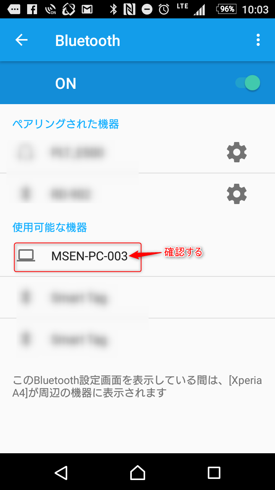
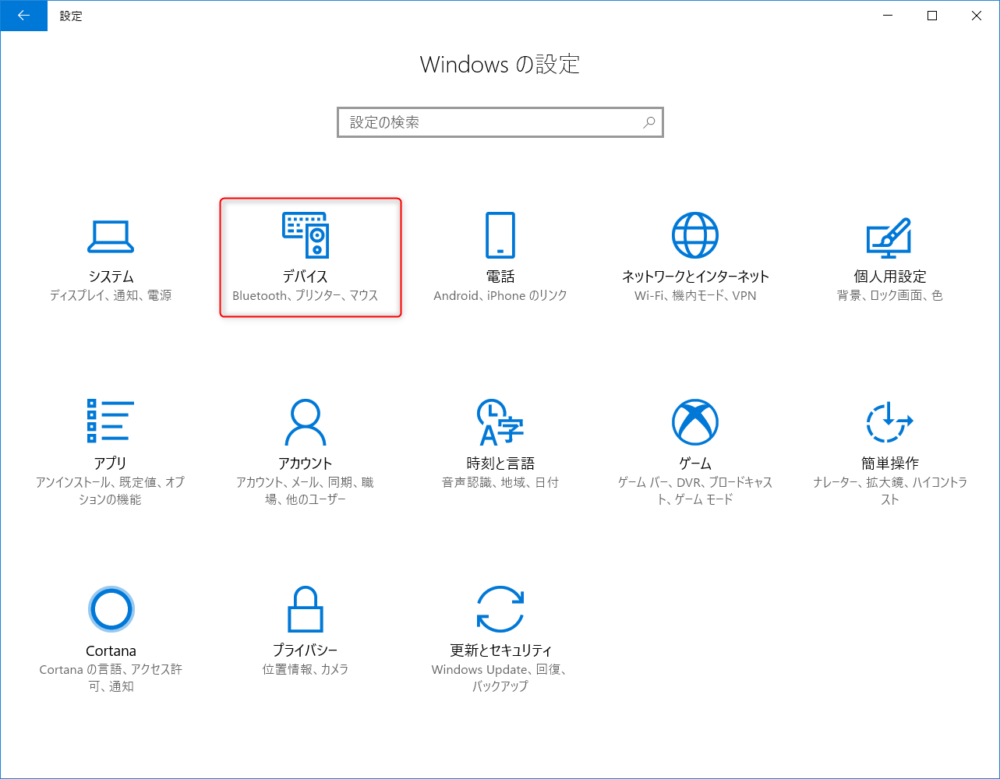
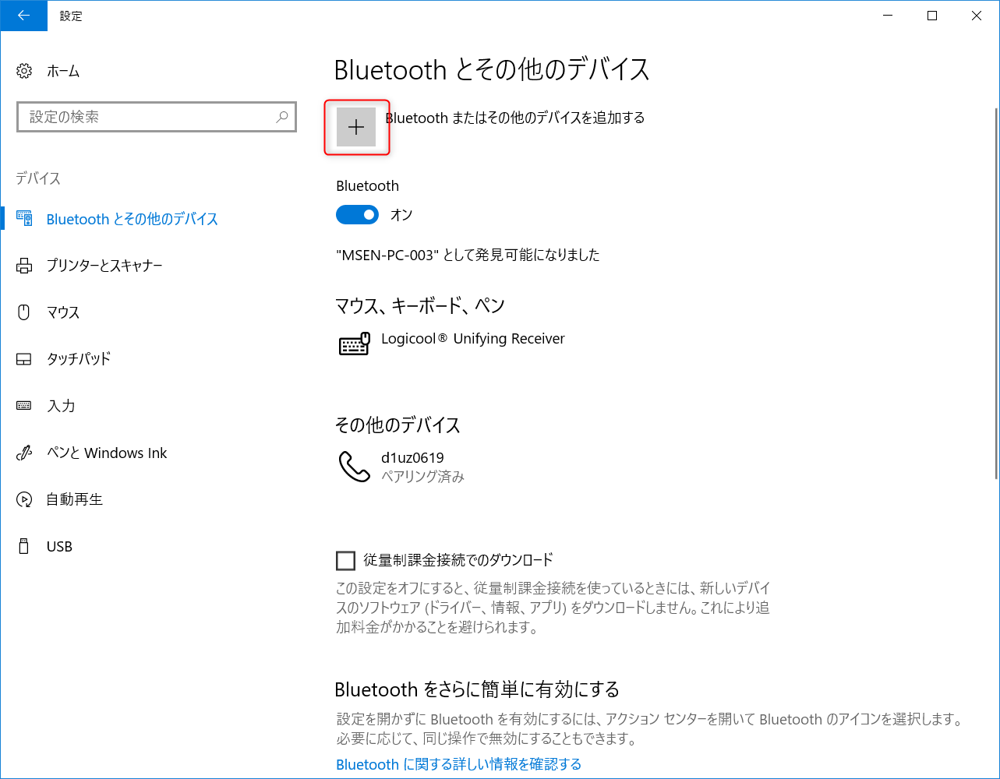
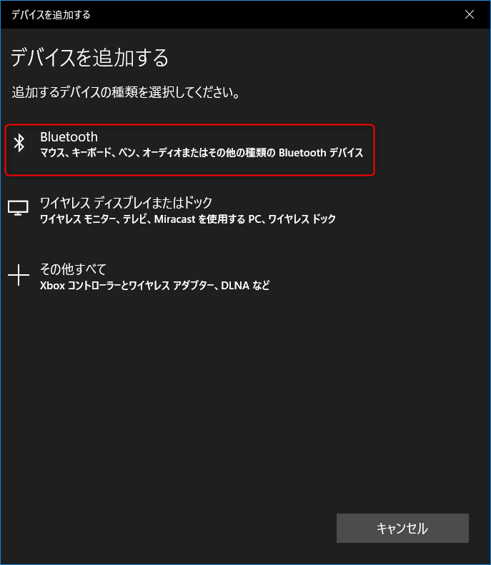
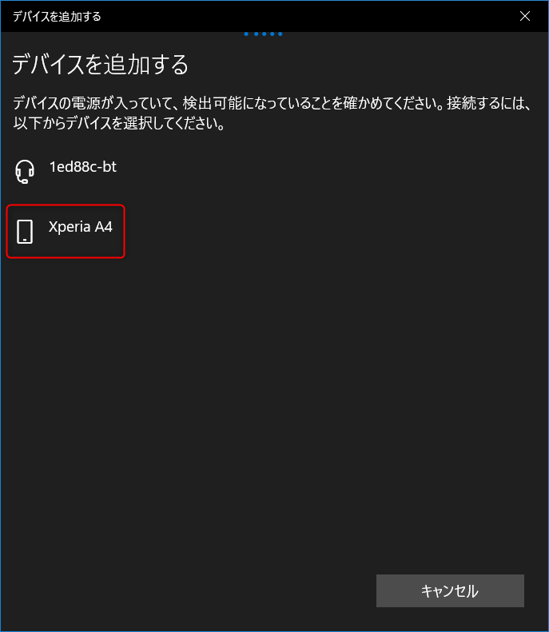
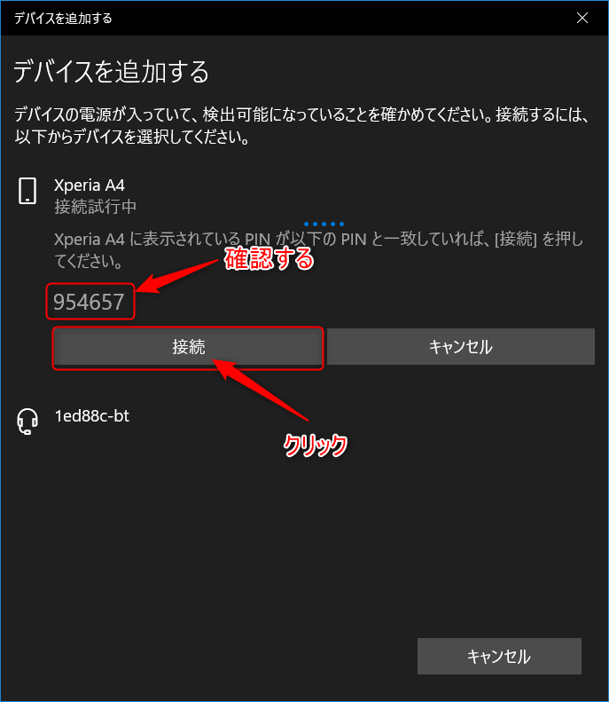
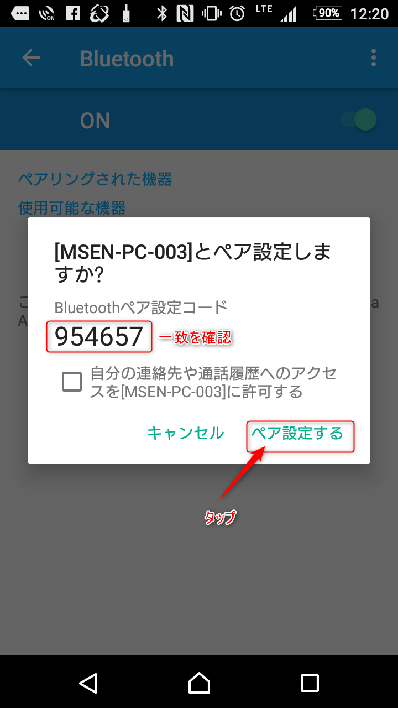
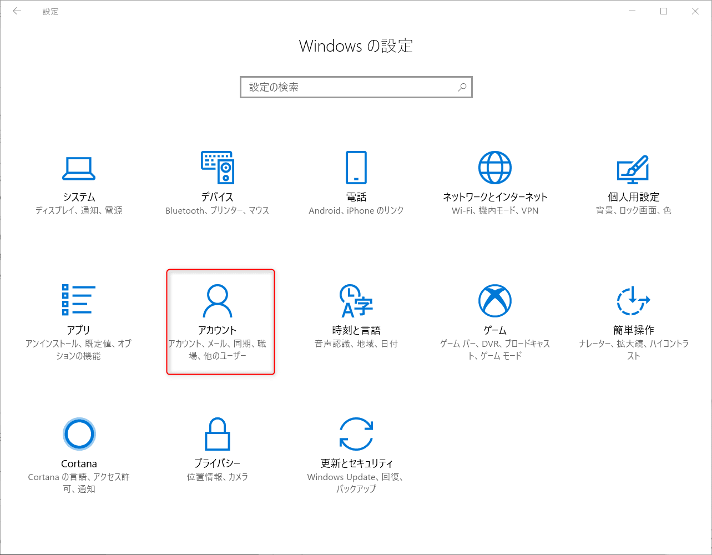
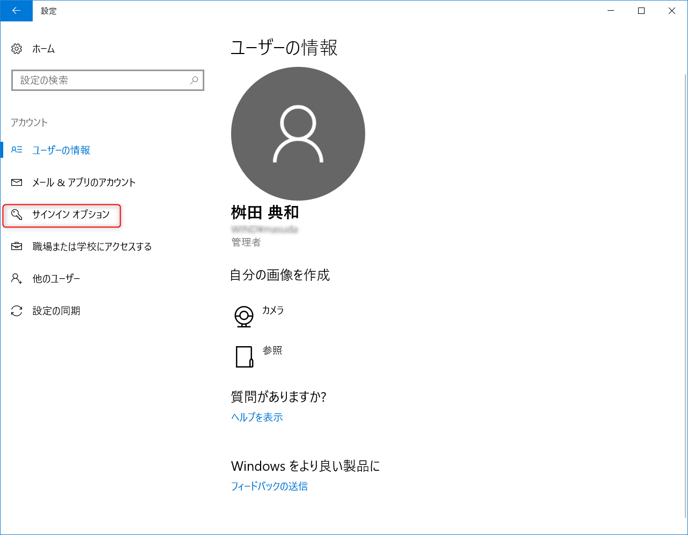
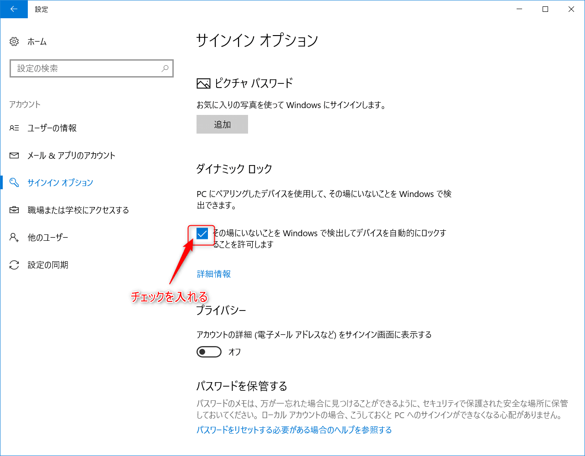

こんにちは。

勝手に利用されたりしないためパソコンから離席するときは、画面ロックをされている方も多いと思いますが、誰かに呼ばれたり、他のことを考えてたりなどなど、うっかりロックし忘れてしまうこともあると思います。

そんなうっかり忘れを防ぐために、Windows 10 Creators Updateの新機能で **ダイナミックロック (Dynamic Lock)** があります。

この機能を有効にする流れを紹介します。

## はじめに

**ダイナミックロック** は、ロックしたいパソコンとスマートフォンをBluetoothでペアリングして、スマートフォンとパソコンが一定距離離れたら自動でロックされるという機能です。
記事で利用しているパソコンとスマートフォンのバージョンは以下のとおりです。

- パソコン： Windows 10 Pro バージョン 1709 (Fall Creators Update)
- スマートフォン： Android 6.0.1

## ペアリング

1. **スマートフォン**で、Bluetooth機能をONにします。

1. ロックしたい**パソコン**で、Bluetooth機能をONにします。

1. **スマートフォン**で、設定からBluetoothに進みます。

1. **パソコン**で、設定から以下のように操作し、スマートフォンをクリックします。すると確認キーが表示されるので接続をクリックします。

1. **スマートフォン**で、手順3の画面に以下の画面が出るので、手順4で表示されたコードと一致していることを確認し、ペア設定をするをタップします。

これでペアリングは完了です。

## ダイナミックロックを有効にする
1. **パソコン**で、設定からアカウントと進み、ダイナミックロックを有効にします。

これで設定は完了です。

## あとがき

スマートフォン側でBluetooth機能をオフにしてみると、ロックされました。

ちなみに Bluetoothの通信可能距離は10m (Class 2) です。

ロック後のログインについては、スマートフォンと接続されているかどうかは無関係です。

マイクロソフトにも紹介されていますので参考にしてください。

- [離席時に Windows 10 PC を自動的にロックする](https://support.microsoft.com/ja-jp/help/4028111/windows-lock-your-windows-10-pc-automatically-when-you-step-away-from)

それでは次回の記事でお会いしましょう。