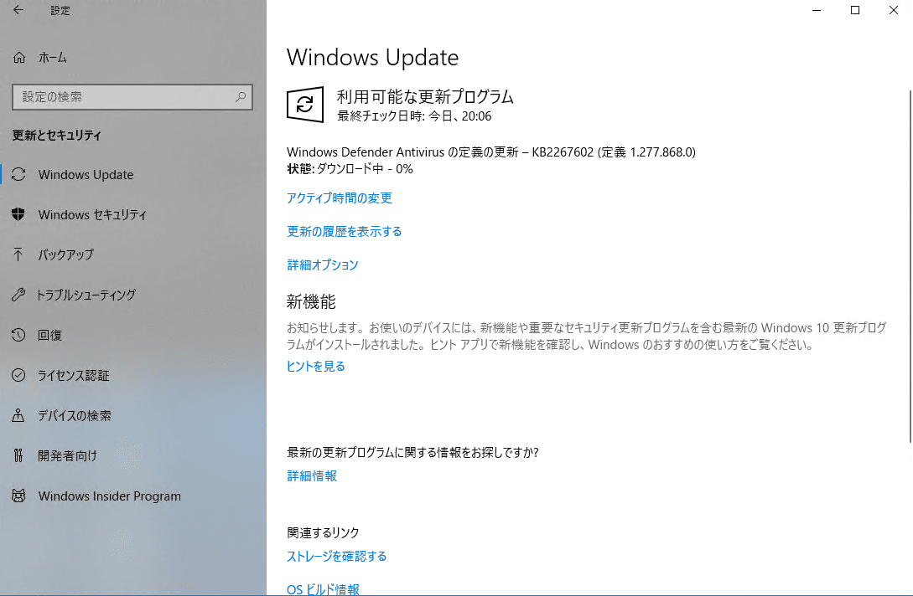
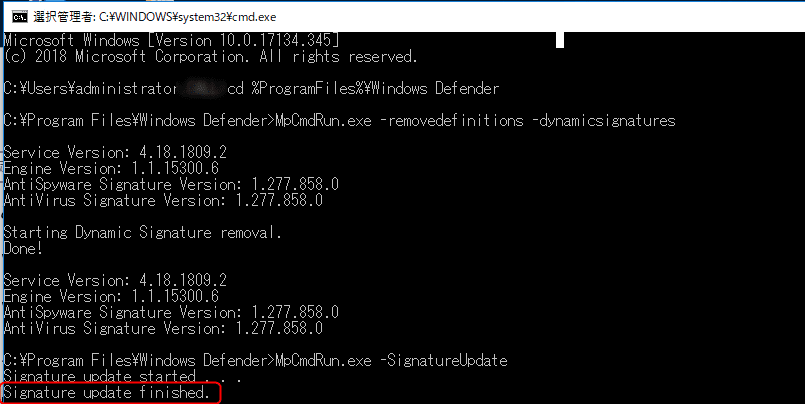
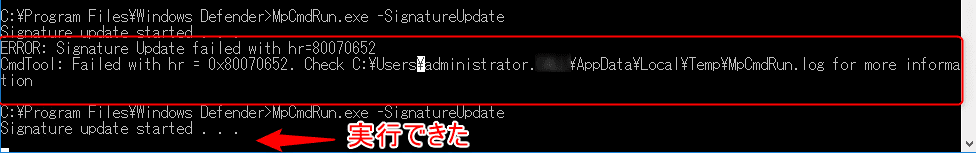

こんにちは。

今回は、Windows Updateで、**Windows Defender Antivirus の定義更新 - KB2267602 (定義 1.277.866.0)** が完結しない問題について投稿します。

遭遇した環境は、Windows 10 で、1年ぐらいアップデートしていない環境で発生しました。

Windows Updateを実行すると、以下のようにDefenderの定義更新が始まり、しばらくすると保留になり「最新です」となるものの、再度実行するまた現れるということを繰り返していました。



## 改善への道

色々と記事はあったものの、こちらの環境では以下の記事を元にコマンドを実行することで改善しました。

[Latest definition updates for Windows Defender Antivirus and other Microsoft antimalware - Windows Defender Security Intelligence](https://www.microsoft.com/en-us/wdsi/definitions)

流れとしては、以下のとおりです。

1. コマンドプロンプトを管理者権限で開く
2. 以下の3つのコマンドを実行する
  ```
  cd %ProgramFiles%\Windows Defender
  MpCmdRun.exe -removedefinitions -dynamicsignatures
  MpCmdRun.exe -SignatureUpdate
  ```
3. Signature update finished. と出るまで待機する
  
4. Windows Updateを実行する
  
5. 無事最新になる


## あとがき

当方の環境では対象が数台あり、 `MpCmdRun.exe -SignatureUpdate` を実行したところ、以下のエラーになるものがありました。

```
ERROR: Signature Update failed with hr=80070652
CmdTool: Failed with hr = 0x80070652. Check C:\Users\administrator\AppData\Local\Temp\MpCmdRun.log for more information
```

この場合、サービスから **Windows Update** を停止し、**設定→更新とセキュリティ→Windows Update** からUpdateを再試行することで改善しました。
(前回のWindows Updateが中途半端に実行されている可能性があるのだろうか・・・。)




久しぶりにWindows Updateを実施してみたらDefenderが全然更新されない！という方はおられないでしょうか。

1人でも多くの方をこのストレスから救うことができれば嬉しいです。
それでは次回の記事でお会いしましょう。