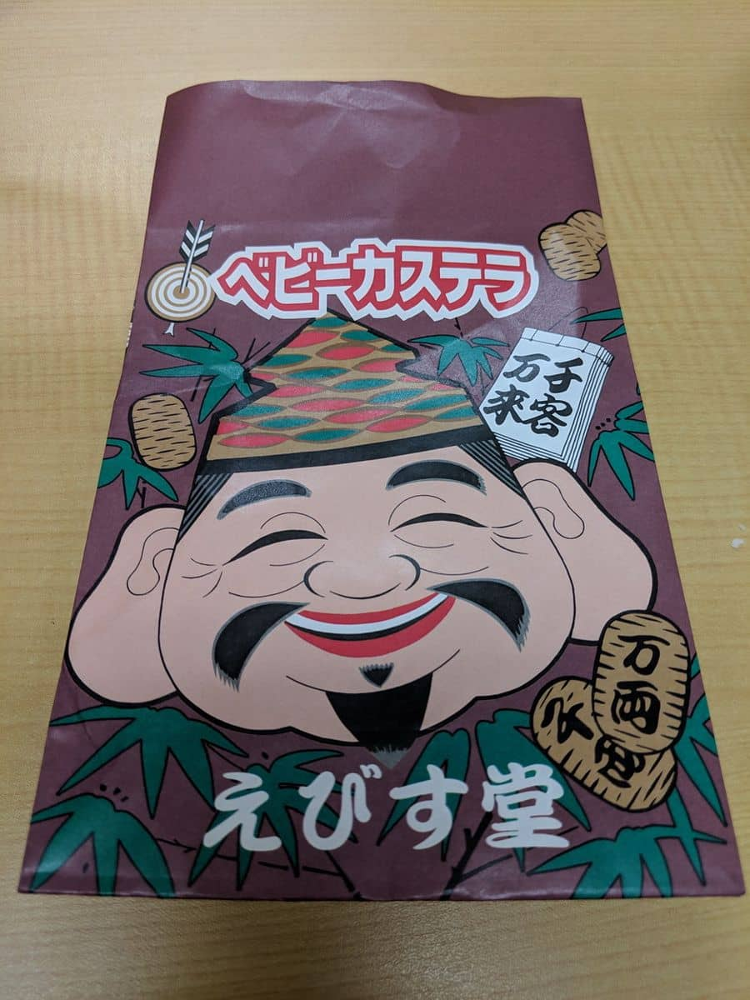

新年あけましておめでとうございます。
本年もよろしくお願いいたします。

1/9(水)に十日戎（今宮戎神社）に参拝にいってきました。

今年も「商売繁盛で笹もってこい」のアナウンスを聞くと新年だなと思います。

## 参拝・福笹
今年も朝から参拝しました。
混雑はしていませんでしたが、今日の仕事はじめで社員一同揃って来られている方も多く見かけました。


返納した去年の福笹です。
1年間ありがとうございました。


そして、今年の福笹です。


毎年この時期は期末となっていて、次の期に向けて飾りを1つずつ増やしています。

今年の追加は、「**亥の絵馬**」にしました。

絵馬への祈願は、以下３つです。

* 私が亥年で3回目の年男なので **縁起担ぎ** の想い
* 猪突猛進で **前進** していきたい想い
* 去年は災害が多かったので **安全** な1年を願う想い

5期目にむけてなので今年で合計 **5つ** になりました。

```
()は、飾りをつけた時期です。
1.2. 「熊手」→福や運をかき集める、「箕」→かき集めた福や運をすくい取る(2016年2期目に向けて)
3.   「俵」　→金運や財運の豊作を願う(2017年3期目に向けて)
4.   「打ち出の小槌」→打てばなんでも好きなものが出てくるといわれる(2018年4期目にむけて)
5.   「絵馬」→祈願や祈願した願いが叶ったことへの謝礼をする(2019年5期目にむけて)
```

来年(2020年)も6つ目を飾り付けの投稿に向けて頑張っていきたいと思います！

## あとがき

個人的に恒例のベビーカステラも今年は全く並ぶことなく購入できました。


福笹は **1月9日から11日まで終夜** いただけるようです。

[今宮戎神社ホームページ](http://www.imamiya-ebisu.jp/h31-gyouzi)

2019年もスタッフ一同頑張って参りますのでどうぞよろしくお願いいたします！

