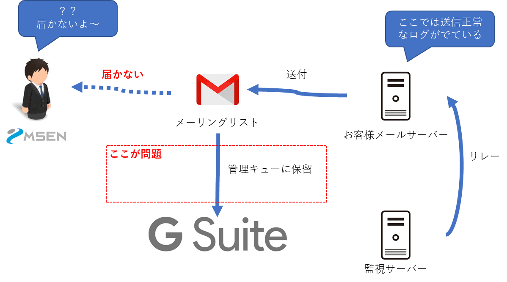
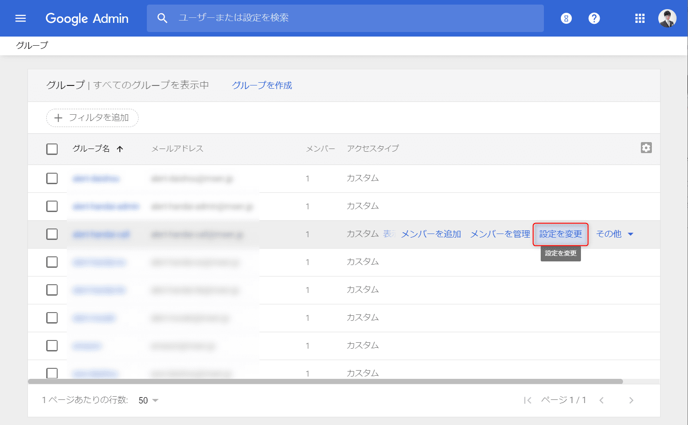
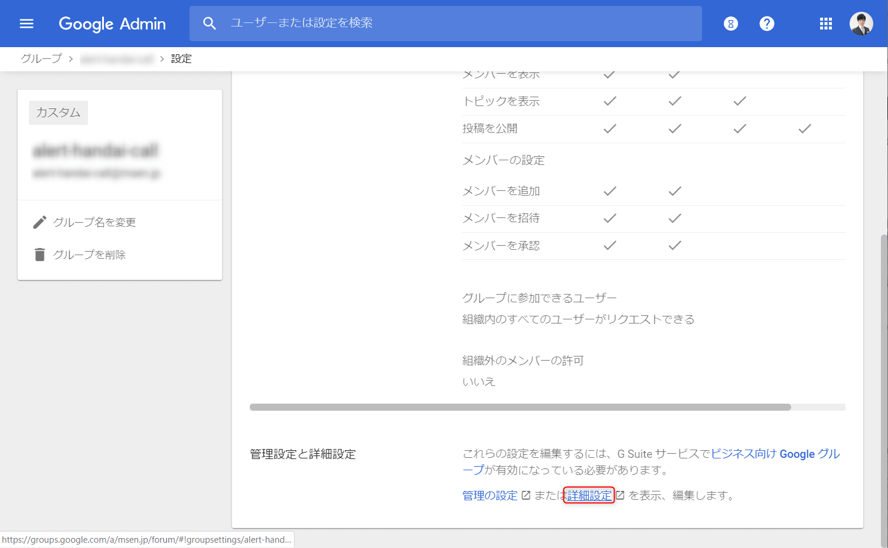

こんにちは。

先日、 **G Suiteで作成したメーリングリスト**に対して、通報メールを飛ばしても **メールが受信できない** 現象に見舞われました。

結論から言うと、自動的に **管理キューに送付され保留状態となっていた** ですが、
このような場合の確認方法と、解除方法をGoogleに問い合わせたので備忘録を兼ねて記事にしました。

今回のメーリングリストは、 Slackのメール連携で発行されたメールアドレスを指定しています。

**alert-dummy@msen.jp -> Slack で発行された連携メールアドレス**
このあたりが、自動で保留されてしまった原因かもしれませんがGoogleへの問い合わせでははっきりしませんでした。

環境的には以下のようなイメージです。

<a href="images/cannot-receive-email-sent-to-mailing-list-in-g-suite-1.png"></a>

上記の図にも記載しましたが、 **お客様メールサーバーのログには正常に送信できたことが記録** されていました。
```
Apr  5 12:01:07 zabbix postfix/qmgr[6043]: 05B838002F4B: from=<root@zabbix.example.com>, size=313, nrcpt=1 (queue active)
Apr  5 12:01:07 call-zabbix postfix/smtp[6064]: 05B838002F4B: to=<alert-dummy@msen.jp>, relay=133.1.196.25[133.1.196.25]:25, delay=1074, delays=1073/0.03/0/0.07, dsn=2.6.0, status=sent (250 2.6.0  <20190405024314.05B838002F4B@sample.jp> Queued mail for delivery)
Apr  5 12:01:07 zabbix postfix/qmgr[6043]: 05B838002F4B: removed
```
**alert-dummy@msen.jp** がメーリングリストになります。(記事上のメールアドレスになります)

でも届かない・・・

Googleに問い合わせをしたところ、 Google 管理コンソールから以下の流れで確認・対処を行うことで指示され解決につながりました。

[管理コンソール](https://admin.google.com/)

1. ログを検索
**レポート → 監査 → メールログ** を検索
以下の画像では、**送信者のIP** で検索していますが特定できる他の指定で問題ありません。
<a href="images/cannot-receive-email-sent-to-mailing-list-in-g-suite-2.png"></a>
上記から、送信したメールがGoogleで止まっていることが分かります。

2. メーリングリスト(グループ情報)を確認
G Suiteでは、メーリングリストはグループとして管理されますので、 **グループ** という表現になります。

左上の **三** から、 **ディレクトリ → グループ** へと進みます。
<a href="images/cannot-receive-email-sent-to-mailing-list-in-g-suite-3.png"></a>

送れなかった **グループを選択し設定を変更をクリック** します。
<a href="images/cannot-receive-email-sent-to-mailing-list-in-g-suite-4.png"></a>

遷移した画面を **下にスクロールし詳細設定をクリック** します。
<a href="images/cannot-receive-email-sent-to-mailing-list-in-g-suite-5.png"></a>

**別ウィンドウでグループ詳細設定画面** が開きます。

保留されたメッセージの確認と送信については、 **メッセージ → 保留中のメッセージ** へ進み 以下の画像を参考に許可を出します。

<a href="images/cannot-receive-email-sent-to-mailing-list-in-g-suite-6.png"></a>

上記と同画面に、以下のような **今後許可する** 設定があるのでそちらを選択したあとに再送してもまた保留になりました。
なぜなのかは今回追求していません。

<a href="images/cannot-receive-email-sent-to-mailing-list-in-g-suite-7.png"></a>

保留(管理キューに溜めない)にしないためには、 **設定 → 管理** から以下のように変更します。

<a href="images/cannot-receive-email-sent-to-mailing-list-in-g-suite-8.png"></a>

**保存を忘れないように注意です。**

<a href="images/cannot-receive-email-sent-to-mailing-list-in-g-suite-9.png"></a>

これで、無事に届くようになりました。

[グループ宛ての正当なメールが迷惑メールに分類される場合の対応 - G Suite 管理者 ヘルプ](https://support.google.com/a/answer/2567001?hl=ja)

参考になれば幸いです。
それでは次回の記事でお会いしましょう。