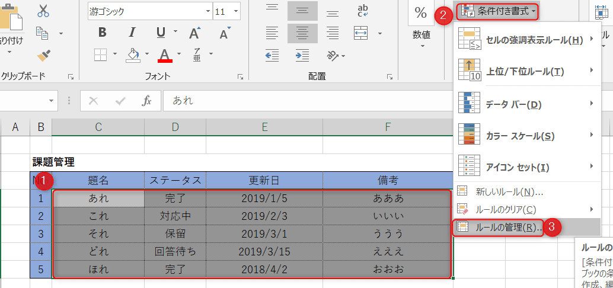

こんにちは。

今回は、 **Excelの条件付き書式** を使って、 **条件に一致した行の色を変える** 方法を紹介します。

一部、うまくいかず **はまってしまった** のでその点についても記載します。

バージョンは、**Excel 2016** です。

以下のようなExcelを例に、各行のD列に対して以下の条件を設定します。
1. **完了** の場合 → 行全体を **グレー** に
2. **対応中** の場合 → なにもしない
3. **保留** の場合 → 行全体を **グレー** に
4. **回答待ち** の場合 → 行全体を **緑** に

## 手順

1. **C4:F8** を選択し、 **条件付き書式** をクリックし **新しいルール** へ進みます

1. **数式を使用して、書式設定するセルを決定(①)** を選択し、 **(③)の位置を一度クリック**して、 **ステータスを示すセルを1つ(②)** をクリックし、 ③の数式に続けて **="完了"** を追記します。続けて **書式設定(④)** に進みます。

1. 完了はグレーなので **塗りつぶしでグレーを指定** します

1. 画像の状態になるので、OKをクリックします

1. これで完成のはずが・・・

**全てグレーになってしまいました・・・**

## はまった部分

前項の手順 **2-③** で、**=$D$4="完了"** と記載しましたが、正しくは **=$D4="完了"** としなければ行けませんでした。**(Dと4の間の$は不要だった)**

先ほど作成した、ルールは残っているため修正します。

修正して、こうなりました。

OKを押すと、**完了だけがグレー** になりました。

続けて同じように他の条件付き書式設定をします。

想定通りになりました。

## あとがき
**手順2-2** でExcelが自動でセルに対する書式を入力してくれるのですがこれを疑いもせずそのままに進んでいたためはまりました。。

自動で入力された、 **=$D$4="完了"** は **列方向(D)** も **行方向(4)** の両方が固定となっていましたが、**行方向は可変** のため、**数字の手前の$を削除** したところ解決した、ということでした。

**疑う気持ちは大切** w

それでは次回の記事でお会いしましょう。
