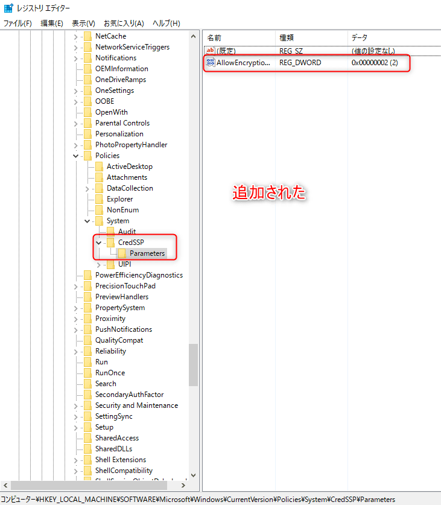

こんにちは。

2018年5月頃の少し古い話ですが、**2018年5月の更新プログラム適用** するとリモートデスクトップ接続時に、以下のエラーとなってしまう現象が発生していました。

```
認証エラーが発生しました。
要求された関数はサポートされていません
リモート コンピューター:
原因は CredSSP 暗号化オラクルの修復である可能性があります。
詳細については、https://go.microsoft.com/fwlink/?linkid=866660 を参照してください
```

接続される側(サーバー側)にWindows Updateをあて最新にすれば問題ないですが諸事情でできない環境もまだ残っていると思います。

そんな諸事情につい最近見舞われたので接続できるようにする手順を自社メモとして書きました。

根本的な解決策は、サーバー側で2018年3月以降のWindowsUpdate更新プログラムの適用が必要で、2018年5月更新プログラムによるRDP接続の仕様変更対策が原因となります。

以下に詳しく書かれています。
[2018 年 5 月の更新プログラム適用によるリモート デスクトップ接続への影響 | Ask CORE](https://blogs.technet.microsoft.com/askcorejp/2018/05/02/2018-05-rollup-credssp-rdp/#menu4)

今回は、ドメイン環境でグループポリシーから設定を配布する方法と、個別にレジストリで適用する方法の2つを紹介します。

### グループポリシーで対応する場合
1. グループポリシー管理を開きます
1. 新規グループポリシーを作成し、右クリックから編集します(名前は任意)
1. コンピュータの構成→管理用テンプレート→システム→資格情報の委任と開き暗号化オラクルの修復をダブルクリックします
<a href="images/creadssp-encryption-oracle-repair-1.png"></a>
1. <a href="images/creadssp-encryption-oracle-repair-2.png"></a>
1. 有効にし、選択しを脆弱にします
<a href="images/creadssp-encryption-oracle-repair-3.png"></a>
1. ポリシーをリンクします
<a href="images/creadssp-encryption-oracle-repair-4.png"></a>
**暗号化オラクルの修復 がない場合は、Windows Updateをかけてください**

### クライアント(接続側)のレジストリで対応する場合

1. 管理者権限でコマンドプロンプトを開き、以下を実行する
```
REG ADD HKLM\Software\Microsoft\Windows\CurrentVersion\Policies\System\CredSSP\Parameters /v AllowEncryptionOracle /t REG_DWORD /d 2
```
1. レジストリエディタを開き、以下のパスに追加されていることを確認
`HKLM\Software\Microsoft\Windows\CurrentVersion\Policies\System\CredSSP\Parameters`
追加前
<a href="images/creadssp-encryption-oracle-repair-5.png"></a>

追加後
<a href="images/creadssp-encryption-oracle-repair-6.png"></a>

https://blogs.technet.microsoft.com/askcorejp/2018/05/02/2018-05-rollup-credssp-rdp/#menu4

## あとがき

本来はサーバー側を最新にしてこの対応をしないことが望ましいです。

グループポリシーの場合は、サーバー側のアップデート対応が完了すればグループポリシーを無効にするか削除し、本対応を取り消すことが望ましいです。

それでは次回の記事でお会いしましょう。
