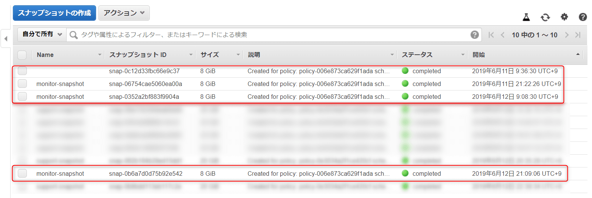

こんにちは。

先日、以下の記事でコマンドを使ってスナップショットを作成する方法をご紹介しました。

[\[AWS\] EBSボリュームのスナップショットをコマンドで取得する方法](https://mseeeen.msen.jp/how-to-get-a-snapshot-of-ebs-volume-on-aws-by-command)

ローテーションを考えないといけないな、と思って調べていると、ちょっと複雑な手順が多いな・・・と手が止まっていたのですが以下の記事を発見！

[【新サービス】EBSスナップショットのライフサイクルを自動化するAmazon DLMが登場！ ｜ DevelopersIO](https://dev.classmethod.jp/cloud/aws/amazon-dlm-ebs-snapshot-lifecycle/)

こちらを参考に、**Amazon Data Lifecycle Manager (Amazon DLM)** という AWS のサービスを利用して、とても簡単にスナップショットを世代管理することができました。

上記の記事では、**2018年7月13日時点** では **米国東部 (バージニア北部)** ・ **米国西部 (オレゴン)** ・ **EU (アイルランド)** で対応していると記載がありましたが、 **本記事執筆時点では東京リージョンも対応** しておりました。

それでは早速設定してみましょう！

## ポリシー作成

### ボリュームにタグ付けする
前回の記事で利用した `monitor` インスタンスの `EBSボリューム` を対象にします。

まず、 **Nameタグ** が設定されていない場合は設定します。

**EC2→ライフサイクルマネージャー→スナップショットのライフサイクルポリシーを作成する** と進みます。

### ポリシー作成の流れ
今回作成したポリシーは、 以下のとおりです。

* **UTC0:00** から **12時間** おきに **Name=monitor** とタグ付けされた全てのボリュームのスナップショットが作成される。
* **最大4個保持** される (最も古いスナップショットは2日前以降となる)
(ポリシー作成画面の最後の部分でも設定した内容を確認できます)

時間はUTC設定になっているので、日本時間の **9時** と **21時** に実行されることになります。

画面では以下のようになります。

作成されました。

## 動作確認
ポリシーを設定して3日間様子見て確認しました。

### 設定翌日の9時
取れてますね！

開始時間が、9:36になってなっているのでポリシー作成画面に記載があった、
>スナップショットは、指定された開始時間から1時間以内に作成が開始されます。

のとおりのようです。

#### ポリシー修正
スナップショットを見てみると `monitor` のバックアップだということがわかりにくいので以下のようにタグを付けるようにポリシーを変更しました。

さて、本日の21時でどうなるか。

### 設定翌日の21時

**赤枠** のとおり、 **タグが付いたスナップショット** が無事取得できていました。

## ローテーション確認

### ローテーション直前(4回取得)の状態

### ローテーション確認
正常に設定した4世代でローテーションされている

## あとがき
記事を書き終わってから気づきましたが、参考にさせていただいたサイトでも東京リージョンに対応したことを記事にされていました。

[Amazon DLMが東京に上陸してEBSのライフサイクル管理が簡単になりました ｜ DevelopersIO](https://dev.classmethod.jp/cloud/aws/amazon-dlm-tokyo-region/)

それでは次回の記事でお会いしましょう。