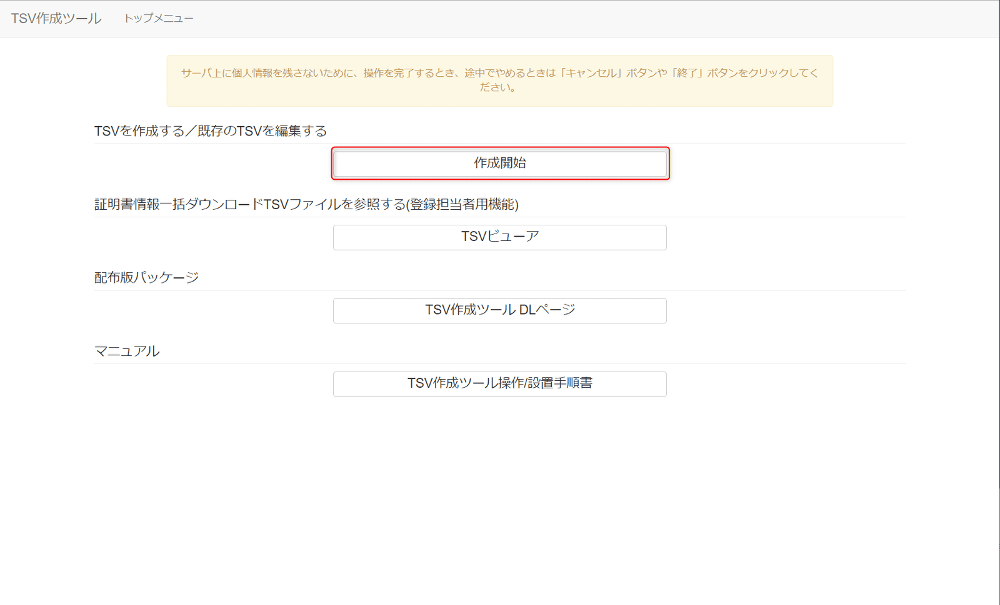

こんにちは。

以前、以下の記事で **UPKI向けサーバー証明書の作成方法** について紹介しました。
[\[サーバー証明書\] UPKI向けCSRとTSVの作成方法](/how-to-create-csr-and-tsv-for-upki/)

今回は、 **有効期限よりも前に利用しなくなった証明書** を **失効するための手続き** について紹介します。
文中の表現は前回の記事と同じようになるように意識しましたので併せて参考にしてください。

## 概要

1. 失効申請用のTSVファイルを作成
1. 学術機関にTSVを送付
1. NIIから学術機関に証明書失効完了通知

事前準備として、**旧証明書を準備** してください。
ファイル転送が困難な場合は、サーバーに接続し `cat` コマンドで出力された `-----BEGIN CERTIFICATE-----` から `-----END CERTIFICATE-----` までをテキストに貼り付けて **cer拡張子で保存** しても可能です。


公式の手順は以下になりますので適宜ご参考ください。
[失効手続き - UPKI電子証明書発行サービス](https://certs.nii.ac.jp/join/ee/case3/)

## 失効申請用のTSVファイルを作成

1. TSV作成ツールを利用します
[TSV作成ツール: トップメニュー](https://certs.nii.ac.jp/tsv-tool/)

1. 作成を開始します


1. TSVファイルの種別に **失効申請用TSV** を選択します


1. 準備した旧証明書ファイルを読み込みます


1. 読込完了後、残りの項目(利用者管理者E-mail、失効理由、失効理由コメント）を入力し完了します


1. 作成されたTSVをダウンロードします


ダウンロードすることができました。


## 学術機関にTSVを送付

前項で作成したTSVファイルを **学術機関に送付** し、失効手続きを進めていただくよう依頼します。

## NIIから学術機関に証明書失効完了通知

NIIから学術機関にサーバ証明書の失効が完了した旨の連絡がありますので、念のため伝達していただくように調整し、認識することが良いかと思います。

## 失効したことを実際に確認してみる

学術機関から失効通知を共有していただくことで失効の確認は出来ますが、自身で確認したい場合の方法を紹介します。

1. 旧証明書を開き、 **詳細タブ** の **CRL配布ポイント** のURLに接続し **CRLをダウンロード** します

`fullcrlg4.crl` がダウンロードできます。

1. 同じく旧証明書を開き、 **シリアル番号** をコピーします


1. CRLに旧証明書のシリアル番号があるか確認します
**CRLはWindows上でダブルクリック** することで開けますが **検索することは困難** です。
また、メモ帳などで開いても文字化けのようになり確認することできません。
そのため、 `openssl` コマンドを利用できる端末で検索します。
まず、 [1] でダウンロードした、 `fullcrlg4.crl` を端末に転送します。

1. 転送後、以下の **コマンドでCRLに旧証明書のシリアル番号が含まれているか確認** します

```
$ openssl crl -inform der -in fullcrlg4.crl -text | grep -i xxxxxxxxxadb1c50
    Serial Number: xxxxxxxxxADB1C50
```

含まれていることが確認できましたので、 **無事失効** しています。

**Windows上で確認できるシリアル番号は英字が小文字** ですが、 **CRLには大文字** で載っているため`grep` のオプションで `-i` を指定して大文字・小文字を無視しています。

## あとがき

有効期限が残っている証明書が流出などで悪用されてしまうと、利用者からみると有効なサイトとして利用出来てしまうため失効手続きが必要となります。

CRL証明書失効リストについては以下も参考にしてください。
[証明書失効リスト - Wikipedia](https://ja.wikipedia.org/wiki/%E8%A8%BC%E6%98%8E%E6%9B%B8%E5%A4%B1%E5%8A%B9%E3%83%AA%E3%82%B9%E3%83%88)

それでは次回の記事でお会いしましょう。