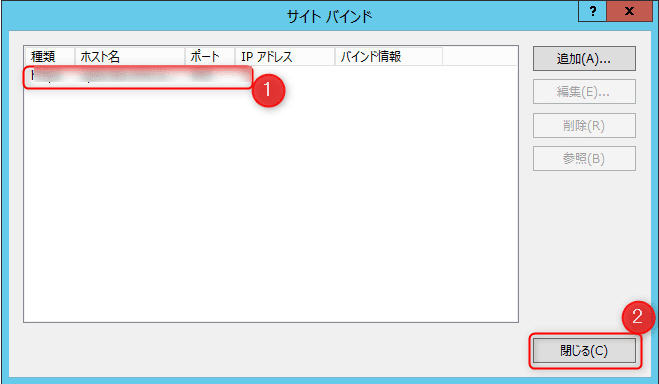

こんにちは。

今回は、Microsoft IISへインストールするための証明書 **PKCS#12(pfx) 形式への変換する方法** と **IISへのインポート方法** を紹介します。

以下の記事で証明書を作成し、手元には **秘密鍵のファイル(本手順では test.key)** と **証明書のファイル(本手順では test.cer)** が別々にあり、それを元に **pfx形式に変換** した際の手順です。
[\[サーバー証明書\] UPKI向けCSRとTSVの作成方法](https://mseeeen.msen.jp/how-to-create-csr-and-tsv-for-upki/)

## pfx形式への変換手順

opensslコマンドが使える環境で実施します。

1. 以下のコマンドを実行します。
`openssl pkcs12 -export -inkey test.key -in test.cer -out test.pfx`
1. パスワードを求められるため、入力します。(メモしましょう)
```
Enter Export Password:
Verifying - Enter Export Password:
```
これで作成は完了です。簡単ですね！

### IISへのインポート手順
1. 前項で作成した、 **pfxファイルをインストールするIISサーバーに転送** します
1. **IISマネージャーから、サーバー証明書** を開きます
<a href="images/how-to-create-a-pfx-certificate-and-import-it-into-iis-1.png"></a>
1. **インポート** を開き、 **作成したpfxファイルを指定** し、 **インポートを完了** します
<a href="images/how-to-create-a-pfx-certificate-and-import-it-into-iis-2.png"></a>
↓　pfxファイルを指定し、作成じに設定したパスワードを入力します
<a href="images/how-to-create-a-pfx-certificate-and-import-it-into-iis-3.png"></a>
↓　インポートされたことを確認し閉じます
<a href="images/how-to-create-a-pfx-certificate-and-import-it-into-iis-4.png"></a>
↓　一覧に表示されたことを確認します
<a href="images/how-to-create-a-pfx-certificate-and-import-it-into-iis-5.png"></a>
1. **証明書を適用するサイトを選択しバインド** します
<a href="images/how-to-create-a-pfx-certificate-and-import-it-into-iis-6.png"></a>
↓　各項目設定します
<a href="images/how-to-create-a-pfx-certificate-and-import-it-into-iis-7.png"></a>
↓　設定されていることを確認し画面を閉じます
<a href="images/how-to-create-a-pfx-certificate-and-import-it-into-iis-8.png"></a>

以上で設定は完了です。

### あとがき
中間証明書をインストールしていない場合は、以下を参考に併せて実施してください。
NIIではない基幹でも手順としては同じ流れになると思います。
[IIS8.0・IIS8.5編 - UPKI_Manual - meatwiki](https://meatwiki.nii.ac.jp/confluence/pages/viewpage.action?pageId=26192405#IIS8.0%E3%83%BBIIS8.5%E7%B7%A8-_Toc505611511)

それでは次回の記事でお会いしましょう。