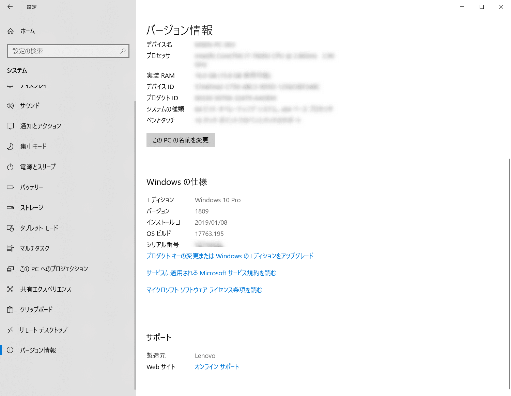

こんにちは。

私は文字システムに ATOK を利用しているのですが、先日 **Windows10のバージョンが1809に上がって** から **頻繁に Microsoft IME に切り替わってしまう** 現象に見舞われました。

**Microsoft IME を削除** すればいいと思い、これまで認識していた方法を実施してみたのですが少し方法が変わっていたのでメモを兼ねて記事にします。

## 削除方法

1. 「設定」→「時刻と言語」 を開きます

1. 「言語タブ」から「オプション」に進みます

1. **Microsoft IME** を削除します

無事消えました。

## あとがき
非常に簡単な手順なのですが、長年 Windows を使っているとこういった設定が少しずつ変わっていて地味にはまりますね。。

お役に立てれば幸いです。

それでは次回の記事でお会いしましょう。