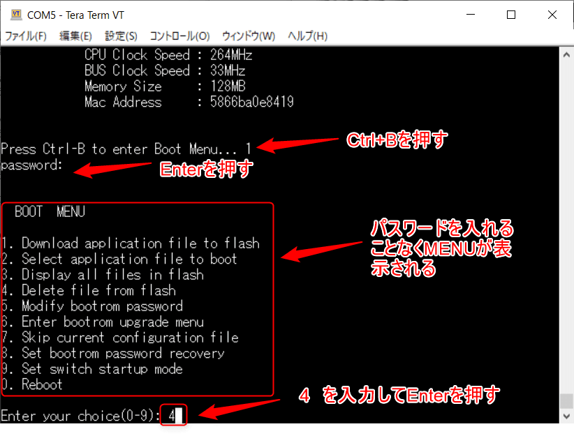
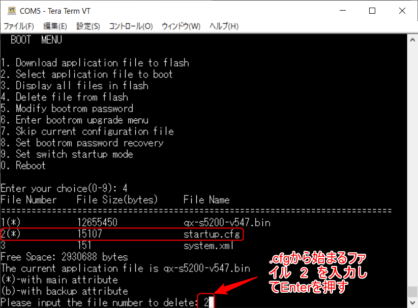
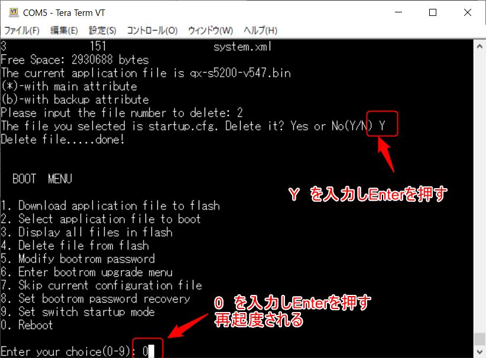
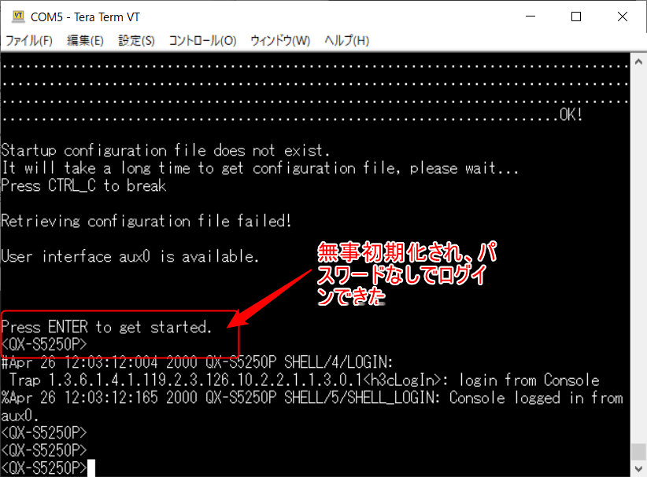

こんにちは。

先日、評価のためNEC製L2スイッチの **QX-S5226P** を使おうと思ったらパスワードが設定されており誰もログインできず・・・。

**初期化スイッチもない** ので、マニュアルを元に **強制的に初期化** したので今後の備忘録を兼ねて記事にしました。

[インスタレーションマニュアル](https://www.manuals.nec.co.jp/contents/system/files/2019-07/qx-s5200g_ins_2_4_ns.pdf) の 8-41 ページ **8.10.1** (コンフィグファイルの削除) あたりが今回の手順です。

## 初期化手順
1. 電源を入れ、 `Press Ctrl-B to enter Boot Menu...` が見えたらすぐに `Ctrl+B` を押します。
パスワードが求められますが、 `Enter` を押します。
`BOOT MENU` がでるので、`4` を入力してEnterを押します。

1. `2` を選択して、Enterを押します。 (.cfgから始まるファイルを選択) `bin` とか消すと恐らく動かなくなりますのでご注意。

1. 削除確認に `Y` を入力してEnterを押します。
続けて、 `0` を入力して機器を再起動します。

1. 再起動後、無事 `パスワードなしでログイン` できました。

## あとがき
久しぶりに触りましたが、QXはよく使われるCiscoと違い少しコンフィグに癖がありますね。参考になれば幸いです。

それでは次回の記事でお会いしましょう。