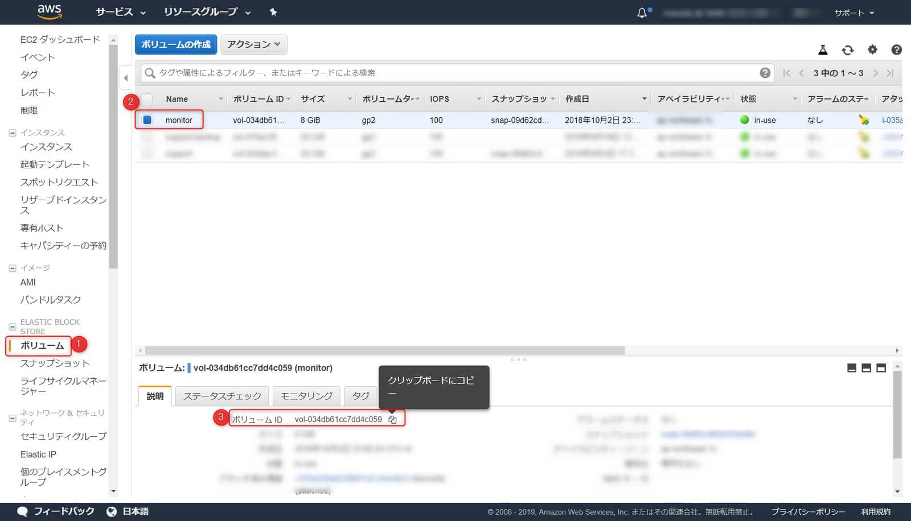

こんにちは。

今回は、EC2で動かしているインスタンスのスナップショットをコマンドを利用して取得してみようと思います。

前提は以下のとおりです。

* AmazonLinux2インスタンスが運用されている
* IAM でユーザーを作成している 

今回は、弊社で動かしている `monitor` というインスタンスを利用したいと思います。
<a href="images/how-to-get-a-snapshot-of-ebs-volume-on-aws-by-command-1.png"></a>

AmazonLinux2にはすでに、 `aws` というコマンドが使える状態になっているためこのコマンドを使って取得します。

```
[root@monitor ~]# aws --version
aws-cli/1.15.80 Python/2.7.14 Linux/4.14.70-72.55.amzn2.x86_64 botocore/1.10.79
```

では、早速はじめましょう。

## アクセスキーとシークレットアクセスキーの確認

**IAM→ユーザー→認証情報** と進み、 **アクセスキーの作成** をクリックします。

<a href="images/how-to-get-a-snapshot-of-ebs-volume-on-aws-by-command-2.png"></a>

アクセスキーとシークレットアクセスキーをメモします。
<a href="images/how-to-get-a-snapshot-of-ebs-volume-on-aws-by-command-3.png"></a>


## awsコマンドの初期化

`aws configure` コマンドを実行して以下の流れで設定します。

```
[root@monitor ~]# aws configure
AWS Access Key ID [None]: "前項でメモしたアクセスキーを入力"
AWS Secret Access Key [None]: "前項でメモしたアクセスキーを入力"
Default region name [None]: ap-northeast-1
Default output format [None]: json
```

* region は 東京を指定しています。
* output format は json を指定しています。

<a href="images/how-to-get-a-snapshot-of-ebs-volume-on-aws-by-command-4.png"></a>

## バックアップ対象のボリュームIDの確認
* ボリュームIDの確認
<a href="images/how-to-get-a-snapshot-of-ebs-volume-on-aws-by-command-5.png"></a>

## スナップショットの取得を確認
以下のコマンドを実行します。

```
aws ec2 create-snapshot --volume-id vol-034db61cc7dd4c059 --description  "Backup: `date`."
```

実行結果は以下のとおりです。
```
[root@monitor ~]# aws ec2 create-snapshot --volume-id vol-034db61cc7dd4c059 --description  "Backup: `date`."
{
    "Description": "Backup: Fri Jun  7 15:26:53 JST 2019.", 
    "Tags": [], 
    "Encrypted": false, 
    "VolumeId": "vol-034db61cc7dd4c059", 
    "State": "pending", 
    "VolumeSize": 8, 
    "StartTime": "2019-06-07T06:26:53.000Z", 
    "Progress": "", 
    "OwnerId": "560018181288", 
    "SnapshotId": "snap-094019974f77995d4"
}
```

おー、できました。
**SnapshotIdが一致** してますね。

<a href="images/how-to-get-a-snapshot-of-ebs-volume-on-aws-by-command-6.png"></a>

以下のようなスクリプトを作成し、cronに設定して動作確認したところ、取得出来ていました。

**GetSnapshot.sh**
```
#!/bin/sh

volumeId=vol-034db61cc7dd4c059
backupName=monitor-backup

aws ec2 create-snapshot --volume-id ${volumeId} --description  "${backupName}: `date`."
```

<a href="images/how-to-get-a-snapshot-of-ebs-volume-on-aws-by-command-7.png"></a>

ただ、このままでは無限に取得されてS3ストレージのコストが膨大になるので、ローテーション処理についても別途考えようと思っています。

それでは次回の記事でお会いしましょう。

