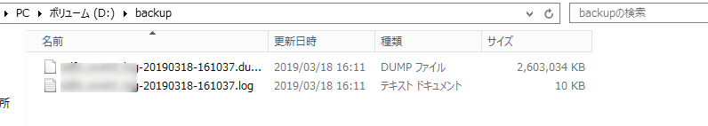

こんにちは。

今回は、**Windows版のPostgreSQL** で **PowerShellとタスクスケジューラーを使って定期的にDBダンプを取得する方法** と **取得したダンプでリストアする方法** を紹介します。

## 環境
* Windows Server 2012 R2
* PostgreSQL 9.6
* PowerShell バージョン 4.0

## 設定ファイル配置
後述するPowerShellスクリプト内にデータベースのパスワードを記載したくないので、タスクを実行するユーザーのプロファイルにPostgreSQLの設定ファイルを配置します。

以下を参考にしました。
[パスワードファイル](https://www.postgresql.jp/document/9.1/html/libpq-pgpass.html)

設定を配置する場所は、 `C:\Users\Username\AppData\Roaming` で `masuda` というユーザーで実行するのであれば、 `C:\Users\masuda\AppData\Roaming` になります。

上記を例に記載します。

`Roaming` フォルダ配下に `postgresql` というフォルダを作成し、 `pgpass.conf` というファイルを作成します。

書式は以下のとおりです。

`hostname:port:database:username:password`

`hostname` `port` `database` は `*` として、ダンプを取得したいデータベースに **アクセスできるユーザー名**を `username` に記載し、 そのユーザーのパスワードを `password` に記載し1行の状態で保存します。

今回の記事では以下のとおりです。
`*:*:*:dbuser:dbpassword`

## バックアップ用PowerShell (`c:\dbbackup.ps1`)
```
# 変数
$date = Get-Date -Format "yyyyMMdd-HHmmss";
$db_host = "127.0.0.1"
$cmd_path = "c:\Program Files\PostgreSQL\9.6\bin"
$db_name = "dbname"
$db_user = "dbuser"
$dest_path = "D:\backup"
$dest_file = "$dest_path\$db_name-$date.dump"
$log_file = "$dest_path\$db_name-$date.log"
# バックアップ処理
cd $cmd_path
.\pg_dump.exe -h $db_host -p 5432 -U $db_user -w -Fc -Z 0 -v -f $dest_file $db_name 2> $log_file
# ローテーション処理
ls $dest_path | ? {$_.LastWriteTime -lt (Get-Date).AddDays(-14)} | rm
```

* 仕様
    * PostgreSQLパス：c:\Program Files\PostgreSQL\9.6\bin
    * データベース名：dbname
    * データベースユーザー：dbuser
    * バックアップ先：D:\backup
    * ローテーション：14日分保持

## タスクスケジューラーの設定
* 基本タスクの作成へ進み、以下の流れで設定します


    * プログラム/スクリプト `%SystemRoot%\System32\WindowsPowerShell\v1.0\powershell.exe`
    * 引数の追加(オプション) `-ExecutionPolicy RemoteSigned -File ".\dbbackup.ps1"`
    * 開始 `C:\`


* 設定を完了し、タスク実行ユーザーで認証します


* テスト的に手動でタスクを実行します


* 正常に取得できていることが確認できます


## リストア方法

本手順で取得したダンプファイルをコピーし、リストア先で以下の流れを参考にリストアします。

ダンプファイルは、 `C:\dbname_log-20190325-000001.dump` に展開されているとします。

### データベースを再生成

1. **pgAdmin 4** を開き、データベースに接続します
1. Databeseを右クリックし削除します

↓

1. 同じ環境のDBを再度作成します

以上で再生成は完了です。

本手順ではpgAdmin4を利用していますが、コマンド等 他の方法でも可能です。

### データベースをダンプからリストア
1. コマンドプロンプトを管理者権限で開きます
1. 以下のコマンドを実行します
```
cd c:\Program Files\PostgreSQL\9.6\bin
pg_restore -U postgres -d adfs_event_log < C:\dbname_log-20190325-000001.dump
```

#### 実行結果
```
c:\Program Files\PostgreSQL\9.6\bin>pg_restore -U postgres -d adfs_event_log < C:\dbname_log-20190325-000001.dump
パスワード: dummy-password
c:\Program Files\PostgreSQL\9.6\bin>
```

上記でリストアが完了です。

## あとがき
`pg_restore` で ユーザー指定を `-U postgres` と postgres ユーザーを指定して実行しました。
このユーザー指定を **postgres以外のユーザーを指定すると以下のエラーが出力されることを確認** しましたが、実害はありません。

```
pg_restore: [アーカイバ(db)] TOC処理中にエラーがありました:
pg_restore: [アーカイバ(db)] TOCエントリ2224; 0 0 COMMENT EXTENSION plpgsql のエ
ラーです
pg_restore: [アーカイバ(db)] could not execute query: ERROR:  諡｡蠑ｵ讖溯・ plpgs
ql 縺ｮ謇譛芽・〒縺ｪ縺代ｌ縺ｰ縺ｪ繧翫∪縺帙ｓ
   コマンド: COMMENT ON EXTENSION plpgsql IS 'PL/pgSQL procedural language';

警告: リストアにてエラーを無視しました: 1
```

この件については、以下の記事が参考になると思います。
[PostgreSQL: 非特権ユーザーによる pg_dump と pg_restore - tkrdの日記](http://tkrd.hatenablog.com/entry/2017/04/27/012832)

それでは次回の記事でお会いしましょう。