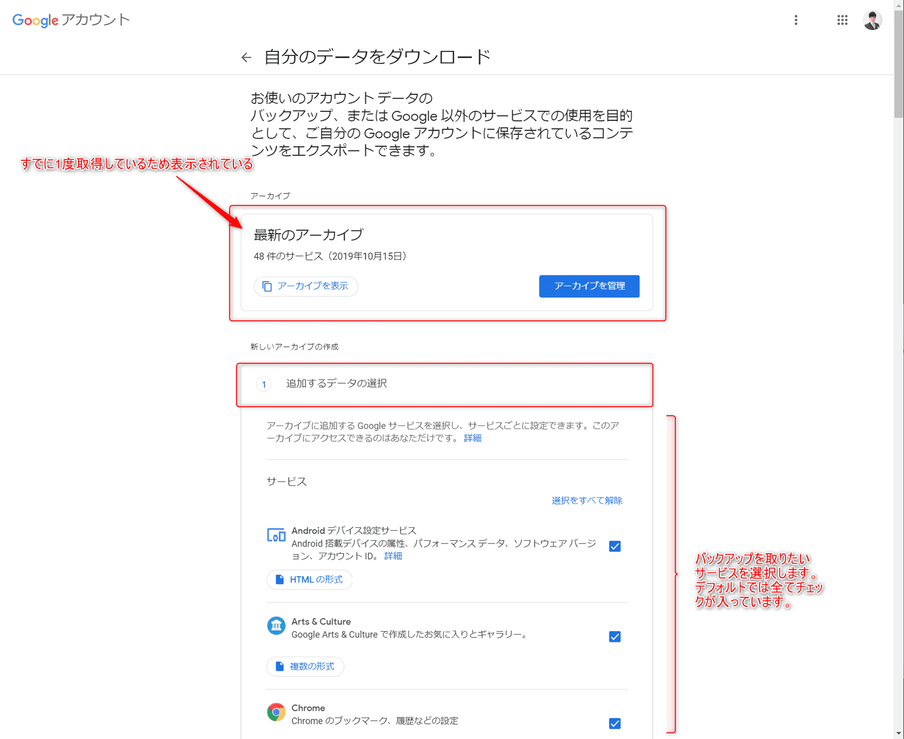
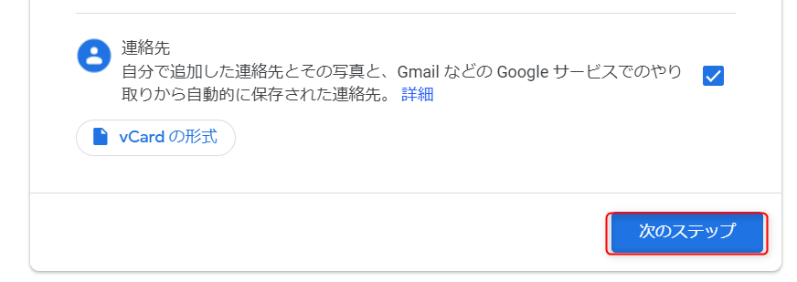
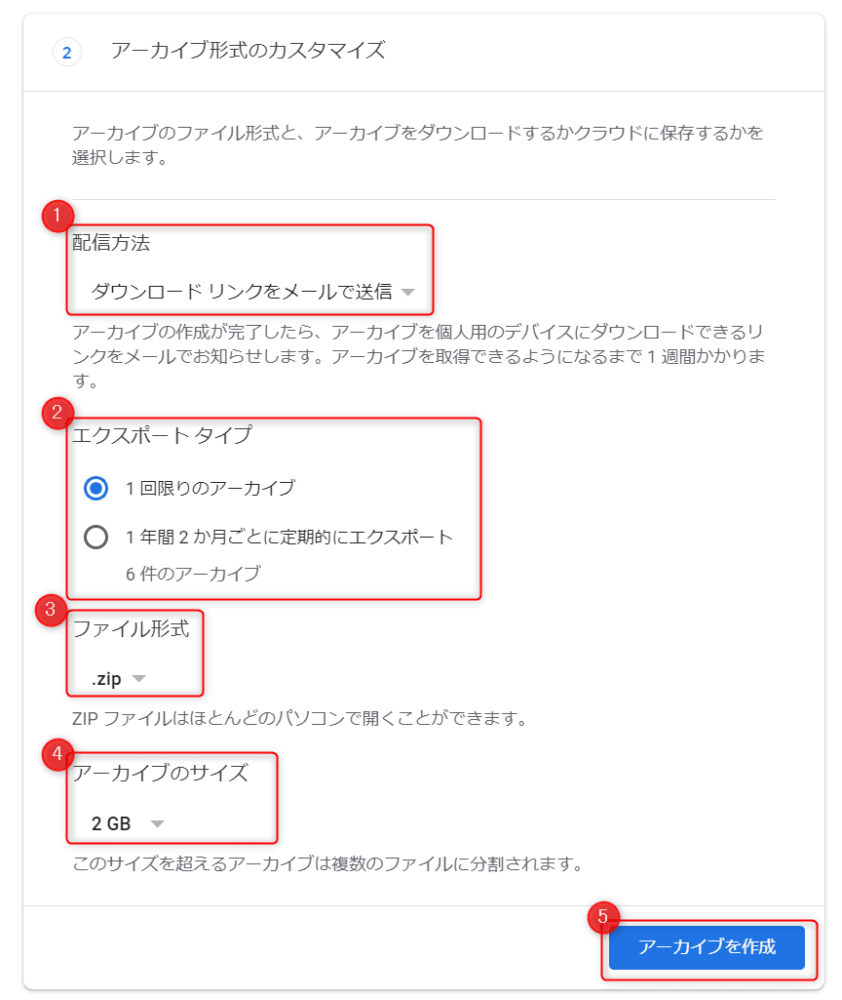
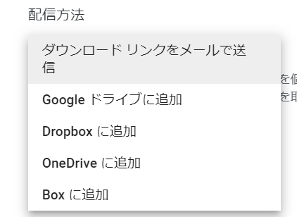
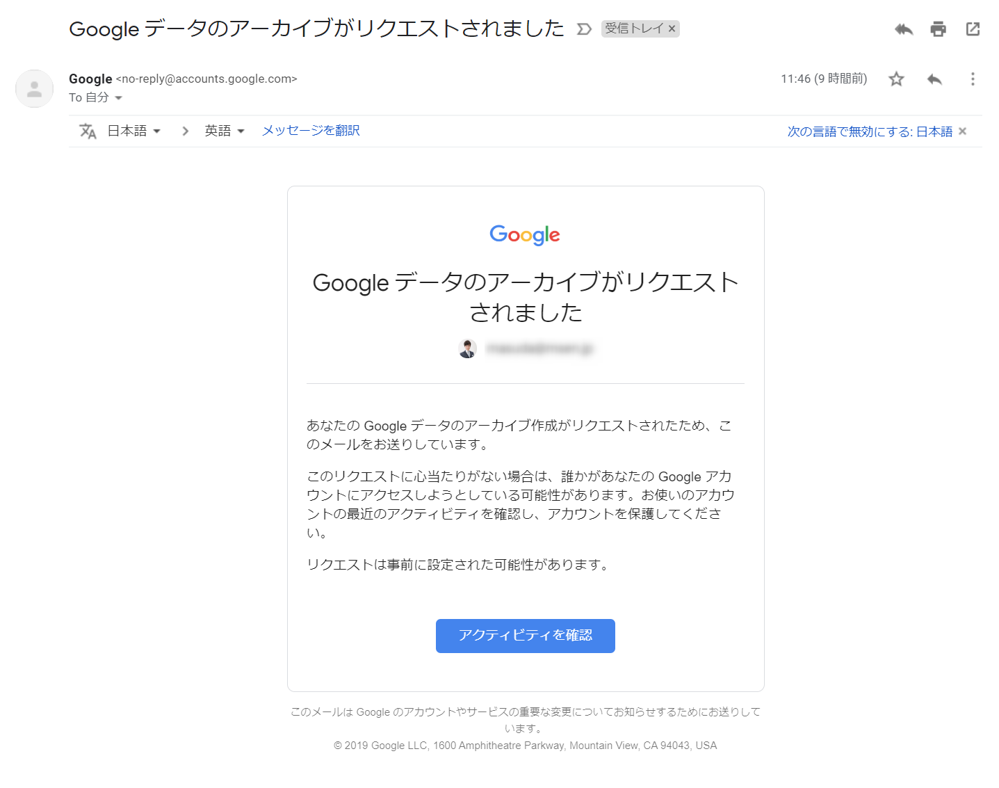
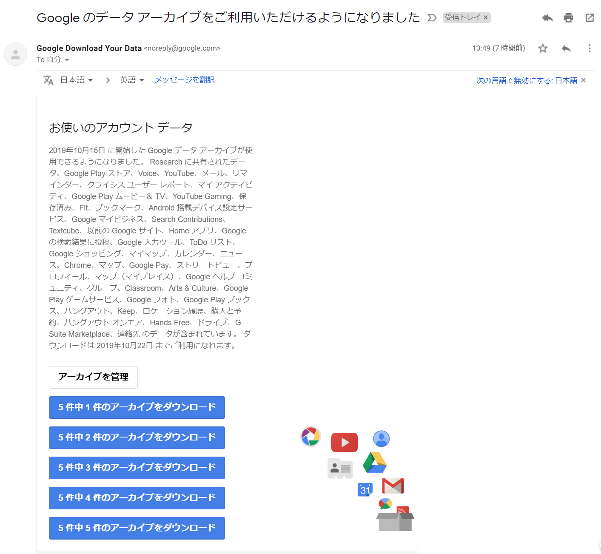
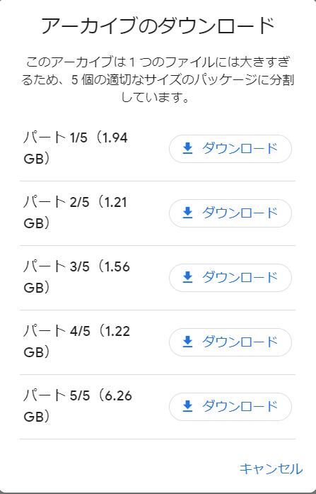
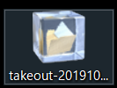
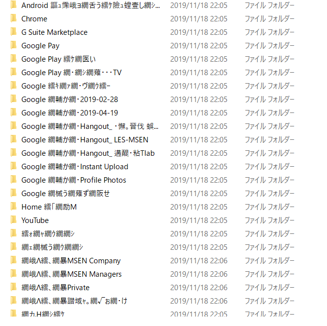
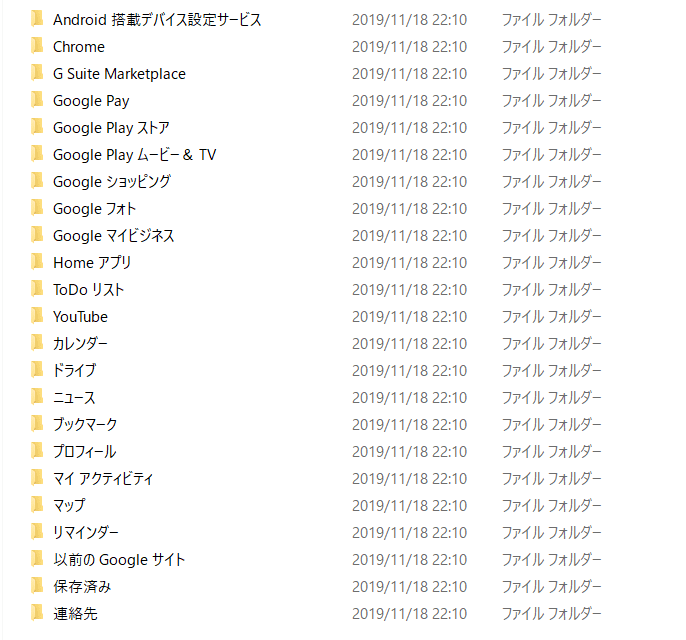

こんにちは。

今回は **Google のサービスをバックアップを取得する方法** を紹介します。

## 手順

手順は簡単です。

1. **Googleアカウントにログインした状態** で以下にアクセスします。
[自分のデータをダウンロード](https://takeout.google.com/settings/takeout)

1. **バックアップを取りたいサービスにチェックを入れ、次のステップへ** 進みます。
**GMailやGoogleドライブだけではなく、ハングアウトなど様々なサービス** が選択できます。

1. **アーカイブ形式を選択し、アーカイブを作成をクリックするとバックアップが開始** されます。

**配信方法も複数選択肢が準備** されています。素晴らしい。

**開始すると、以下のようなメール** が来ます。

**完了すると、以下のようなメール** が来ます。

**ダウンロードに進むと、指定したサイズで分割されておりそれぞれダウンロード** します。
タイミングの問題だったのか、1.9GB程度のサイズでも30分ほどかかった感じでした。

あとは、解凍して適宜復元という感じです。

## あとがき
私は、解凍ソフトに昔から **Lhaplus** を利用しているのですが、ダウンロードしたバックアップデータをLhaplusで解凍すると **文字化け** します。

↓

**涙**

Googleもまだまだだな、と思っていたら、これは **Lhaplusが悪さ** をしているようで検索すると記事にされている方もいました。
[Googleドライブからダウンロードしたファイル名が文字化けする場合の対処方法 | TeraDas](https://www.teradas.net/archives/31267/)

確かに、 **7zipで解凍してみると文字化けしません** でした。

↓

慣れ親しんだ解凍ソフトウェアを変えようかと悩む出来事でした。。

それでは次回の記事でお会いしましょう。
