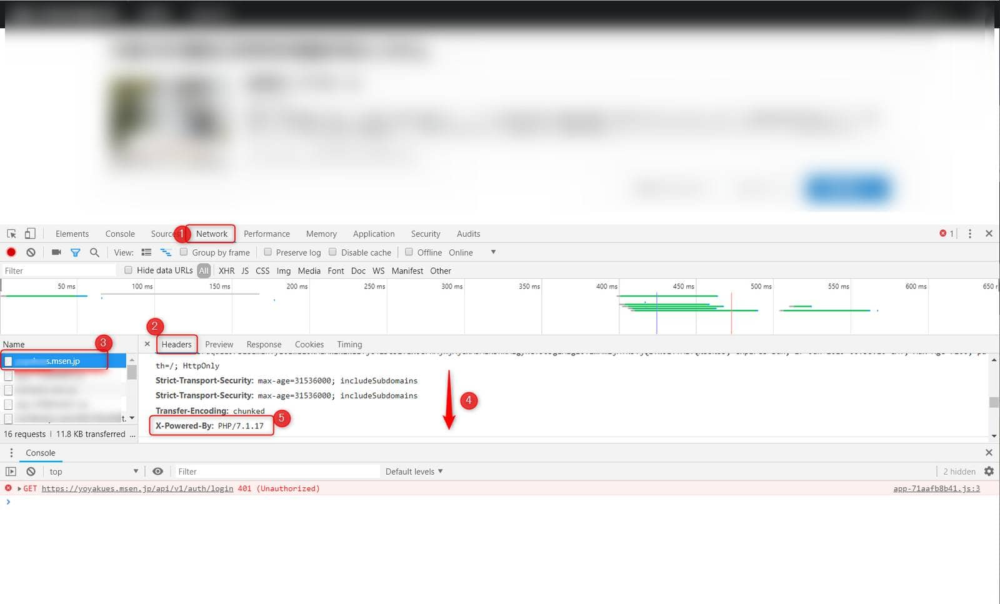

こんにちは。

PHPを利用するWebサービスにおいて、 **HTTP応答ヘッダーのPHPバージョンを隠す** 方法を紹介します。

これらが表示状態にあると、攻撃に有用な情報を取得される可能性がありますので念のため無効にしておくことが望ましいでしょう。

## php.ini の設定

対象は **CentOS7** です。

`/etc/php.ini` を修正します。

設定は非常に簡単で、 `expose_php = On` を `expose_php = Off` に変更するだけです。

```
# diff -u /etc/php.ini.20190127 /etc/php.ini
--- /etc/php.ini.20190127       2019-01-27 13:31:47.731344626 +0900
+++ /etc/php.ini        2019-01-27 13:33:33.594806700 +0900
@@ -371,7 +371,7 @@
 ; threat in any way, but it makes it possible to determine whether you use PHP
 ; on your server or not.
 ; http://php.net/expose-php
-expose_php = On
+expose_php = Off
```

設定の反映は、 `php.fpm` の場合は `systemctl restart php-fpm` です。

## 設定の有効性確認

`Chrome` の機能を利用して有効性の確認を行います。

### expose_php = On の状態

対象のサイトに接続し、**F12** をクリックし、 **Networkタブ(①)** に進み **Headersタブ(②)** の状態で **ページを選択(③)**します。 

表示された内容を **下にスクロール(④)** すると、 **X-Powered-By(⑤)** が表示されていることが確認できます。

<a href="images/how-to-hide-the-php-version-of-the-http-response-header-1.png"></a>

### expose_php = Off の状態

前項と同じ手順で表示し、設定が **非表示(①)** になっていることが確認できます。

<a href="images/how-to-hide-the-php-version-of-the-http-response-header-2.png"></a>

それでは次回の記事でお会いしましょう。