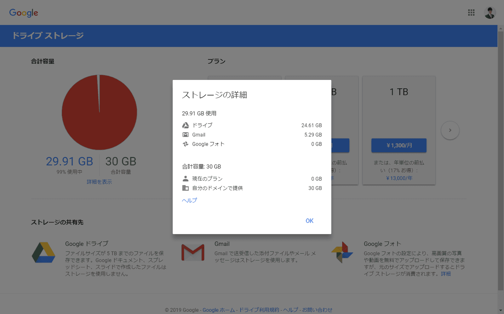
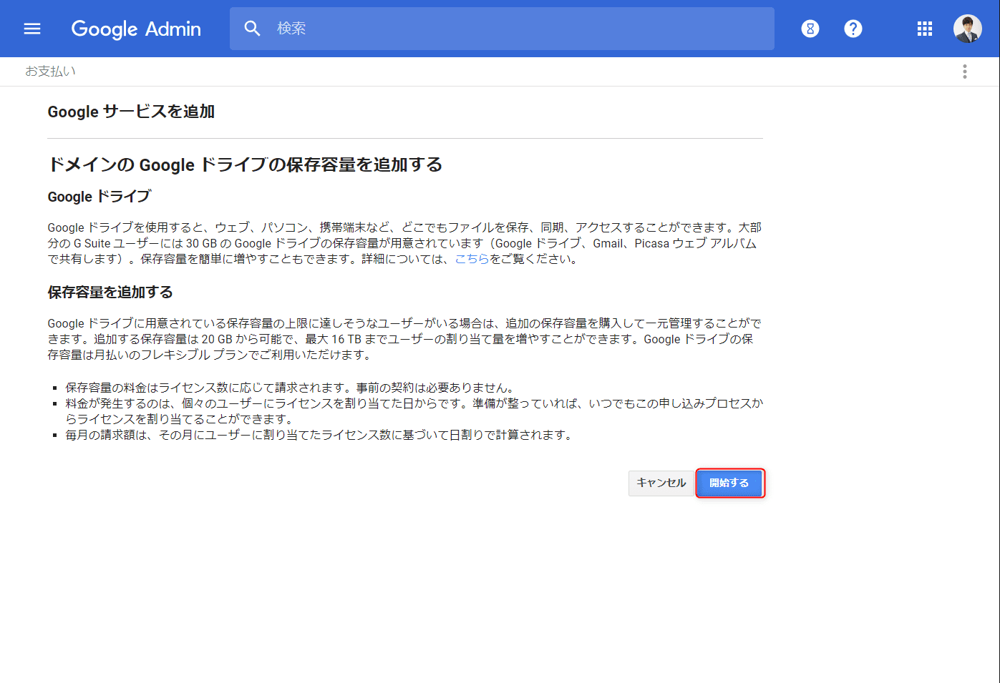
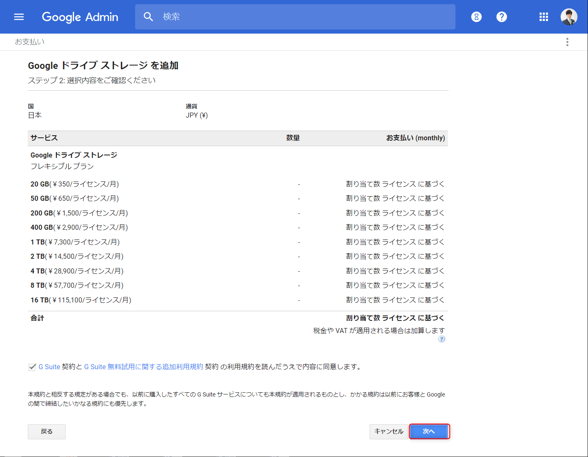

こんにちは。

ある日、GMailの上部にこんな通知があらわれました。

こちらから確認すると、99%利用で枯渇寸前でした。
[ドライブ ストレージ](https://drive.google.com/u/1/settings/storage?i=u)

上記画面から容量を追加することも出来ますが、Googleサポートに確認するとこの場合、 **支払いが組織への一括請求とならない**ようで、管理者から容量を追加します。

## Google ドライブストレージのライセンスを有効にする
1. [管理コンソール](https://admin.google.com/msen.jp/AdminHome?hl=ja#) にアクセス
1. 左上の **三** から **アプリ → GSuite** と進みます

1. **サービスを追加** をクリックします

1. **Googleドライブストレージ** の **今すぐ追加** をクリックします

1. **開始する** をクリックします

1. **次へ** をクリックします ( **この画面で支払いは確定しません** )

1. 支払い情報を確認し **次へ** をクリックします 

1. **次へ** をクリックします

**Google ドライブストレージがアクティブ** になり追加されたことが確認できます

## ユーザーに容量追加オプションを適用する
1. 左上の **三** から **ディレクトリ → ユーザー** と進みます

1. 追加する **ユーザーをチェック(①)** し、右上の **┇(②)** をクリックし **ライセンスを割り当てる(③)** をクリックします

1. プランを選択し、 **割当** をクリックします (画像の20GBは最小単位です)

プラン右の▼をクリックすると選択一覧がでます

以上で完了です。

## 確認
再度、以下のリンクから確認してみます。
[ドライブ ストレージ](https://drive.google.com/u/1/settings/storage?i=u)

無事増えていました。

すぐにアクセスすると **!マーク** が表示されていましたが2,3分まってF5でページを更新すれば増えました。

## 参考リンク
公式の参考ページは以下のリンクになります。

[ユーザー向けのドライブ ストレージの追加購入 - G Suite 管理者 ヘルプ](https://support.google.com/a/answer/1726914)

## あとがき
ただ・・・、読んでいただき気づかれたかもしれませんが個人ページから増量する方が **100GBでも月250円** と安いように見えます。

こちらは再度Googleに問い合わせをして続報を掲載したいと思います。

それでは次回の記事でお会いしましょう。