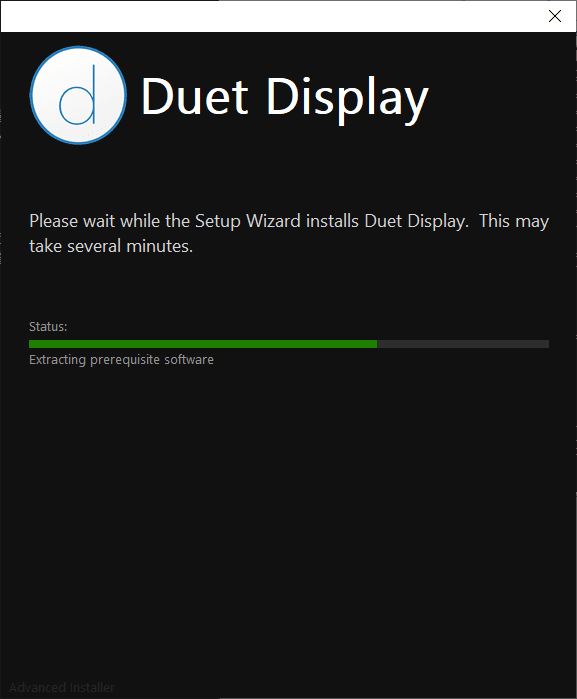
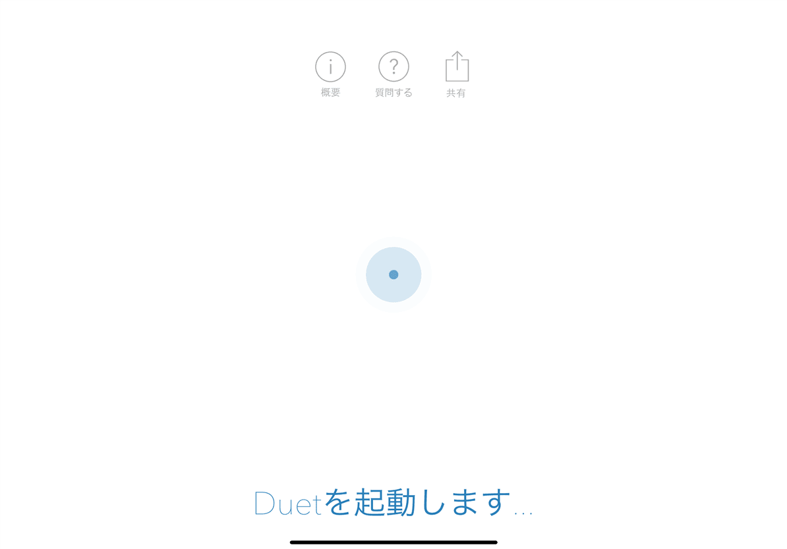

こんにちは。

今回は **Duet Display** というアプリを利用して、**iPad Pro** を **Windows 10 PC** の **外部ディスプレイとして利用する方法** を紹介します。

## Windows PC側の準備

1. 以下のURLからセットアッププログラムをダウンロードします
私が作業した際のセットアッププログラムはバージョン **1-5-6-7** でした
またプログラムの容量が **185MB** ありましたので **通信環境にご注意** ください
[Duet Display - Ex-Apple Engineers Turn Your iPad Into An Extra Display](https://www.duetdisplay.com/jp/#)

1. ダウンロードしたプログラムを利用しセットアップします
インストールは非常に簡単ですが、インストール完了後に **再起動が発生します**
    

    

    

    

1. デスクトップ上に出ている画像のアイコンをダブルクリックして起動します

1. ファイアウォールの設定を変更する確認が出ます
パブリックネットワークを許可するチェックが標準で入っていましたが、セキュリティを高めるために外しました
利用される環境に合わせて適正に設定してください

1. プログラムが常駐します

以上で、Windows PC側の準備は完了です。

## iPad 側作業
1. App Store から **Duet Display** というアプリをインストールします
**有料** なので注意してください

iPad の準備は以上で完了です。

## 外部ディスプレイになるまで

1. **USB-Cケーブル** でPC と iPad を接続します 
    

    

1. 信頼確認とパスコードを入力する
PCとiPadを接続すると信頼確認とパスコードを求められるので入力します
    

     

1. **iPad側で** **duetを起動** して以下の流れで準備します
    
※通知を拒否する場合は許可しないを選択してください

    

    

    

1. 前項の **接続** をタップした後、少しだけ以下の画面になり、

すぐに表示されました！

ちなみに、USBを抜くとiPad側のような画面で待機状態になりました。

## 外部ディスプレイの設定
外部ディスプレイの設定は、Windows側の **ディスプレイの設定** からできます。

**2** で認識されていますね。

以下の画像はWindows側のDuetアプリの設定です。
常駐プログラムをクリックすると出てきます。
設定は特に変えていません。

## あとがき

利用の流れは、以下になると思います。

1. USB-CケーブルでiPadとPCを接続する
1. iPad Pro側で信頼確認とパスコードを入力する
→これなんとか記憶しないのか・・・FaceIDも無理だし。。(進展あれば追記します)
1. iPad Pro側でDuetを起動する
1. iPadがPC側の外部ディスプレイとして表示される

**Apple Pencilも普通に使えます** 、**が、** OneNoteを使ってみたところお絵かきは実用に耐えませんでした。
[video width="1920" height="1080" mp4="https://mseeeen.msen.jp/wp-content/uploads/2019/03/VID_20190303_175136.mp4"][/video]

キャプチャを取り忘れましたが、はじめにApple Pencilでタッチしたときにさらに上位グレードがあるような広告画面が出ていましたのでそちらを使えばいいのかもしれません。

私の利用では外部ディスプレイとして利用できれば十分なので追求しないでおきます。
何か情報あればコメントいただけましたら幸いです。

それでは次回の記事でお会いしましょう。