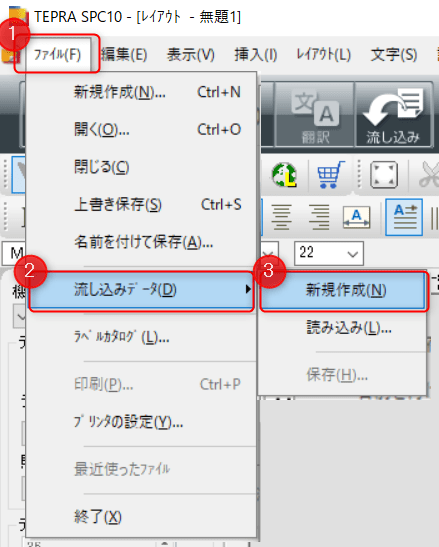
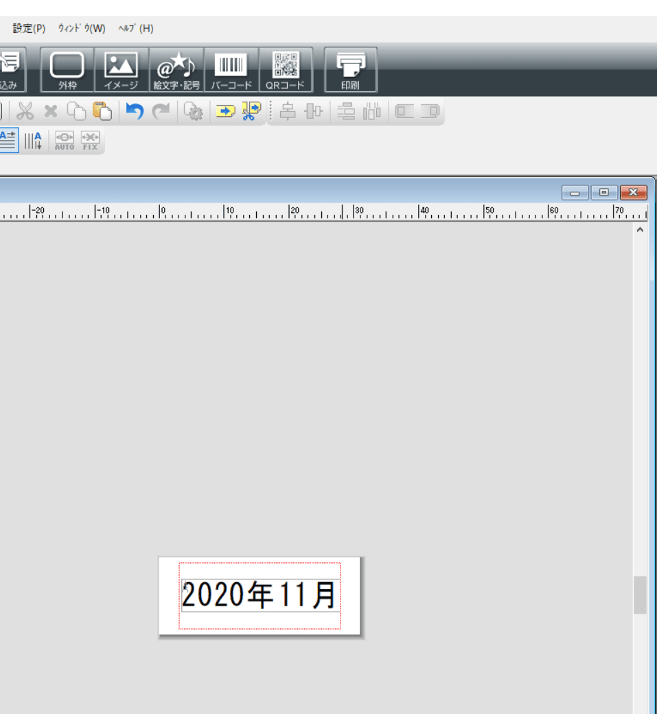

こんにちは。

今回は、キングジムのテプラPRO **SR3900Pを使って** 、**流し込みデータ機能** を利用し、**複数のデータを一気に印刷する** 方法を紹介します。
たまに作業するのですが、毎回やりかたを忘れて調べるのでメモを兼ねて。

使う機器は **現在製造中止** になってしまった SR3900P です。
[「テプラ」PRO SR3900P | 「テプラ」製造中止商品 | ファイルとテプラのキングジム](https://www.kingjim.co.jp/products/tepra/sr3900p.html)

年季入ってます。

ソフトウェアは、 **SPC10 Ver1.90** を利用します。（執筆時点で最新）

SPC10
[SPC10 Ver1.90のダウンロード | ダウンロード | ファイルとテプラのキングジム](https://www.kingjim.co.jp/download/tepra/sr970/dl12.html)

それでは早速やってみましょう。

## 手順

1. Excelを開き、画像のようなデータを作成します

1. SPC10を開き、 **テープ幅を読み取って(①)** **新規作成を選択(②)** して **OK** をクリックします

1. **ファイル** から **流し込みデータ→新規作成** と進みます

以下のような画面になります。

1. **ExcelのデータをCtrl+Cでコピー** します

1. SRC10 の右半分に出てきた **データ作成ウィンドウのA1セルを選択** して、 **Ctrl+Vで貼り付け** ます

1. メニューから **流し込み印刷** をクリックします

1. **A列を選択(①)** して、 **OK(②)** をクリックします

1. 左側の **レイアウトウィンドウに位置を合わせてクリック** します

↓

1. **レイアウトをダブルクリック** すると **フォントサイズなどが調整** できます

1. **印刷ボタン** から **印刷を実行** します

↓

**無事印刷** できました。

流し込み印刷を使えば、事前にデータを作成することで作業時間を短縮できると思います。
応用しながら参考にしてもらえれば嬉しいです。

それでは次回の記事でお会いしましょう。